# 实验三

> 学院：省级示范性软件学院
>
> 题目：《实验三：聚合操作》
>
> 姓名：黄玺竹
>
> 学号：2200770269
>
> 班级：软工2201
>
> 日期：2024-10-25
>
> 实验环境：Elasticsearch8.12.2 Postman11.13.0

## 一、实验目的

1、了解聚合操作的基本概念和基本类型

2、掌握聚合的常用操作及技巧

3、完成18道习题

## 二、实验内容

### 2.1.1 建表及插入数据

建表语句

```json
    {
    "mappings":{
        "properties":{
            "order_id": { "type": "keyword" },
            "order_date": { "type": "date" },
            "customer_id": { "type": "keyword" },
            "customer_name": { "type": "keyword" },
            "customer_gender": { "type": "keyword" },
            "customer_age": { "type": "integer" },
            "customer_city": { "type": "keyword" },
            "product_id": { "type": "keyword" },
            "product_name": { "type": "keyword" },
            "product_category": { "type": "keyword" },
            "quantity": { "type": "integer" },
            "price": { "type": "float" },
            "total_amount": { "type": "float" },
            "payment_method": { "type": "keyword" },
            "is_returned": { "type": "boolean" }
        }
    }
}
```

批量插入数据语句

```json
{"index": {"_id": "1"}}
{"order_id": "6945", "order_date": "2023-03-06", "customer_id": "C242", "customer_name": "Bob Smith", "customer_gender": "female", "customer_age": 60, "customer_city": "Philadelphia", "product_id": "P041", "product_name": "Pro Accessory", "product_category": "Sports", "quantity": 4, "price": 205.89, "total_amount": 823.56, "payment_method": "Credit Card", "is_returned": false}
{"index": {"_id": "2"}}
{"order_id": "5629", "order_date": "2023-11-14", "customer_id": "C262", "customer_name": "Frank Garcia", "customer_gender": "female", "customer_age": 52, "customer_city": "Dallas", "product_id": "P097", "product_name": "Ultra Accessory", "product_category": "Sports", "quantity": 3, "price": 475.18, "total_amount": 1425.54, "payment_method": "Debit Card", "is_returned": true}
{"index": {"_id": "3"}}
{"order_id": "4488", "order_date": "2023-03-28", "customer_id": "C342", "customer_name": "Frank Garcia", "customer_gender": "female", "customer_age": 62, "customer_city": "New York", "product_id": "P001", "product_name": "Ultra Device", "product_category": "Books", "quantity": 5, "price": 722.89, "total_amount": 3614.45, "payment_method": "Credit Card", "is_returned": false}
{"index": {"_id": "4"}}
{"order_id": "7960", "order_date": "2023-09-23", "customer_id": "C408", "customer_name": "Eva Johnson", "customer_gender": "male", "customer_age": 37, "customer_city": "San Antonio", "product_id": "P079", "product_name": "Ultra Accessory", "product_category": "Home Appliances", "quantity": 2, "price": 485.3, "total_amount": 970.6, "payment_method": "Cash on Delivery", "is_returned": false}
{"index": {"_id": "5"}}
{"order_id": "2111", "order_date": "2023-02-18", "customer_id": "C981", "customer_name": "Eva Garcia", "customer_gender": "female", "customer_age": 19, "customer_city": "Los Angeles", "product_id": "P091", "product_name": "Mega Widget", "product_category": "Books", "quantity": 5, "price": 61.52, "total_amount": 307.6, "payment_method": "Debit Card", "is_returned": false}
{"index": {"_id": "6"}}
{"order_id": "2121", "order_date": "2023-01-10", "customer_id": "C030", "customer_name": "Jack Davis", "customer_gender": "male", "customer_age": 18, "customer_city": "Chicago", "product_id": "P070", "product_name": "Ultra Tool", "product_category": "Home Appliances", "quantity": 3, "price": 860.58, "total_amount": 2581.74, "payment_method": "Debit Card", "is_returned": true}
{"index": {"_id": "7"}}
{"order_id": "1211", "order_date": "2023-07-06", "customer_id": "C672", "customer_name": "Jack Williams", "customer_gender": "female", "customer_age": 64, "customer_city": "San Diego", "product_id": "P092", "product_name": "Mega Device", "product_category": "Electronics", "quantity": 4, "price": 389.1, "total_amount": 1556.4, "payment_method": "Cash on Delivery", "is_returned": true}
{"index": {"_id": "8"}}
{"order_id": "7394", "order_date": "2023-08-15", "customer_id": "C719", "customer_name": "Frank Rodriguez", "customer_gender": "female", "customer_age": 59, "customer_city": "San Diego", "product_id": "P083", "product_name": "Super Device", "product_category": "Beauty", "quantity": 2, "price": 593.15, "total_amount": 1186.3, "payment_method": "Credit Card", "is_returned": true}
{"index": {"_id": "9"}}
{"order_id": "7593", "order_date": "2023-07-22", "customer_id": "C145", "customer_name": "Bob Johnson", "customer_gender": "female", "customer_age": 33, "customer_city": "Dallas", "product_id": "P031", "product_name": "Pro Tool", "product_category": "Furniture", "quantity": 3, "price": 740.32, "total_amount": 2220.96, "payment_method": "PayPal", "is_returned": false}
{"index": {"_id": "10"}}
{"order_id": "3304", "order_date": "2023-03-03", "customer_id": "C111", "customer_name": "Jack Jones", "customer_gender": "female", "customer_age": 53, "customer_city": "Chicago", "product_id": "P027", "product_name": "Elite Device", "product_category": "Jewelry", "quantity": 1, "price": 489.24, "total_amount": 489.24, "payment_method": "Credit Card", "is_returned": true}
{"index": {"_id": "11"}}
{"order_id": "7928", "order_date": "2023-05-02", "customer_id": "C441", "customer_name": "Henry Williams", "customer_gender": "male", "customer_age": 57, "customer_city": "San Diego", "product_id": "P005", "product_name": "Elite Accessory", "product_category": "Groceries", "quantity": 3, "price": 989.17, "total_amount": 2967.51, "payment_method": "Debit Card", "is_returned": true}
{"index": {"_id": "12"}}
{"order_id": "9071", "order_date": "2023-04-01", "customer_id": "C798", "customer_name": "Grace Williams", "customer_gender": "male", "customer_age": 66, "customer_city": "Phoenix", "product_id": "P055", "product_name": "Ultra Widget", "product_category": "Furniture", "quantity": 4, "price": 332.32, "total_amount": 1329.28, "payment_method": "Cash on Delivery", "is_returned": false}
{"index": {"_id": "13"}}
{"order_id": "4022", "order_date": "2023-08-04", "customer_id": "C763", "customer_name": "Jack Martinez", "customer_gender": "female", "customer_age": 23, "customer_city": "Phoenix", "product_id": "P026", "product_name": "Ultra Widget", "product_category": "Books", "quantity": 5, "price": 826.39, "total_amount": 4131.95, "payment_method": "Debit Card", "is_returned": false}
{"index": {"_id": "14"}}
{"order_id": "1363", "order_date": "2023-04-28", "customer_id": "C727", "customer_name": "Frank Davis", "customer_gender": "female", "customer_age": 67, "customer_city": "New York", "product_id": "P012", "product_name": "Super Widget", "product_category": "Toys", "quantity": 3, "price": 248.55, "total_amount": 745.65, "payment_method": "Credit Card", "is_returned": false}
{"index": {"_id": "15"}}
{"order_id": "6142", "order_date": "2023-04-27", "customer_id": "C005", "customer_name": "Charlie Davis", "customer_gender": "male", "customer_age": 28, "customer_city": "San Jose", "product_id": "P048", "product_name": "Ultra Gadget", "product_category": "Home Appliances", "quantity": 4, "price": 510.43, "total_amount": 2041.72, "payment_method": "PayPal", "is_returned": true}
{"index": {"_id": "16"}}
{"order_id": "2769", "order_date": "2023-01-03", "customer_id": "C393", "customer_name": "Alice Rodriguez", "customer_gender": "male", "customer_age": 19, "customer_city": "San Jose", "product_id": "P093", "product_name": "Ultra Accessory", "product_category": "Jewelry", "quantity": 3, "price": 317.89, "total_amount": 953.67, "payment_method": "Cash on Delivery", "is_returned": true}
{"index": {"_id": "17"}}
{"order_id": "3810", "order_date": "2023-07-30", "customer_id": "C808", "customer_name": "Ivy Garcia", "customer_gender": "male", "customer_age": 52, "customer_city": "Philadelphia", "product_id": "P013", "product_name": "Elite Gadget", "product_category": "Electronics", "quantity": 3, "price": 541.31, "total_amount": 1623.93, "payment_method": "Debit Card", "is_returned": false}
{"index": {"_id": "18"}}
{"order_id": "4772", "order_date": "2023-04-12", "customer_id": "C043", "customer_name": "David Garcia", "customer_gender": "male", "customer_age": 18, "customer_city": "Los Angeles", "product_id": "P009", "product_name": "Elite Gadget", "product_category": "Beauty", "quantity": 3, "price": 953.55, "total_amount": 2860.65, "payment_method": "Credit Card", "is_returned": false}
{"index": {"_id": "19"}}
{"order_id": "9792", "order_date": "2023-02-25", "customer_id": "C974", "customer_name": "Henry Miller", "customer_gender": "male", "customer_age": 37, "customer_city": "Los Angeles", "product_id": "P012", "product_name": "Ultra Device", "product_category": "Beauty", "quantity": 1, "price": 898.19, "total_amount": 898.19, "payment_method": "Debit Card", "is_returned": false}
{"index": {"_id": "20"}}
{"order_id": "8033", "order_date": "2023-02-17", "customer_id": "C280", "customer_name": "Bob Rodriguez", "customer_gender": "female", "customer_age": 63, "customer_city": "New York", "product_id": "P084", "product_name": "Ultra Device", "product_category": "Electronics", "quantity": 1, "price": 847.14, "total_amount": 847.14, "payment_method": "Debit Card", "is_returned": false}
{"index": {"_id": "21"}}
{"order_id": "4105", "order_date": "2023-11-30", "customer_id": "C605", "customer_name": "Henry Martinez", "customer_gender": "male", "customer_age": 24, "customer_city": "San Antonio", "product_id": "P003", "product_name": "Elite Widget", "product_category": "Groceries", "quantity": 3, "price": 871.75, "total_amount": 2615.25, "payment_method": "Cash on Delivery", "is_returned": false}
{"index": {"_id": "22"}}
{"order_id": "5339", "order_date": "2023-05-25", "customer_id": "C323", "customer_name": "David Johnson", "customer_gender": "female", "customer_age": 41, "customer_city": "Dallas", "product_id": "P054", "product_name": "Elite Gadget", "product_category": "Fashion", "quantity": 4, "price": 501.88, "total_amount": 2007.52, "payment_method": "Credit Card", "is_returned": false}
{"index": {"_id": "23"}}
{"order_id": "2291", "order_date": "2023-02-22", "customer_id": "C180", "customer_name": "Bob Smith", "customer_gender": "male", "customer_age": 53, "customer_city": "Chicago", "product_id": "P065", "product_name": "Ultra Tool", "product_category": "Groceries", "quantity": 5, "price": 229.9, "total_amount": 1149.5, "payment_method": "PayPal", "is_returned": true}
{"index": {"_id": "24"}}
{"order_id": "6857", "order_date": "2023-03-15", "customer_id": "C552", "customer_name": "Alice Smith", "customer_gender": "male", "customer_age": 21, "customer_city": "San Diego", "product_id": "P099", "product_name": "Elite Widget", "product_category": "Jewelry", "quantity": 2, "price": 621.51, "total_amount": 1243.02, "payment_method": "Credit Card", "is_returned": false}
{"index": {"_id": "25"}}
{"order_id": "9291", "order_date": "2023-07-12", "customer_id": "C424", "customer_name": "Grace Garcia", "customer_gender": "male", "customer_age": 63, "customer_city": "San Diego", "product_id": "P062", "product_name": "Super Device", "product_category": "Electronics", "quantity": 1, "price": 302.94, "total_amount": 302.94, "payment_method": "Debit Card", "is_returned": true}
{"index": {"_id": "26"}}
{"order_id": "1897", "order_date": "2023-01-20", "customer_id": "C056", "customer_name": "Grace Martinez", "customer_gender": "female", "customer_age": 40, "customer_city": "San Diego", "product_id": "P018", "product_name": "Mega Tool", "product_category": "Sports", "quantity": 5, "price": 635.06, "total_amount": 3175.3, "payment_method": "PayPal", "is_returned": false}
{"index": {"_id": "27"}}
{"order_id": "5953", "order_date": "2023-04-14", "customer_id": "C363", "customer_name": "Henry Brown", "customer_gender": "female", "customer_age": 70, "customer_city": "New York", "product_id": "P024", "product_name": "Pro Widget", "product_category": "Home Appliances", "quantity": 2, "price": 882.01, "total_amount": 1764.02, "payment_method": "Cash on Delivery", "is_returned": true}
{"index": {"_id": "28"}}
{"order_id": "3156", "order_date": "2023-03-12", "customer_id": "C878", "customer_name": "Henry Martinez", "customer_gender": "male", "customer_age": 22, "customer_city": "Houston", "product_id": "P087", "product_name": "Mega Accessory", "product_category": "Jewelry", "quantity": 1, "price": 535.02, "total_amount": 535.02, "payment_method": "Debit Card", "is_returned": false}
{"index": {"_id": "29"}}
{"order_id": "6906", "order_date": "2023-12-20", "customer_id": "C071", "customer_name": "Bob Martinez", "customer_gender": "male", "customer_age": 69, "customer_city": "Philadelphia", "product_id": "P034", "product_name": "Mega Accessory", "product_category": "Home Appliances", "quantity": 2, "price": 639.65, "total_amount": 1279.3, "payment_method": "PayPal", "is_returned": false}
{"index": {"_id": "30"}}
{"order_id": "8191", "order_date": "2023-08-02", "customer_id": "C458", "customer_name": "Ivy Smith", "customer_gender": "female", "customer_age": 42, "customer_city": "Dallas", "product_id": "P016", "product_name": "Elite Tool", "product_category": "Books", "quantity": 2, "price": 366.21, "total_amount": 732.42, "payment_method": "PayPal", "is_returned": false}
{"index": {"_id": "31"}}
{"order_id": "3182", "order_date": "2023-10-12", "customer_id": "C207", "customer_name": "Bob Garcia", "customer_gender": "female", "customer_age": 33, "customer_city": "San Diego", "product_id": "P047", "product_name": "Ultra Widget", "product_category": "Jewelry", "quantity": 3, "price": 833.95, "total_amount": 2501.85, "payment_method": "Debit Card", "is_returned": true}
{"index": {"_id": "32"}}
{"order_id": "4709", "order_date": "2023-05-21", "customer_id": "C451", "customer_name": "Grace Martinez", "customer_gender": "male", "customer_age": 40, "customer_city": "Chicago", "product_id": "P021", "product_name": "Mega Device", "product_category": "Groceries", "quantity": 3, "price": 106.01, "total_amount": 318.03, "payment_method": "PayPal", "is_returned": true}
{"index": {"_id": "33"}}
{"order_id": "1550", "order_date": "2023-02-25", "customer_id": "C029", "customer_name": "Frank Smith", "customer_gender": "female", "customer_age": 44, "customer_city": "San Jose", "product_id": "P037", "product_name": "Elite Tool", "product_category": "Groceries", "quantity": 4, "price": 743.62, "total_amount": 2974.48, "payment_method": "Debit Card", "is_returned": false}
{"index": {"_id": "34"}}
{"order_id": "5735", "order_date": "2023-08-19", "customer_id": "C765", "customer_name": "David Davis", "customer_gender": "female", "customer_age": 42, "customer_city": "Philadelphia", "product_id": "P037", "product_name": "Super Accessory", "product_category": "Groceries", "quantity": 3, "price": 724.34, "total_amount": 2173.02, "payment_method": "Credit Card", "is_returned": true}
{"index": {"_id": "35"}}
{"order_id": "2189", "order_date": "2023-01-20", "customer_id": "C988", "customer_name": "Charlie Brown", "customer_gender": "male", "customer_age": 24, "customer_city": "San Diego", "product_id": "P004", "product_name": "Ultra Widget", "product_category": "Jewelry", "quantity": 1, "price": 206.12, "total_amount": 206.12, "payment_method": "Credit Card", "is_returned": true}
{"index": {"_id": "36"}}
{"order_id": "4261", "order_date": "2023-04-16", "customer_id": "C199", "customer_name": "Grace Brown", "customer_gender": "female", "customer_age": 30, "customer_city": "New York", "product_id": "P027", "product_name": "Mega Tool", "product_category": "Furniture", "quantity": 1, "price": 291.97, "total_amount": 291.97, "payment_method": "Cash on Delivery", "is_returned": false}
{"index": {"_id": "37"}}
{"order_id": "3166", "order_date": "2023-03-21", "customer_id": "C949", "customer_name": "Ivy Rodriguez", "customer_gender": "female", "customer_age": 24, "customer_city": "Los Angeles", "product_id": "P008", "product_name": "Mega Widget", "product_category": "Books", "quantity": 1, "price": 600.69, "total_amount": 600.69, "payment_method": "PayPal", "is_returned": false}
{"index": {"_id": "38"}}
{"order_id": "7539", "order_date": "2023-08-15", "customer_id": "C581", "customer_name": "Alice Williams", "customer_gender": "male", "customer_age": 69, "customer_city": "San Antonio", "product_id": "P010", "product_name": "Super Tool", "product_category": "Home Appliances", "quantity": 4, "price": 584.18, "total_amount": 2336.72, "payment_method": "Credit Card", "is_returned": false}
{"index": {"_id": "39"}}
{"order_id": "4588", "order_date": "2023-02-23", "customer_id": "C131", "customer_name": "Alice Smith", "customer_gender": "female", "customer_age": 62, "customer_city": "San Diego", "product_id": "P057", "product_name": "Elite Accessory", "product_category": "Electronics", "quantity": 5, "price": 553.25, "total_amount": 2766.25, "payment_method": "PayPal", "is_returned": true}
{"index": {"_id": "40"}}
{"order_id": "4199", "order_date": "2023-11-10", "customer_id": "C494", "customer_name": "Charlie Jones", "customer_gender": "male", "customer_age": 45, "customer_city": "Houston", "product_id": "P020", "product_name": "Elite Tool", "product_category": "Beauty", "quantity": 1, "price": 342.63, "total_amount": 342.63, "payment_method": "Cash on Delivery", "is_returned": true}
{"index": {"_id": "41"}}
{"order_id": "9196", "order_date": "2023-02-06", "customer_id": "C534", "customer_name": "Alice Garcia", "customer_gender": "female", "customer_age": 32, "customer_city": "Phoenix", "product_id": "P020", "product_name": "Mega Device", "product_category": "Furniture", "quantity": 1, "price": 635.12, "total_amount": 635.12, "payment_method": "PayPal", "is_returned": false}
{"index": {"_id": "42"}}
{"order_id": "1941", "order_date": "2023-06-23", "customer_id": "C475", "customer_name": "Bob Rodriguez", "customer_gender": "female", "customer_age": 48, "customer_city": "Chicago", "product_id": "P090", "product_name": "Ultra Device", "product_category": "Electronics", "quantity": 4, "price": 215.28, "total_amount": 861.12, "payment_method": "Cash on Delivery", "is_returned": false}
{"index": {"_id": "43"}}
{"order_id": "9818", "order_date": "2023-05-27", "customer_id": "C532", "customer_name": "Bob Johnson", "customer_gender": "male", "customer_age": 47, "customer_city": "Phoenix", "product_id": "P084", "product_name": "Super Tool", "product_category": "Home Appliances", "quantity": 3, "price": 827.32, "total_amount": 2481.96, "payment_method": "PayPal", "is_returned": false}
{"index": {"_id": "44"}}
{"order_id": "1809", "order_date": "2023-07-13", "customer_id": "C317", "customer_name": "Charlie Miller", "customer_gender": "male", "customer_age": 36, "customer_city": "San Jose", "product_id": "P021", "product_name": "Pro Gadget", "product_category": "Jewelry", "quantity": 3, "price": 121.06, "total_amount": 363.18, "payment_method": "Credit Card", "is_returned": true}
{"index": {"_id": "45"}}
{"order_id": "1361", "order_date": "2023-01-29", "customer_id": "C138", "customer_name": "Charlie Davis", "customer_gender": "female", "customer_age": 50, "customer_city": "San Diego", "product_id": "P078", "product_name": "Ultra Accessory", "product_category": "Toys", "quantity": 2, "price": 948.74, "total_amount": 1897.48, "payment_method": "Cash on Delivery", "is_returned": false}
{"index": {"_id": "46"}}
{"order_id": "7019", "order_date": "2023-03-01", "customer_id": "C165", "customer_name": "Grace Martinez", "customer_gender": "male", "customer_age": 18, "customer_city": "Phoenix", "product_id": "P005", "product_name": "Elite Accessory", "product_category": "Furniture", "quantity": 5, "price": 963.32, "total_amount": 4816.6, "payment_method": "Debit Card", "is_returned": true}
{"index": {"_id": "47"}}
{"order_id": "2564", "order_date": "2023-12-31", "customer_id": "C983", "customer_name": "Grace Martinez", "customer_gender": "male", "customer_age": 34, "customer_city": "San Diego", "product_id": "P067", "product_name": "Super Gadget", "product_category": "Home Appliances", "quantity": 5, "price": 919.89, "total_amount": 4599.45, "payment_method": "Cash on Delivery", "is_returned": false}
{"index": {"_id": "48"}}
{"order_id": "8300", "order_date": "2023-08-19", "customer_id": "C556", "customer_name": "Jack Martinez", "customer_gender": "female", "customer_age": 25, "customer_city": "Philadelphia", "product_id": "P069", "product_name": "Pro Tool", "product_category": "Toys", "quantity": 2, "price": 345.59, "total_amount": 691.18, "payment_method": "Credit Card", "is_returned": false}
{"index": {"_id": "49"}}
{"order_id": "1156", "order_date": "2023-06-15", "customer_id": "C438", "customer_name": "David Davis", "customer_gender": "male", "customer_age": 59, "customer_city": "Houston", "product_id": "P020", "product_name": "Mega Tool", "product_category": "Beauty", "quantity": 2, "price": 687.43, "total_amount": 1374.86, "payment_method": "Cash on Delivery", "is_returned": true}
{"index": {"_id": "50"}}
{"order_id": "2897", "order_date": "2023-03-13", "customer_id": "C320", "customer_name": "Charlie Rodriguez", "customer_gender": "male", "customer_age": 68, "customer_city": "San Jose", "product_id": "P060", "product_name": "Pro Tool", "product_category": "Jewelry", "quantity": 5, "price": 918.59, "total_amount": 4592.95, "payment_method": "Credit Card", "is_returned": false}
{"index": {"_id": "51"}}
{"order_id": "5636", "order_date": "2023-05-12", "customer_id": "C643", "customer_name": "Jack Martinez", "customer_gender": "male", "customer_age": 33, "customer_city": "San Jose", "product_id": "P073", "product_name": "Ultra Tool", "product_category": "Fashion", "quantity": 4, "price": 141.53, "total_amount": 566.12, "payment_method": "Credit Card", "is_returned": false}
{"index": {"_id": "52"}}
{"order_id": "3983", "order_date": "2023-08-05", "customer_id": "C973", "customer_name": "Frank Johnson", "customer_gender": "female", "customer_age": 44, "customer_city": "San Jose", "product_id": "P084", "product_name": "Super Widget", "product_category": "Furniture", "quantity": 5, "price": 171.0, "total_amount": 855.0, "payment_method": "Cash on Delivery", "is_returned": false}
{"index": {"_id": "53"}}
{"order_id": "5290", "order_date": "2023-01-02", "customer_id": "C369", "customer_name": "Jack Williams", "customer_gender": "male", "customer_age": 56, "customer_city": "Los Angeles", "product_id": "P095", "product_name": "Ultra Gadget", "product_category": "Jewelry", "quantity": 2, "price": 634.53, "total_amount": 1269.06, "payment_method": "Cash on Delivery", "is_returned": false}
{"index": {"_id": "54"}}
{"order_id": "8195", "order_date": "2023-11-25", "customer_id": "C782", "customer_name": "Jack Martinez", "customer_gender": "male", "customer_age": 62, "customer_city": "Phoenix", "product_id": "P040", "product_name": "Ultra Gadget", "product_category": "Books", "quantity": 1, "price": 595.85, "total_amount": 595.85, "payment_method": "PayPal", "is_returned": true}
{"index": {"_id": "55"}}
{"order_id": "6632", "order_date": "2023-03-01", "customer_id": "C596", "customer_name": "Frank Garcia", "customer_gender": "female", "customer_age": 23, "customer_city": "Philadelphia", "product_id": "P080", "product_name": "Super Tool", "product_category": "Fashion", "quantity": 1, "price": 641.04, "total_amount": 641.04, "payment_method": "Credit Card", "is_returned": true}
{"index": {"_id": "56"}}
{"order_id": "1364", "order_date": "2023-12-18", "customer_id": "C701", "customer_name": "Charlie Smith", "customer_gender": "male", "customer_age": 67, "customer_city": "Phoenix", "product_id": "P060", "product_name": "Pro Gadget", "product_category": "Fashion", "quantity": 1, "price": 978.14, "total_amount": 978.14, "payment_method": "Cash on Delivery", "is_returned": false}
{"index": {"_id": "57"}}
{"order_id": "7109", "order_date": "2023-08-25", "customer_id": "C480", "customer_name": "Bob Jones", "customer_gender": "female", "customer_age": 43, "customer_city": "San Antonio", "product_id": "P010", "product_name": "Elite Widget", "product_category": "Fashion", "quantity": 1, "price": 29.28, "total_amount": 29.28, "payment_method": "Debit Card", "is_returned": true}
{"index": {"_id": "58"}}
{"order_id": "5865", "order_date": "2023-04-29", "customer_id": "C658", "customer_name": "Frank Garcia", "customer_gender": "male", "customer_age": 58, "customer_city": "Los Angeles", "product_id": "P004", "product_name": "Super Gadget", "product_category": "Groceries", "quantity": 3, "price": 798.19, "total_amount": 2394.57, "payment_method": "Credit Card", "is_returned": true}
{"index": {"_id": "59"}}
{"order_id": "2212", "order_date": "2023-10-09", "customer_id": "C863", "customer_name": "Henry Garcia", "customer_gender": "female", "customer_age": 50, "customer_city": "Chicago", "product_id": "P085", "product_name": "Mega Gadget", "product_category": "Home Appliances", "quantity": 2, "price": 291.02, "total_amount": 582.04, "payment_method": "Debit Card", "is_returned": false}
{"index": {"_id": "60"}}
{"order_id": "6114", "order_date": "2023-05-21", "customer_id": "C365", "customer_name": "Charlie Garcia", "customer_gender": "male", "customer_age": 36, "customer_city": "Los Angeles", "product_id": "P080", "product_name": "Super Accessory", "product_category": "Jewelry", "quantity": 1, "price": 254.71, "total_amount": 254.71, "payment_method": "PayPal", "is_returned": false}
{"index": {"_id": "61"}}
{"order_id": "2867", "order_date": "2023-10-13", "customer_id": "C854", "customer_name": "Charlie Martinez", "customer_gender": "male", "customer_age": 21, "customer_city": "Houston", "product_id": "P031", "product_name": "Pro Widget", "product_category": "Beauty", "quantity": 4, "price": 679.3, "total_amount": 2717.2, "payment_method": "Debit Card", "is_returned": false}
{"index": {"_id": "62"}}
{"order_id": "5073", "order_date": "2023-12-25", "customer_id": "C285", "customer_name": "Bob Smith", "customer_gender": "male", "customer_age": 29, "customer_city": "San Diego", "product_id": "P078", "product_name": "Elite Accessory", "product_category": "Home Appliances", "quantity": 3, "price": 473.43, "total_amount": 1420.29, "payment_method": "Cash on Delivery", "is_returned": false}
{"index": {"_id": "63"}}
{"order_id": "9574", "order_date": "2023-06-26", "customer_id": "C023", "customer_name": "Charlie Garcia", "customer_gender": "female", "customer_age": 40, "customer_city": "San Jose", "product_id": "P076", "product_name": "Mega Widget", "product_category": "Furniture", "quantity": 2, "price": 115.01, "total_amount": 230.02, "payment_method": "Cash on Delivery", "is_returned": true}
{"index": {"_id": "64"}}
{"order_id": "5086", "order_date": "2023-01-28", "customer_id": "C965", "customer_name": "Jack Jones", "customer_gender": "female", "customer_age": 33, "customer_city": "Philadelphia", "product_id": "P036", "product_name": "Ultra Device", "product_category": "Fashion", "quantity": 4, "price": 326.84, "total_amount": 1307.36, "payment_method": "PayPal", "is_returned": false}
{"index": {"_id": "65"}}
{"order_id": "2320", "order_date": "2023-11-17", "customer_id": "C789", "customer_name": "David Smith", "customer_gender": "male", "customer_age": 21, "customer_city": "Chicago", "product_id": "P041", "product_name": "Elite Accessory", "product_category": "Sports", "quantity": 5, "price": 498.44, "total_amount": 2492.2, "payment_method": "PayPal", "is_returned": true}
{"index": {"_id": "66"}}
{"order_id": "2463", "order_date": "2023-12-07", "customer_id": "C038", "customer_name": "Jack Jones", "customer_gender": "male", "customer_age": 66, "customer_city": "Dallas", "product_id": "P017", "product_name": "Super Device", "product_category": "Beauty", "quantity": 3, "price": 499.37, "total_amount": 1498.11, "payment_method": "Credit Card", "is_returned": true}
{"index": {"_id": "67"}}
{"order_id": "9420", "order_date": "2023-06-25", "customer_id": "C336", "customer_name": "Grace Brown", "customer_gender": "female", "customer_age": 24, "customer_city": "Los Angeles", "product_id": "P035", "product_name": "Elite Device", "product_category": "Fashion", "quantity": 3, "price": 70.95, "total_amount": 212.85, "payment_method": "Cash on Delivery", "is_returned": true}
{"index": {"_id": "68"}}
{"order_id": "1322", "order_date": "2023-01-27", "customer_id": "C457", "customer_name": "Jack Garcia", "customer_gender": "male", "customer_age": 19, "customer_city": "Los Angeles", "product_id": "P076", "product_name": "Ultra Tool", "product_category": "Beauty", "quantity": 5, "price": 742.85, "total_amount": 3714.25, "payment_method": "Debit Card", "is_returned": true}
{"index": {"_id": "69"}}
{"order_id": "5018", "order_date": "2023-07-10", "customer_id": "C409", "customer_name": "Frank Martinez", "customer_gender": "male", "customer_age": 47, "customer_city": "San Jose", "product_id": "P021", "product_name": "Ultra Gadget", "product_category": "Fashion", "quantity": 5, "price": 266.16, "total_amount": 1330.8, "payment_method": "Debit Card", "is_returned": false}
{"index": {"_id": "70"}}
{"order_id": "7009", "order_date": "2023-05-10", "customer_id": "C923", "customer_name": "Jack Williams", "customer_gender": "male", "customer_age": 62, "customer_city": "Dallas", "product_id": "P001", "product_name": "Ultra Tool", "product_category": "Books", "quantity": 1, "price": 811.29, "total_amount": 811.29, "payment_method": "Debit Card", "is_returned": false}
{"index": {"_id": "71"}}
{"order_id": "5884", "order_date": "2023-05-29", "customer_id": "C528", "customer_name": "Charlie Johnson", "customer_gender": "female", "customer_age": 18, "customer_city": "Philadelphia", "product_id": "P031", "product_name": "Elite Gadget", "product_category": "Books", "quantity": 1, "price": 379.51, "total_amount": 379.51, "payment_method": "Cash on Delivery", "is_returned": false}
{"index": {"_id": "72"}}
{"order_id": "6635", "order_date": "2023-01-15", "customer_id": "C575", "customer_name": "Frank Brown", "customer_gender": "male", "customer_age": 51, "customer_city": "New York", "product_id": "P089", "product_name": "Elite Accessory", "product_category": "Electronics", "quantity": 4, "price": 781.98, "total_amount": 3127.92, "payment_method": "Cash on Delivery", "is_returned": true}
{"index": {"_id": "73"}}
{"order_id": "9082", "order_date": "2023-10-10", "customer_id": "C116", "customer_name": "Ivy Brown", "customer_gender": "male", "customer_age": 37, "customer_city": "Houston", "product_id": "P008", "product_name": "Elite Widget", "product_category": "Sports", "quantity": 4, "price": 111.95, "total_amount": 447.8, "payment_method": "Debit Card", "is_returned": false}
{"index": {"_id": "74"}}
{"order_id": "8042", "order_date": "2023-11-25", "customer_id": "C041", "customer_name": "Bob Davis", "customer_gender": "female", "customer_age": 67, "customer_city": "Chicago", "product_id": "P062", "product_name": "Ultra Accessory", "product_category": "Books", "quantity": 2, "price": 352.53, "total_amount": 705.06, "payment_method": "Credit Card", "is_returned": true}
{"index": {"_id": "75"}}
{"order_id": "4047", "order_date": "2023-01-19", "customer_id": "C200", "customer_name": "Ivy Miller", "customer_gender": "female", "customer_age": 27, "customer_city": "San Diego", "product_id": "P056", "product_name": "Pro Device", "product_category": "Electronics", "quantity": 2, "price": 298.64, "total_amount": 597.28, "payment_method": "Debit Card", "is_returned": true}
{"index": {"_id": "76"}}
{"order_id": "4072", "order_date": "2023-12-01", "customer_id": "C126", "customer_name": "Grace Williams", "customer_gender": "female", "customer_age": 31, "customer_city": "Houston", "product_id": "P083", "product_name": "Pro Gadget", "product_category": "Groceries", "quantity": 2, "price": 480.09, "total_amount": 960.18, "payment_method": "Debit Card", "is_returned": false}
{"index": {"_id": "77"}}
{"order_id": "7911", "order_date": "2023-12-31", "customer_id": "C503", "customer_name": "Bob Jones", "customer_gender": "female", "customer_age": 21, "customer_city": "Los Angeles", "product_id": "P005", "product_name": "Elite Gadget", "product_category": "Electronics", "quantity": 3, "price": 192.63, "total_amount": 577.89, "payment_method": "Debit Card", "is_returned": true}
{"index": {"_id": "78"}}
{"order_id": "3590", "order_date": "2023-06-30", "customer_id": "C003", "customer_name": "Henry Smith", "customer_gender": "male", "customer_age": 23, "customer_city": "San Jose", "product_id": "P099", "product_name": "Pro Widget", "product_category": "Home Appliances", "quantity": 4, "price": 46.63, "total_amount": 186.52, "payment_method": "Cash on Delivery", "is_returned": true}
{"index": {"_id": "79"}}
{"order_id": "4306", "order_date": "2023-07-09", "customer_id": "C589", "customer_name": "Bob Rodriguez", "customer_gender": "male", "customer_age": 42, "customer_city": "Philadelphia", "product_id": "P051", "product_name": "Ultra Accessory", "product_category": "Beauty", "quantity": 3, "price": 570.6, "total_amount": 1711.8, "payment_method": "Cash on Delivery", "is_returned": true}
{"index": {"_id": "80"}}
{"order_id": "4255", "order_date": "2023-02-02", "customer_id": "C003", "customer_name": "Henry Miller", "customer_gender": "male", "customer_age": 66, "customer_city": "San Antonio", "product_id": "P076", "product_name": "Ultra Accessory", "product_category": "Toys", "quantity": 4, "price": 901.45, "total_amount": 3605.8, "payment_method": "Debit Card", "is_returned": false}
{"index": {"_id": "81"}}
{"order_id": "1162", "order_date": "2023-12-25", "customer_id": "C018", "customer_name": "Grace Smith", "customer_gender": "female", "customer_age": 63, "customer_city": "New York", "product_id": "P067", "product_name": "Ultra Device", "product_category": "Groceries", "quantity": 4, "price": 155.11, "total_amount": 620.44, "payment_method": "Cash on Delivery", "is_returned": false}
{"index": {"_id": "82"}}
{"order_id": "9635", "order_date": "2023-05-12", "customer_id": "C237", "customer_name": "Henry Johnson", "customer_gender": "female", "customer_age": 61, "customer_city": "New York", "product_id": "P079", "product_name": "Ultra Widget", "product_category": "Beauty", "quantity": 2, "price": 773.0, "total_amount": 1546.0, "payment_method": "Debit Card", "is_returned": true}
{"index": {"_id": "83"}}
{"order_id": "6795", "order_date": "2023-06-14", "customer_id": "C336", "customer_name": "Ivy Jones", "customer_gender": "male", "customer_age": 54, "customer_city": "Philadelphia", "product_id": "P010", "product_name": "Mega Device", "product_category": "Electronics", "quantity": 4, "price": 394.85, "total_amount": 1579.4, "payment_method": "Cash on Delivery", "is_returned": false}
{"index": {"_id": "84"}}
{"order_id": "6288", "order_date": "2023-09-22", "customer_id": "C327", "customer_name": "Jack Smith", "customer_gender": "male", "customer_age": 68, "customer_city": "Houston", "product_id": "P072", "product_name": "Ultra Tool", "product_category": "Home Appliances", "quantity": 3, "price": 919.6, "total_amount": 2758.8, "payment_method": "Credit Card", "is_returned": false}
{"index": {"_id": "85"}}
{"order_id": "5127", "order_date": "2023-01-13", "customer_id": "C243", "customer_name": "David Williams", "customer_gender": "female", "customer_age": 69, "customer_city": "Philadelphia", "product_id": "P043", "product_name": "Elite Device", "product_category": "Home Appliances", "quantity": 3, "price": 954.01, "total_amount": 2862.03, "payment_method": "PayPal", "is_returned": false}
{"index": {"_id": "86"}}
{"order_id": "2322", "order_date": "2023-10-03", "customer_id": "C543", "customer_name": "Frank Miller", "customer_gender": "male", "customer_age": 49, "customer_city": "Los Angeles", "product_id": "P099", "product_name": "Super Widget", "product_category": "Beauty", "quantity": 5, "price": 971.79, "total_amount": 4858.95, "payment_method": "PayPal", "is_returned": false}
{"index": {"_id": "87"}}
{"order_id": "9268", "order_date": "2023-01-07", "customer_id": "C136", "customer_name": "Henry Rodriguez", "customer_gender": "male", "customer_age": 63, "customer_city": "Houston", "product_id": "P046", "product_name": "Super Widget", "product_category": "Furniture", "quantity": 3, "price": 896.47, "total_amount": 2689.41, "payment_method": "Debit Card", "is_returned": false}
{"index": {"_id": "88"}}
{"order_id": "7091", "order_date": "2023-05-04", "customer_id": "C551", "customer_name": "Grace Brown", "customer_gender": "male", "customer_age": 61, "customer_city": "Chicago", "product_id": "P016", "product_name": "Ultra Gadget", "product_category": "Toys", "quantity": 4, "price": 95.13, "total_amount": 380.52, "payment_method": "Debit Card", "is_returned": false}
{"index": {"_id": "89"}}
{"order_id": "2123", "order_date": "2023-10-05", "customer_id": "C483", "customer_name": "Henry Rodriguez", "customer_gender": "male", "customer_age": 55, "customer_city": "San Antonio", "product_id": "P006", "product_name": "Mega Device", "product_category": "Jewelry", "quantity": 2, "price": 499.08, "total_amount": 998.16, "payment_method": "PayPal", "is_returned": true}
{"index": {"_id": "90"}}
{"order_id": "8013", "order_date": "2023-04-29", "customer_id": "C431", "customer_name": "Eva Rodriguez", "customer_gender": "male", "customer_age": 65, "customer_city": "Phoenix", "product_id": "P046", "product_name": "Elite Device", "product_category": "Furniture", "quantity": 4, "price": 889.3, "total_amount": 3557.2, "payment_method": "Credit Card", "is_returned": false}
{"index": {"_id": "91"}}
{"order_id": "1329", "order_date": "2023-02-27", "customer_id": "C198", "customer_name": "David Johnson", "customer_gender": "male", "customer_age": 64, "customer_city": "Dallas", "product_id": "P001", "product_name": "Pro Tool", "product_category": "Electronics", "quantity": 1, "price": 734.57, "total_amount": 734.57, "payment_method": "Cash on Delivery", "is_returned": true}
{"index": {"_id": "92"}}
{"order_id": "1937", "order_date": "2023-06-27", "customer_id": "C928", "customer_name": "Jack Garcia", "customer_gender": "female", "customer_age": 27, "customer_city": "Los Angeles", "product_id": "P002", "product_name": "Ultra Accessory", "product_category": "Toys", "quantity": 3, "price": 241.4, "total_amount": 724.2, "payment_method": "Cash on Delivery", "is_returned": false}
{"index": {"_id": "93"}}
{"order_id": "1472", "order_date": "2023-03-17", "customer_id": "C365", "customer_name": "Frank Miller", "customer_gender": "male", "customer_age": 40, "customer_city": "Los Angeles", "product_id": "P077", "product_name": "Elite Tool", "product_category": "Furniture", "quantity": 4, "price": 150.69, "total_amount": 602.76, "payment_method": "Debit Card", "is_returned": false}
{"index": {"_id": "94"}}
{"order_id": "5187", "order_date": "2023-06-07", "customer_id": "C725", "customer_name": "Ivy Martinez", "customer_gender": "female", "customer_age": 49, "customer_city": "Dallas", "product_id": "P025", "product_name": "Super Accessory", "product_category": "Jewelry", "quantity": 1, "price": 904.01, "total_amount": 904.01, "payment_method": "Credit Card", "is_returned": false}
{"index": {"_id": "95"}}
{"order_id": "1737", "order_date": "2023-09-15", "customer_id": "C977", "customer_name": "Ivy Brown", "customer_gender": "female", "customer_age": 40, "customer_city": "New York", "product_id": "P031", "product_name": "Elite Widget", "product_category": "Sports", "quantity": 5, "price": 977.22, "total_amount": 4886.1, "payment_method": "Cash on Delivery", "is_returned": true}
{"index": {"_id": "96"}}
{"order_id": "3054", "order_date": "2023-02-16", "customer_id": "C872", "customer_name": "David Miller", "customer_gender": "female", "customer_age": 52, "customer_city": "San Jose", "product_id": "P077", "product_name": "Ultra Gadget", "product_category": "Jewelry", "quantity": 5, "price": 493.64, "total_amount": 2468.2, "payment_method": "Debit Card", "is_returned": false}
{"index": {"_id": "97"}}
{"order_id": "5606", "order_date": "2023-06-12", "customer_id": "C053", "customer_name": "Charlie Williams", "customer_gender": "female", "customer_age": 55, "customer_city": "San Antonio", "product_id": "P027", "product_name": "Elite Device", "product_category": "Jewelry", "quantity": 1, "price": 698.18, "total_amount": 698.18, "payment_method": "Cash on Delivery", "is_returned": true}
{"index": {"_id": "98"}}
{"order_id": "6873", "order_date": "2023-12-19", "customer_id": "C209", "customer_name": "Henry Davis", "customer_gender": "male", "customer_age": 63, "customer_city": "New York", "product_id": "P012", "product_name": "Super Gadget", "product_category": "Electronics", "quantity": 2, "price": 287.91, "total_amount": 575.82, "payment_method": "Cash on Delivery", "is_returned": true}
{"index": {"_id": "99"}}
{"order_id": "2082", "order_date": "2023-02-27", "customer_id": "C184", "customer_name": "Charlie Rodriguez", "customer_gender": "male", "customer_age": 45, "customer_city": "San Jose", "product_id": "P043", "product_name": "Super Tool", "product_category": "Toys", "quantity": 4, "price": 621.0, "total_amount": 2484.0, "payment_method": "PayPal", "is_returned": false}
{"index": {"_id": "100"}}
{"order_id": "1211", "order_date": "2023-04-11", "customer_id": "C549", "customer_name": "Alice Garcia", "customer_gender": "male", "customer_age": 62, "customer_city": "Houston", "product_id": "P047", "product_name": "Ultra Device", "product_category": "Electronics", "quantity": 5, "price": 758.18, "total_amount": 3790.9, "payment_method": "PayPal", "is_returned": false}
```

成功截图
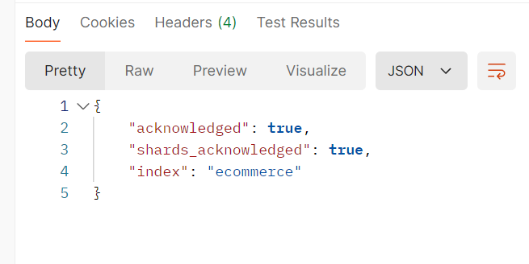
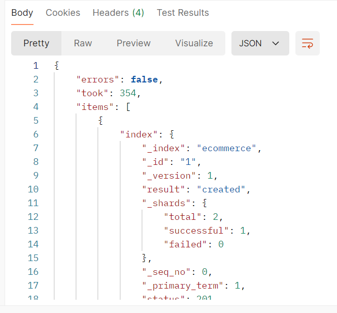

### 2.2 18题

> 语句
> get /ecommerce/_search

#### 2.2.1 统计每个产品类别的总销售额

```json
{
    "aggs":{
        "categories":{
            "terms":{
                "filed":"product_category",
                "size":100
            },
            "aggs":{
                "total_price":{
                    "sum":{
                        "filed":"total_amount"
                    }
                }
            }
        }
    }
}
```

> 成功代码

```json
{
    "took": 11,
    "timed_out": false,
    "_shards": {
        "total": 1,
        "successful": 1,
        "skipped": 0,
        "failed": 0
    },
    "hits": {
        "total": {
            "value": 100,
            "relation": "eq"
        },
        "max_score": 1.0,
        "hits": [
            {
                "_index": "ecommerce",
                "_id": "1",
                "_score": 1.0,
                "_source": {
                    "order_id": "6945",
                    "order_date": "2023-03-06",
                    "customer_id": "C242",
                    "customer_name": "Bob Smith",
                    "customer_gender": "female",
                    "customer_age": 60,
                    "customer_city": "Philadelphia",
                    "product_id": "P041",
                    "product_name": "Pro Accessory",
                    "product_category": "Sports",
                    "quantity": 4,
                    "price": 205.89,
                    "total_amount": 823.56,
                    "payment_method": "Credit Card",
                    "is_returned": false
                }
            },
            {
                "_index": "ecommerce",
                "_id": "2",
                "_score": 1.0,
                "_source": {
                    "order_id": "5629",
                    "order_date": "2023-11-14",
                    "customer_id": "C262",
                    "customer_name": "Frank Garcia",
                    "customer_gender": "female",
                    "customer_age": 52,
                    "customer_city": "Dallas",
                    "product_id": "P097",
                    "product_name": "Ultra Accessory",
                    "product_category": "Sports",
                    "quantity": 3,
                    "price": 475.18,
                    "total_amount": 1425.54,
                    "payment_method": "Debit Card",
                    "is_returned": true
                }
            },
            {
                "_index": "ecommerce",
                "_id": "3",
                "_score": 1.0,
                "_source": {
                    "order_id": "4488",
                    "order_date": "2023-03-28",
                    "customer_id": "C342",
                    "customer_name": "Frank Garcia",
                    "customer_gender": "female",
                    "customer_age": 62,
                    "customer_city": "New York",
                    "product_id": "P001",
                    "product_name": "Ultra Device",
                    "product_category": "Books",
                    "quantity": 5,
                    "price": 722.89,
                    "total_amount": 3614.45,
                    "payment_method": "Credit Card",
                    "is_returned": false
                }
            },
            {
                "_index": "ecommerce",
                "_id": "4",
                "_score": 1.0,
                "_source": {
                    "order_id": "7960",
                    "order_date": "2023-09-23",
                    "customer_id": "C408",
                    "customer_name": "Eva Johnson",
                    "customer_gender": "male",
                    "customer_age": 37,
                    "customer_city": "San Antonio",
                    "product_id": "P079",
                    "product_name": "Ultra Accessory",
                    "product_category": "Home Appliances",
                    "quantity": 2,
                    "price": 485.3,
                    "total_amount": 970.6,
                    "payment_method": "Cash on Delivery",
                    "is_returned": false
                }
            },
            {
                "_index": "ecommerce",
                "_id": "5",
                "_score": 1.0,
                "_source": {
                    "order_id": "2111",
                    "order_date": "2023-02-18",
                    "customer_id": "C981",
                    "customer_name": "Eva Garcia",
                    "customer_gender": "female",
                    "customer_age": 19,
                    "customer_city": "Los Angeles",
                    "product_id": "P091",
                    "product_name": "Mega Widget",
                    "product_category": "Books",
                    "quantity": 5,
                    "price": 61.52,
                    "total_amount": 307.6,
                    "payment_method": "Debit Card",
                    "is_returned": false
                }
            },
            {
                "_index": "ecommerce",
                "_id": "6",
                "_score": 1.0,
                "_source": {
                    "order_id": "2121",
                    "order_date": "2023-01-10",
                    "customer_id": "C030",
                    "customer_name": "Jack Davis",
                    "customer_gender": "male",
                    "customer_age": 18,
                    "customer_city": "Chicago",
                    "product_id": "P070",
                    "product_name": "Ultra Tool",
                    "product_category": "Home Appliances",
                    "quantity": 3,
                    "price": 860.58,
                    "total_amount": 2581.74,
                    "payment_method": "Debit Card",
                    "is_returned": true
                }
            },
            {
                "_index": "ecommerce",
                "_id": "7",
                "_score": 1.0,
                "_source": {
                    "order_id": "1211",
                    "order_date": "2023-07-06",
                    "customer_id": "C672",
                    "customer_name": "Jack Williams",
                    "customer_gender": "female",
                    "customer_age": 64,
                    "customer_city": "San Diego",
                    "product_id": "P092",
                    "product_name": "Mega Device",
                    "product_category": "Electronics",
                    "quantity": 4,
                    "price": 389.1,
                    "total_amount": 1556.4,
                    "payment_method": "Cash on Delivery",
                    "is_returned": true
                }
            },
            {
                "_index": "ecommerce",
                "_id": "8",
                "_score": 1.0,
                "_source": {
                    "order_id": "7394",
                    "order_date": "2023-08-15",
                    "customer_id": "C719",
                    "customer_name": "Frank Rodriguez",
                    "customer_gender": "female",
                    "customer_age": 59,
                    "customer_city": "San Diego",
                    "product_id": "P083",
                    "product_name": "Super Device",
                    "product_category": "Beauty",
                    "quantity": 2,
                    "price": 593.15,
                    "total_amount": 1186.3,
                    "payment_method": "Credit Card",
                    "is_returned": true
                }
            },
            {
                "_index": "ecommerce",
                "_id": "9",
                "_score": 1.0,
                "_source": {
                    "order_id": "7593",
                    "order_date": "2023-07-22",
                    "customer_id": "C145",
                    "customer_name": "Bob Johnson",
                    "customer_gender": "female",
                    "customer_age": 33,
                    "customer_city": "Dallas",
                    "product_id": "P031",
                    "product_name": "Pro Tool",
                    "product_category": "Furniture",
                    "quantity": 3,
                    "price": 740.32,
                    "total_amount": 2220.96,
                    "payment_method": "PayPal",
                    "is_returned": false
                }
            },
            {
                "_index": "ecommerce",
                "_id": "10",
                "_score": 1.0,
                "_source": {
                    "order_id": "3304",
                    "order_date": "2023-03-03",
                    "customer_id": "C111",
                    "customer_name": "Jack Jones",
                    "customer_gender": "female",
                    "customer_age": 53,
                    "customer_city": "Chicago",
                    "product_id": "P027",
                    "product_name": "Elite Device",
                    "product_category": "Jewelry",
                    "quantity": 1,
                    "price": 489.24,
                    "total_amount": 489.24,
                    "payment_method": "Credit Card",
                    "is_returned": true
                }
            }
        ]
    },
    "aggregations": {
        "categories": {
            "doc_count_error_upper_bound": 0,
            "sum_other_doc_count": 0,
            "buckets": [
                {
                    "key": "Jewelry",
                    "doc_count": 14,
                    "total_price": {
                        "value": 17477.37028503418
                    }
                },
                {
                    "key": "Electronics",
                    "doc_count": 13,
                    "total_price": {
                        "value": 18941.559997558594
                    }
                },
                {
                    "key": "Home Appliances",
                    "doc_count": 13,
                    "total_price": {
                        "value": 25865.190231323242
                    }
                },
                {
                    "key": "Beauty",
                    "doc_count": 11,
                    "total_price": {
                        "value": 22708.94012451172
                    }
                },
                {
                    "key": "Furniture",
                    "doc_count": 10,
                    "total_price": {
                        "value": 17228.31996154785
                    }
                },
                {
                    "key": "Books",
                    "doc_count": 9,
                    "total_price": {
                        "value": 11878.820098876953
                    }
                },
                {
                    "key": "Groceries",
                    "doc_count": 9,
                    "total_price": {
                        "value": 16172.980072021484
                    }
                },
                {
                    "key": "Fashion",
                    "doc_count": 8,
                    "total_price": {
                        "value": 7073.110048294067
                    }
                },
                {
                    "key": "Toys",
                    "doc_count": 7,
                    "total_price": {
                        "value": 10528.830047607422
                    }
                },
                {
                    "key": "Sports",
                    "doc_count": 6,
                    "total_price": {
                        "value": 13250.500122070312
                    }
                }
            ]
        }
    }
}
```

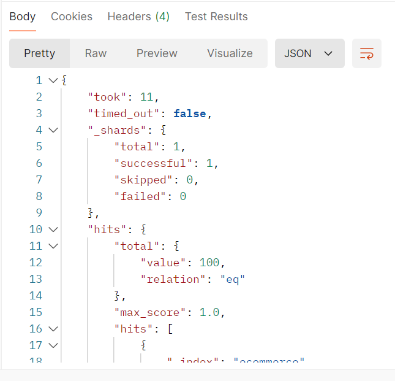

#### 2.2.2 计算每个城市的平均订单金额。

> 代码

```json
{
    "aggs":{
        "cities":{
            "terms":{
                "field":"customer_city",
                "size":100
            },
            "aggs":{
                "avg_price":{
                    "avg":{
                        "field":"total_amount"
                    }
                }
            }
        }
    }
}
```

> 成功代码

```json
{
    "took": 19,
    "timed_out": false,
    "_shards": {
        "total": 1,
        "successful": 1,
        "skipped": 0,
        "failed": 0
    },
    "hits": {
        "total": {
            "value": 100,
            "relation": "eq"
        },
        "max_score": 1.0,
        "hits": [
            {
                "_index": "ecommerce",
                "_id": "1",
                "_score": 1.0,
                "_source": {
                    "order_id": "6945",
                    "order_date": "2023-03-06",
                    "customer_id": "C242",
                    "customer_name": "Bob Smith",
                    "customer_gender": "female",
                    "customer_age": 60,
                    "customer_city": "Philadelphia",
                    "product_id": "P041",
                    "product_name": "Pro Accessory",
                    "product_category": "Sports",
                    "quantity": 4,
                    "price": 205.89,
                    "total_amount": 823.56,
                    "payment_method": "Credit Card",
                    "is_returned": false
                }
            },
            {
                "_index": "ecommerce",
                "_id": "2",
                "_score": 1.0,
                "_source": {
                    "order_id": "5629",
                    "order_date": "2023-11-14",
                    "customer_id": "C262",
                    "customer_name": "Frank Garcia",
                    "customer_gender": "female",
                    "customer_age": 52,
                    "customer_city": "Dallas",
                    "product_id": "P097",
                    "product_name": "Ultra Accessory",
                    "product_category": "Sports",
                    "quantity": 3,
                    "price": 475.18,
                    "total_amount": 1425.54,
                    "payment_method": "Debit Card",
                    "is_returned": true
                }
            },
            {
                "_index": "ecommerce",
                "_id": "3",
                "_score": 1.0,
                "_source": {
                    "order_id": "4488",
                    "order_date": "2023-03-28",
                    "customer_id": "C342",
                    "customer_name": "Frank Garcia",
                    "customer_gender": "female",
                    "customer_age": 62,
                    "customer_city": "New York",
                    "product_id": "P001",
                    "product_name": "Ultra Device",
                    "product_category": "Books",
                    "quantity": 5,
                    "price": 722.89,
                    "total_amount": 3614.45,
                    "payment_method": "Credit Card",
                    "is_returned": false
                }
            },
            {
                "_index": "ecommerce",
                "_id": "4",
                "_score": 1.0,
                "_source": {
                    "order_id": "7960",
                    "order_date": "2023-09-23",
                    "customer_id": "C408",
                    "customer_name": "Eva Johnson",
                    "customer_gender": "male",
                    "customer_age": 37,
                    "customer_city": "San Antonio",
                    "product_id": "P079",
                    "product_name": "Ultra Accessory",
                    "product_category": "Home Appliances",
                    "quantity": 2,
                    "price": 485.3,
                    "total_amount": 970.6,
                    "payment_method": "Cash on Delivery",
                    "is_returned": false
                }
            },
            {
                "_index": "ecommerce",
                "_id": "5",
                "_score": 1.0,
                "_source": {
                    "order_id": "2111",
                    "order_date": "2023-02-18",
                    "customer_id": "C981",
                    "customer_name": "Eva Garcia",
                    "customer_gender": "female",
                    "customer_age": 19,
                    "customer_city": "Los Angeles",
                    "product_id": "P091",
                    "product_name": "Mega Widget",
                    "product_category": "Books",
                    "quantity": 5,
                    "price": 61.52,
                    "total_amount": 307.6,
                    "payment_method": "Debit Card",
                    "is_returned": false
                }
            },
            {
                "_index": "ecommerce",
                "_id": "6",
                "_score": 1.0,
                "_source": {
                    "order_id": "2121",
                    "order_date": "2023-01-10",
                    "customer_id": "C030",
                    "customer_name": "Jack Davis",
                    "customer_gender": "male",
                    "customer_age": 18,
                    "customer_city": "Chicago",
                    "product_id": "P070",
                    "product_name": "Ultra Tool",
                    "product_category": "Home Appliances",
                    "quantity": 3,
                    "price": 860.58,
                    "total_amount": 2581.74,
                    "payment_method": "Debit Card",
                    "is_returned": true
                }
            },
            {
                "_index": "ecommerce",
                "_id": "7",
                "_score": 1.0,
                "_source": {
                    "order_id": "1211",
                    "order_date": "2023-07-06",
                    "customer_id": "C672",
                    "customer_name": "Jack Williams",
                    "customer_gender": "female",
                    "customer_age": 64,
                    "customer_city": "San Diego",
                    "product_id": "P092",
                    "product_name": "Mega Device",
                    "product_category": "Electronics",
                    "quantity": 4,
                    "price": 389.1,
                    "total_amount": 1556.4,
                    "payment_method": "Cash on Delivery",
                    "is_returned": true
                }
            },
            {
                "_index": "ecommerce",
                "_id": "8",
                "_score": 1.0,
                "_source": {
                    "order_id": "7394",
                    "order_date": "2023-08-15",
                    "customer_id": "C719",
                    "customer_name": "Frank Rodriguez",
                    "customer_gender": "female",
                    "customer_age": 59,
                    "customer_city": "San Diego",
                    "product_id": "P083",
                    "product_name": "Super Device",
                    "product_category": "Beauty",
                    "quantity": 2,
                    "price": 593.15,
                    "total_amount": 1186.3,
                    "payment_method": "Credit Card",
                    "is_returned": true
                }
            },
            {
                "_index": "ecommerce",
                "_id": "9",
                "_score": 1.0,
                "_source": {
                    "order_id": "7593",
                    "order_date": "2023-07-22",
                    "customer_id": "C145",
                    "customer_name": "Bob Johnson",
                    "customer_gender": "female",
                    "customer_age": 33,
                    "customer_city": "Dallas",
                    "product_id": "P031",
                    "product_name": "Pro Tool",
                    "product_category": "Furniture",
                    "quantity": 3,
                    "price": 740.32,
                    "total_amount": 2220.96,
                    "payment_method": "PayPal",
                    "is_returned": false
                }
            },
            {
                "_index": "ecommerce",
                "_id": "10",
                "_score": 1.0,
                "_source": {
                    "order_id": "3304",
                    "order_date": "2023-03-03",
                    "customer_id": "C111",
                    "customer_name": "Jack Jones",
                    "customer_gender": "female",
                    "customer_age": 53,
                    "customer_city": "Chicago",
                    "product_id": "P027",
                    "product_name": "Elite Device",
                    "product_category": "Jewelry",
                    "quantity": 1,
                    "price": 489.24,
                    "total_amount": 489.24,
                    "payment_method": "Credit Card",
                    "is_returned": true
                }
            }
        ]
    },
    "aggregations": {
        "cities": {
            "doc_count_error_upper_bound": 0,
            "sum_other_doc_count": 0,
            "buckets": [
                {
                    "key": "Los Angeles",
                    "doc_count": 13,
                    "avg_price": {
                        "value": 1482.7977142333984
                    }
                },
                {
                    "key": "San Diego",
                    "doc_count": 13,
                    "avg_price": {
                        "value": 1878.4761915940505
                    }
                },
                {
                    "key": "San Jose",
                    "doc_count": 12,
                    "avg_price": {
                        "value": 1587.2216771443684
                    }
                },
                {
                    "key": "Philadelphia",
                    "doc_count": 11,
                    "avg_price": {
                        "value": 1370.19365345348
                    }
                },
                {
                    "key": "New York",
                    "doc_count": 10,
                    "avg_price": {
                        "value": 1801.9510040283203
                    }
                },
                {
                    "key": "Chicago",
                    "doc_count": 9,
                    "avg_price": {
                        "value": 1062.1610989040798
                    }
                },
                {
                    "key": "Houston",
                    "doc_count": 9,
                    "avg_price": {
                        "value": 1735.199978298611
                    }
                },
                {
                    "key": "Dallas",
                    "doc_count": 8,
                    "avg_price": {
                        "value": 1291.8024978637695
                    }
                },
                {
                    "key": "Phoenix",
                    "doc_count": 8,
                    "avg_price": {
                        "value": 2315.7625274658203
                    }
                },
                {
                    "key": "San Antonio",
                    "doc_count": 7,
                    "avg_price": {
                        "value": 1607.7128516605922
                    }
                }
            ]
        }
    }
}
```

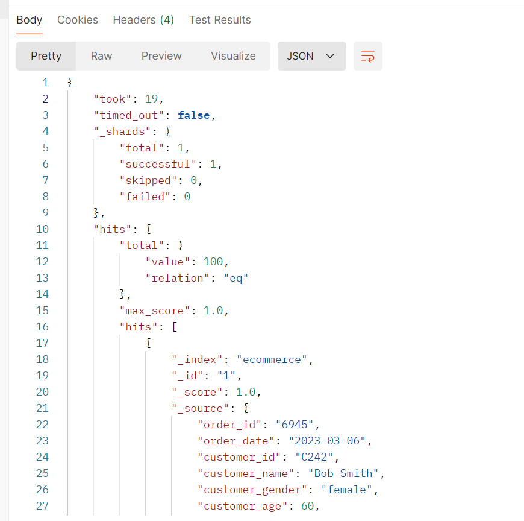

#### 2.2.3 找出销量最高的前5个产品。

>代码

```json
{
    "size":0,
    "aggs":{
        "top5_products":{
            "terms":{
                "field":"product_name",
                "size":5,
                "order":{
                    "sum_products":"asc"
                }
            },
            "aggs":{
                "sum_products":{
                    "sum":{
                        "field":"total_amount"
                    }
                }
        }
    }
}
}
```

>成功代码

```json
{
    "took": 47,
    "timed_out": false,
    "_shards": {
        "total": 1,
        "successful": 1,
        "skipped": 0,
        "failed": 0
    },
    "hits": {
        "total": {
            "value": 100,
            "relation": "eq"
        },
        "max_score": null,
        "hits": []
    },
    "aggregations": {
        "top5_products": {
            "doc_count_error_upper_bound": -1,
            "sum_other_doc_count": 92,
            "buckets": [
                {
                    "key": "Mega Gadget",
                    "doc_count": 1,
                    "sum_products": {
                        "value": 582.0399780273438
                    }
                },
                {
                    "key": "Pro Device",
                    "doc_count": 1,
                    "sum_products": {
                        "value": 597.280029296875
                    }
                },
                {
                    "key": "Pro Accessory",
                    "doc_count": 1,
                    "sum_products": {
                        "value": 823.5599975585938
                    }
                },
                {
                    "key": "Mega Widget",
                    "doc_count": 3,
                    "sum_products": {
                        "value": 1138.3100128173828
                    }
                },
                {
                    "key": "Mega Accessory",
                    "doc_count": 2,
                    "sum_products": {
                        "value": 1814.320068359375
                    }
                }
            ]
        }
    }
}
```

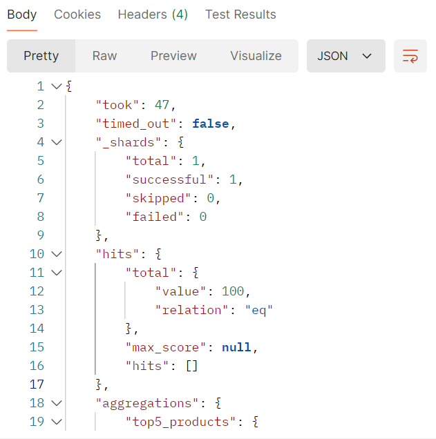

#### 2.2.4 计算男性和女性客户的平均年龄。

>代码

```json
{
    "size":0,
    "aggs":{
        "gender_classification":{
            "terms":{
                "field":"customer_gender"
            },
            "aggs":{
                "avg_age_gender":{
                    "avg":{
                        "field":"total_amount"
                    }
                }
            }
        }
    }
}
```

>成功代码

```json
{
    "took": 7,
    "timed_out": false,
    "_shards": {
        "total": 1,
        "successful": 1,
        "skipped": 0,
        "failed": 0
    },
    "hits": {
        "total": {
            "value": 100,
            "relation": "eq"
        },
        "max_score": null,
        "hits": []
    },
    "aggregations": {
        "gender_classification": {
            "doc_count_error_upper_bound": 0,
            "sum_other_doc_count": 0,
            "buckets": [
                {
                    "key": "male",
                    "doc_count": 55,
                    "avg_age_gender": {
                        "value": 1798.5043728915127
                    }
                },
                {
                    "key": "female",
                    "doc_count": 45,
                    "avg_age_gender": {
                        "value": 1382.397343995836
                    }
                }
            ]
        }
    }
}
```

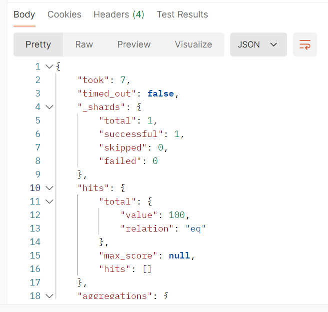

#### 2.2.5 统计每种支付方式的使用次数和总金额

>代码

```json
{
    "size":0,
    "aggs":{
        "payment_way":{
            "terms":{
                "field":"payment_method"
            },
            "aggs":{
                "sum_count_used":{
                    "value_count":{
                        "field":"payment_method"
                    }
                },
                "sum_amount_pay":{
                    "sum":{
                        "field":"total_amount"
                    }
                }
            }
        }
    }
}
```

>成功代码

```json
{
    "took": 17,
    "timed_out": false,
    "_shards": {
        "total": 1,
        "successful": 1,
        "skipped": 0,
        "failed": 0
    },
    "hits": {
        "total": {
            "value": 100,
            "relation": "eq"
        },
        "max_score": null,
        "hits": []
    },
    "aggregations": {
        "payment_way": {
            "doc_count_error_upper_bound": 0,
            "sum_other_doc_count": 0,
            "buckets": [
                {
                    "key": "Cash on Delivery",
                    "doc_count": 29,
                    "sum_count_used": {
                        "value": 29
                    },
                    "sum_amount_pay": {
                        "value": 38746.55044555664
                    }
                },
                {
                    "key": "Debit Card",
                    "doc_count": 29,
                    "sum_count_used": {
                        "value": 29
                    },
                    "sum_amount_pay": {
                        "value": 48975.19040107727
                    }
                },
                {
                    "key": "Credit Card",
                    "doc_count": 22,
                    "sum_count_used": {
                        "value": 22
                    },
                    "sum_amount_pay": {
                        "value": 36358.470153808594
                    }
                },
                {
                    "key": "PayPal",
                    "doc_count": 20,
                    "sum_count_used": {
                        "value": 20
                    },
                    "sum_amount_pay": {
                        "value": 37045.40998840332
                    }
                }
            ]
        }
    }
}
```

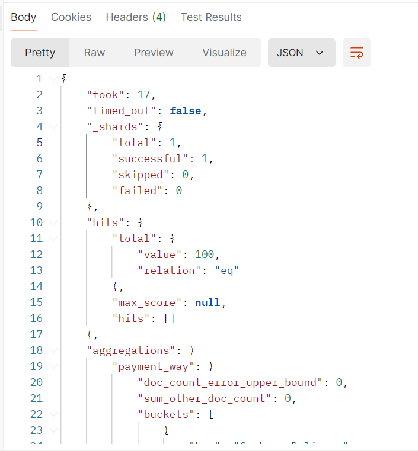

#### 2.2.6 计算每月的总销售额

>代码

```json
{
    "size":0,
    "aggs":{
        "sum_products_sales":{
            "date_histogram":{
                "field":"order_date",
                "calendar_interval":"1M",
                "format":"yyyy-MM-dd"
            },
            "aggs":{
                "sum_pay":{
                    "sum":{
                        "field":"total_amount"
                    }
                }
            }
        }
    }
}
```

>成功代码

```json
{
    "took": 444,
    "timed_out": false,
    "_shards": {
        "total": 1,
        "successful": 1,
        "skipped": 0,
        "failed": 0
    },
    "hits": {
        "total": {
            "value": 100,
            "relation": "eq"
        },
        "max_score": null,
        "hits": []
    },
    "aggregations": {
        "sum_products_sales": {
            "buckets": [
                {
                    "key_as_string": "2023-01-01",
                    "key": 1672531200000,
                    "doc_count": 12,
                    "sum_pay": {
                        "value": 24381.61993408203
                    }
                },
                {
                    "key_as_string": "2023-02-01",
                    "key": 1675209600000,
                    "doc_count": 11,
                    "sum_pay": {
                        "value": 18870.850006103516
                    }
                },
                {
                    "key_as_string": "2023-03-01",
                    "key": 1677628800000,
                    "doc_count": 10,
                    "sum_pay": {
                        "value": 17959.33026123047
                    }
                },
                {
                    "key_as_string": "2023-04-01",
                    "key": 1680307200000,
                    "doc_count": 9,
                    "sum_pay": {
                        "value": 18775.959869384766
                    }
                },
                {
                    "key_as_string": "2023-05-01",
                    "key": 1682899200000,
                    "doc_count": 10,
                    "sum_pay": {
                        "value": 11713.169967651367
                    }
                },
                {
                    "key_as_string": "2023-06-01",
                    "key": 1685577600000,
                    "doc_count": 9,
                    "sum_pay": {
                        "value": 6771.1600341796875
                    }
                },
                {
                    "key_as_string": "2023-07-01",
                    "key": 1688169600000,
                    "doc_count": 7,
                    "sum_pay": {
                        "value": 9110.010131835938
                    }
                },
                {
                    "key_as_string": "2023-08-01",
                    "key": 1690848000000,
                    "doc_count": 8,
                    "sum_pay": {
                        "value": 12135.870210647583
                    }
                },
                {
                    "key_as_string": "2023-09-01",
                    "key": 1693526400000,
                    "doc_count": 3,
                    "sum_pay": {
                        "value": 8615.500122070312
                    }
                },
                {
                    "key_as_string": "2023-10-01",
                    "key": 1696118400000,
                    "doc_count": 6,
                    "sum_pay": {
                        "value": 12106.000183105469
                    }
                },
                {
                    "key_as_string": "2023-11-01",
                    "key": 1698796800000,
                    "doc_count": 6,
                    "sum_pay": {
                        "value": 8176.529968261719
                    }
                },
                {
                    "key_as_string": "2023-12-01",
                    "key": 1701388800000,
                    "doc_count": 9,
                    "sum_pay": {
                        "value": 12509.620300292969
                    }
                }
            ]
        }
    }
}
```

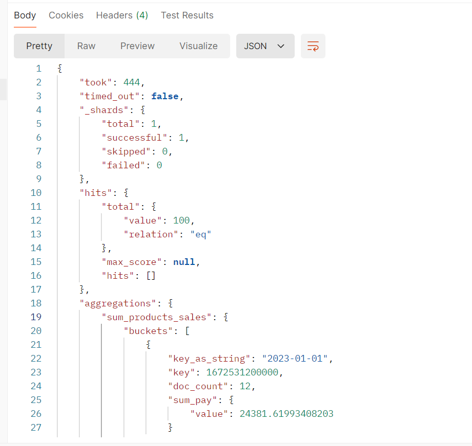

#### 2.2.7 找出平均订单金额最高的前3个客户

>代码

```json
{
    "size":0,
    "aggs":{
        "top3_customers":{
            "terms":{
                "field":"customer_name",
                "size":3,
                "order":{
                    "avg_amount":"desc"
                }
            },
                "aggs":{
                    "avg_amount":{
                        "avg":{
                            "field":"total_amount"
                        }
                    }
                }
        }
    }
}
```

>成功代码

```json
{
    "took": 56,
    "timed_out": false,
    "_shards": {
        "total": 1,
        "successful": 1,
        "skipped": 0,
        "failed": 0
    },
    "hits": {
        "total": {
            "value": 100,
            "relation": "eq"
        },
        "max_score": null,
        "hits": []
    },
    "aggregations": {
        "top3_customers": {
            "doc_count_error_upper_bound": -1,
            "sum_other_doc_count": 93,
            "buckets": [
                {
                    "key": "Eva Rodriguez",
                    "doc_count": 1,
                    "avg_amount": {
                        "value": 3557.199951171875
                    }
                },
                {
                    "key": "Charlie Rodriguez",
                    "doc_count": 2,
                    "avg_amount": {
                        "value": 3538.47509765625
                    }
                },
                {
                    "key": "Grace Martinez",
                    "doc_count": 4,
                    "avg_amount": {
                        "value": 3227.345085144043
                    }
                }
            ]
        }
    }
}
```

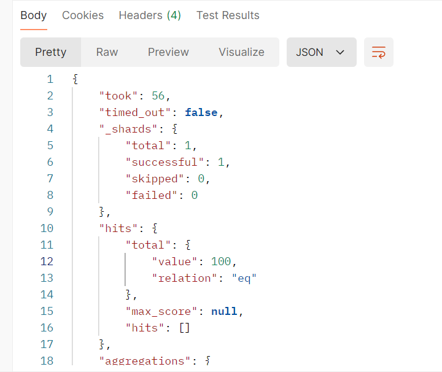

#### 2.2.8 计算每个年龄段（18-30，31-50，51+）的客户数量

>代码

```json
{
    "size":0,
    "aggs":{
        "range_count":{
            "range":{
                "field":"customer_age",
                "ranges":[
                    {"from":18,"to":30},
                    {"from":31,"to":50},
                    {"from":51}
                ]
            },
            "aggs":{
                "total_customer_count":{
                    "cardinality":{
                        "field":"customer_id"
                    }
                }
            }
        }
    }
}
```

>成功代码

```json
{
    "took": 119,
    "timed_out": false,
    "_shards": {
        "total": 1,
        "successful": 1,
        "skipped": 0,
        "failed": 0
    },
    "hits": {
        "total": {
            "value": 100,
            "relation": "eq"
        },
        "max_score": null,
        "hits": []
    },
    "aggregations": {
        "range_count": {
            "buckets": [
                {
                    "key": "18.0-30.0",
                    "from": 18.0,
                    "to": 30.0,
                    "doc_count": 24,
                    "total_customer_count": {
                        "value": 24
                    }
                },
                {
                    "key": "31.0-50.0",
                    "from": 31.0,
                    "to": 50.0,
                    "doc_count": 31,
                    "total_customer_count": {
                        "value": 30
                    }
                },
                {
                    "key": "51.0-*",
                    "from": 51.0,
                    "doc_count": 42,
                    "total_customer_count": {
                        "value": 42
                    }
                }
            ]
        }
    }
}
```

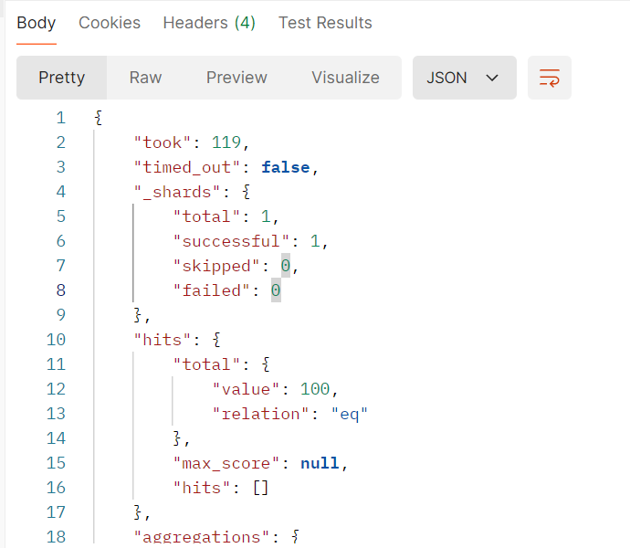

#### 2.2.9 计算每个产品类别的平均单价

>代码

```json
{
    "size":0,
    "aggs":{
        "categories":{
            "terms":{
                "field":"product_category"
            },
            "aggs":{            
                "avg_category":{
                    "avg":{
                     "field":"total_amount"
                    }
                }
            }    
        }
    }
}
```

>成功代码

```json
{
    "took": 104,
    "timed_out": false,
    "_shards": {
        "total": 1,
        "successful": 1,
        "skipped": 0,
        "failed": 0
    },
    "hits": {
        "total": {
            "value": 100,
            "relation": "eq"
        },
        "max_score": null,
        "hits": []
    },
    "aggregations": {
        "categories": {
            "doc_count_error_upper_bound": 0,
            "sum_other_doc_count": 0,
            "buckets": [
                {
                    "key": "Jewelry",
                    "doc_count": 14,
                    "avg_category": {
                        "value": 1248.3835917881556
                    }
                },
                {
                    "key": "Electronics",
                    "doc_count": 13,
                    "avg_category": {
                        "value": 1457.0430767352764
                    }
                },
                {
                    "key": "Home Appliances",
                    "doc_count": 13,
                    "avg_category": {
                        "value": 1989.6300177940955
                    }
                },
                {
                    "key": "Beauty",
                    "doc_count": 11,
                    "avg_category": {
                        "value": 2064.4491022283382
                    }
                },
                {
                    "key": "Furniture",
                    "doc_count": 10,
                    "avg_category": {
                        "value": 1722.8319961547852
                    }
                },
                {
                    "key": "Books",
                    "doc_count": 9,
                    "avg_category": {
                        "value": 1319.868899875217
                    }
                },
                {
                    "key": "Groceries",
                    "doc_count": 9,
                    "avg_category": {
                        "value": 1796.997785780165
                    }
                },
                {
                    "key": "Fashion",
                    "doc_count": 8,
                    "avg_category": {
                        "value": 884.1387560367584
                    }
                },
                {
                    "key": "Toys",
                    "doc_count": 7,
                    "avg_category": {
                        "value": 1504.1185782296318
                    }
                },
                {
                    "key": "Sports",
                    "doc_count": 6,
                    "avg_category": {
                        "value": 2208.4166870117188
                    }
                }
            ]
        }
    }
}
```

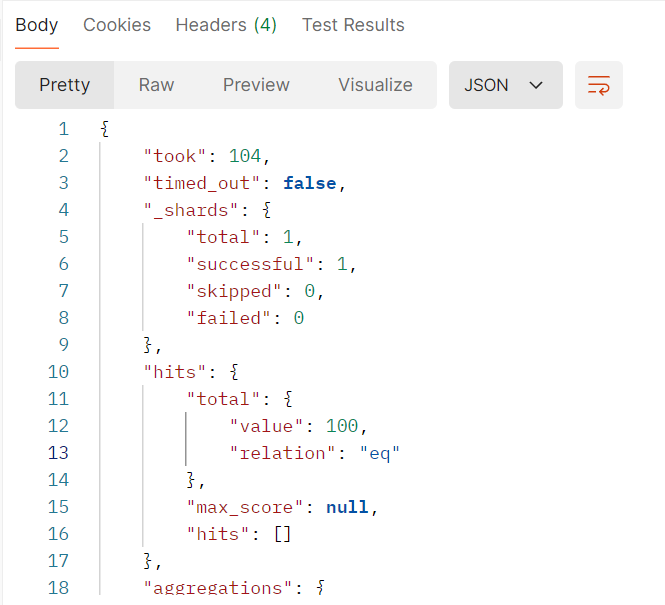

#### 2.2.10 找出订单数量最多的前5个城市

>代码
```json
{
    "size":0,
    "aggs":{
        "top5_city_sales":{
            "terms":{
                "field":"customer_city",
                "size":5,
                "order":{
                    "sales_count":"asc"
                }
            },
            "aggs":{
                "sales_count":{
                    "value_count":{
                        "field":"order_id"
                    }
                }
            }
        }
    }
}
```

>成功代码

```json
{
    "took": 9,
    "timed_out": false,
    "_shards": {
        "total": 1,
        "successful": 1,
        "skipped": 0,
        "failed": 0
    },
    "hits": {
        "total": {
            "value": 100,
            "relation": "eq"
        },
        "max_score": null,
        "hits": []
    },
    "aggregations": {
        "top5_city_sales": {
            "doc_count_error_upper_bound": 0,
            "sum_other_doc_count": 59,
            "buckets": [
                {
                    "key": "San Antonio",
                    "doc_count": 7,
                    "sales_count": {
                        "value": 7
                    }
                },
                {
                    "key": "Dallas",
                    "doc_count": 8,
                    "sales_count": {
                        "value": 8
                    }
                },
                {
                    "key": "Phoenix",
                    "doc_count": 8,
                    "sales_count": {
                        "value": 8
                    }
                },
                {
                    "key": "Chicago",
                    "doc_count": 9,
                    "sales_count": {
                        "value": 9
                    }
                },
                {
                    "key": "Houston",
                    "doc_count": 9,
                    "sales_count": {
                        "value": 9
                    }
                }
            ]
        }
    }
}
```

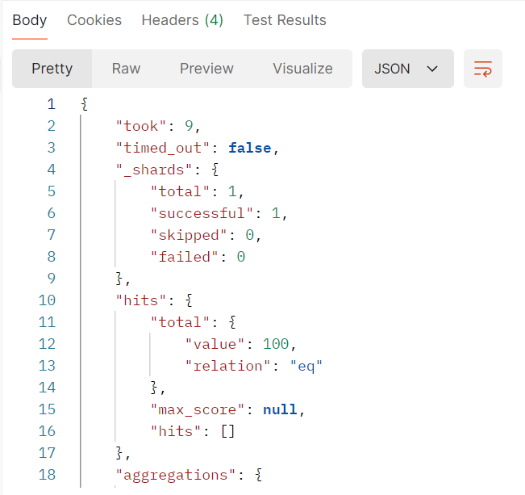

#### 2.2.11 计算每个季度的平均订单金额

>代码

```json
{
    "size":0,
    "aggs":{
        "season":{
            "date_histogram":{
                "field":"order_date",
                "calendar_interval":"1q",
                "format":"yyyy-MM-dd"
            },
            "aggs":{
                "avg_season_sales":{
                    "avg":{
                        "field":"total_amount"
                    }
                }
            }
        }
    }
}
```

>成功代码

```json
{
    "took": 113,
    "timed_out": false,
    "_shards": {
        "total": 1,
        "successful": 1,
        "skipped": 0,
        "failed": 0
    },
    "hits": {
        "total": {
            "value": 100,
            "relation": "eq"
        },
        "max_score": null,
        "hits": []
    },
    "aggregations": {
        "season": {
            "buckets": [
                {
                    "key_as_string": "2023-01-01",
                    "key": 1672531200000,
                    "doc_count": 33,
                    "avg_season_sales": {
                        "value": 1854.9030364065459
                    }
                },
                {
                    "key_as_string": "2023-04-01",
                    "key": 1680307200000,
                    "doc_count": 28,
                    "avg_season_sales": {
                        "value": 1330.724638257708
                    }
                },
                {
                    "key_as_string": "2023-07-01",
                    "key": 1688169600000,
                    "doc_count": 18,
                    "avg_season_sales": {
                        "value": 1658.9655813641018
                    }
                },
                {
                    "key_as_string": "2023-10-01",
                    "key": 1696118400000,
                    "doc_count": 21,
                    "avg_season_sales": {
                        "value": 1561.530973888579
                    }
                }
            ]
        }
    }
}
```

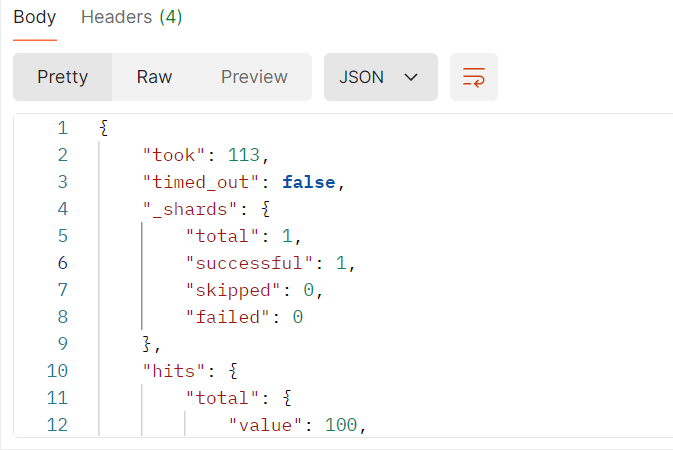

#### 2.2.12 统计每个产品类别中的商品数量

>代码

```json
{
    "size":0,
    "aggs":{
        "every_category":{
            "terms":{
                "field":"product_category"
            },
            "aggs":{
                "count_products":{
                    "value_count":{
                        "field":"product_name"
                    }
                }
            }
        }
    }
}
```

>成功代码

```json
{
    "took": 73,
    "timed_out": false,
    "_shards": {
        "total": 1,
        "successful": 1,
        "skipped": 0,
        "failed": 0
    },
    "hits": {
        "total": {
            "value": 100,
            "relation": "eq"
        },
        "max_score": null,
        "hits": []
    },
    "aggregations": {
        "every_category": {
            "doc_count_error_upper_bound": 0,
            "sum_other_doc_count": 0,
            "buckets": [
                {
                    "key": "Jewelry",
                    "doc_count": 14,
                    "count_products": {
                        "value": 14
                    }
                },
                {
                    "key": "Electronics",
                    "doc_count": 13,
                    "count_products": {
                        "value": 13
                    }
                },
                {
                    "key": "Home Appliances",
                    "doc_count": 13,
                    "count_products": {
                        "value": 13
                    }
                },
                {
                    "key": "Beauty",
                    "doc_count": 11,
                    "count_products": {
                        "value": 11
                    }
                },
                {
                    "key": "Furniture",
                    "doc_count": 10,
                    "count_products": {
                        "value": 10
                    }
                },
                {
                    "key": "Books",
                    "doc_count": 9,
                    "count_products": {
                        "value": 9
                    }
                },
                {
                    "key": "Groceries",
                    "doc_count": 9,
                    "count_products": {
                        "value": 9
                    }
                },
                {
                    "key": "Fashion",
                    "doc_count": 8,
                    "count_products": {
                        "value": 8
                    }
                },
                {
                    "key": "Toys",
                    "doc_count": 7,
                    "count_products": {
                        "value": 7
                    }
                },
                {
                    "key": "Sports",
                    "doc_count": 6,
                    "count_products": {
                        "value": 6
                    }
                }
            ]
        }
    }
}
```

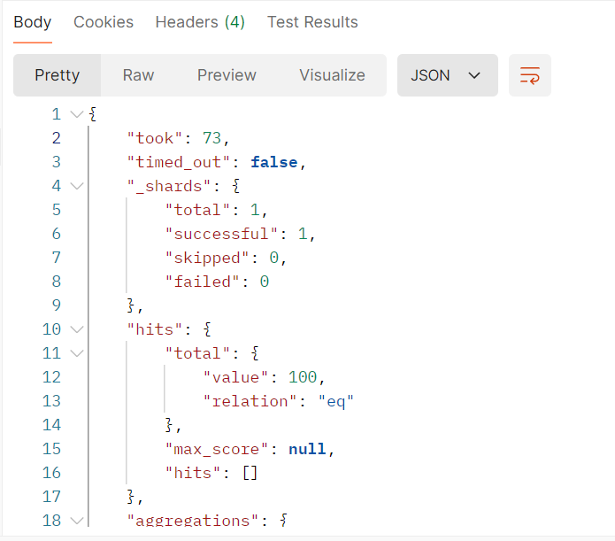

#### 2.2.13 计算男性和女性客户的平均订单金额

>代码

```json
{
    "size":0,
    "aggs":{
        "avg_gender_sales":{
            "terms":{
                "field":"customer_gender"
            },
            "aggs":{
                "avg_order_amount":{
                    "avg":{
                        "field":"total_amount"
                    }
                }
            }
        }
    }
}
```

>成功代码

```json
{
    "took": 72,
    "timed_out": false,
    "_shards": {
        "total": 1,
        "successful": 1,
        "skipped": 0,
        "failed": 0
    },
    "hits": {
        "total": {
            "value": 100,
            "relation": "eq"
        },
        "max_score": null,
        "hits": []
    },
    "aggregations": {
        "avg_gender_sales": {
            "doc_count_error_upper_bound": 0,
            "sum_other_doc_count": 0,
            "buckets": [
                {
                    "key": "male",
                    "doc_count": 55,
                    "avg_order_amount": {
                        "value": 1798.5043728915127
                    }
                },
                {
                    "key": "female",
                    "doc_count": 45,
                    "avg_order_amount": {
                        "value": 1382.397343995836
                    }
                }
            ]
        }
    }
}
```

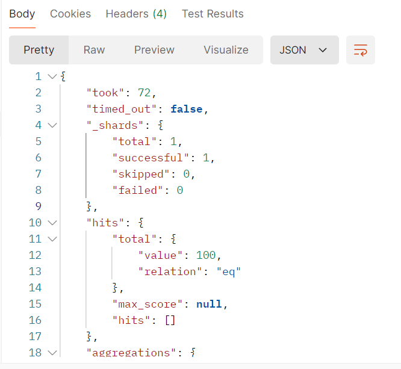

#### 2.2.14 找出总销售额最高的前10个日期

>代码

```json
{
    "size": 0,
    "aggs": {
      "top10_date_sales": {
        "terms":{
            "field":"order_date",
            "size":10,
            "order":{
                "top10_amount":"desc"
            }
        },
        "aggs":{
            "top10_amount":{
                "sum":{
                    "field":"total_amount"
                }
            }
        }
      }
    }
  }
```

>成功代码

```json
{
    "took": 54,
    "timed_out": false,
    "_shards": {
        "total": 1,
        "successful": 1,
        "skipped": 0,
        "failed": 0
    },
    "hits": {
        "total": {
            "value": 100,
            "relation": "eq"
        },
        "max_score": null,
        "hits": []
    },
    "aggregations": {
        "top10_date_sales": {
            "doc_count_error_upper_bound": -1,
            "sum_other_doc_count": 86,
            "buckets": [
                {
                    "key": 1682726400000,
                    "key_as_string": "2023-04-29T00:00:00.000Z",
                    "doc_count": 2,
                    "top10_amount": {
                        "value": 5951.77001953125
                    }
                },
                {
                    "key": 1677628800000,
                    "key_as_string": "2023-03-01T00:00:00.000Z",
                    "doc_count": 2,
                    "top10_amount": {
                        "value": 5457.640075683594
                    }
                },
                {
                    "key": 1703980800000,
                    "key_as_string": "2023-12-31T00:00:00.000Z",
                    "doc_count": 2,
                    "top10_amount": {
                        "value": 5177.3402099609375
                    }
                },
                {
                    "key": 1694736000000,
                    "key_as_string": "2023-09-15T00:00:00.000Z",
                    "doc_count": 1,
                    "top10_amount": {
                        "value": 4886.10009765625
                    }
                },
                {
                    "key": 1696291200000,
                    "key_as_string": "2023-10-03T00:00:00.000Z",
                    "doc_count": 1,
                    "top10_amount": {
                        "value": 4858.9501953125
                    }
                },
                {
                    "key": 1678665600000,
                    "key_as_string": "2023-03-13T00:00:00.000Z",
                    "doc_count": 1,
                    "top10_amount": {
                        "value": 4592.9501953125
                    }
                },
                {
                    "key": 1691107200000,
                    "key_as_string": "2023-08-04T00:00:00.000Z",
                    "doc_count": 1,
                    "top10_amount": {
                        "value": 4131.9501953125
                    }
                },
                {
                    "key": 1677283200000,
                    "key_as_string": "2023-02-25T00:00:00.000Z",
                    "doc_count": 2,
                    "top10_amount": {
                        "value": 3872.6699829101562
                    }
                },
                {
                    "key": 1681171200000,
                    "key_as_string": "2023-04-11T00:00:00.000Z",
                    "doc_count": 1,
                    "top10_amount": {
                        "value": 3790.89990234375
                    }
                },
                {
                    "key": 1674777600000,
                    "key_as_string": "2023-01-27T00:00:00.000Z",
                    "doc_count": 1,
                    "top10_amount": {
                        "value": 3714.25
                    }
                }
            ]
        }
    }
}
```

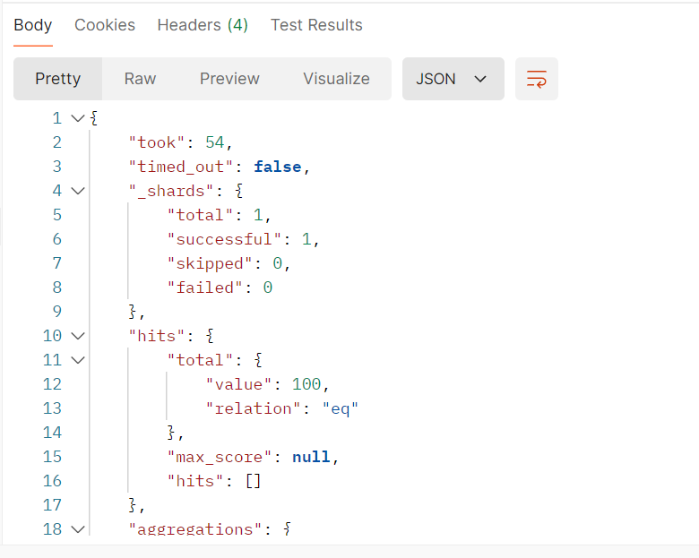

#### 2.2.15 计算每个季度销售额最高的产品类别

>代码

```json
 {
    "size":0,
    "aggs":{
        "date_season":{
            "date_histogram":{
                "field":"order_date",
                "calendar_interval":"1q",
                "format":"yyyy-MM-dd"
            },
            "aggs":{
                "sum_amount_products":{
                    "terms":{
                        "field":"product_category",
                        "size":1
                    },
                    "aggs":{
                        "sum_amount":{
                            "sum":{
                                "field":"total_amount"
                            }
                        }
                    }
                }
            }
        }
    }
  }
```

>成功代码

```json
{
    "took": 221,
    "timed_out": false,
    "_shards": {
        "total": 1,
        "successful": 1,
        "skipped": 0,
        "failed": 0
    },
    "hits": {
        "total": {
            "value": 100,
            "relation": "eq"
        },
        "max_score": null,
        "hits": []
    },
    "aggregations": {
        "date_season": {
            "buckets": [
                {
                    "key_as_string": "2023-01-01",
                    "key": 1672531200000,
                    "doc_count": 33,
                    "sum_amount_products": {
                        "doc_count_error_upper_bound": 0,
                        "sum_other_doc_count": 25,
                        "buckets": [
                            {
                                "key": "Jewelry",
                                "doc_count": 8,
                                "sum_amount": {
                                    "value": 11757.280212402344
                                }
                            }
                        ]
                    }
                },
                {
                    "key_as_string": "2023-04-01",
                    "key": 1680307200000,
                    "doc_count": 28,
                    "sum_amount_products": {
                        "doc_count_error_upper_bound": 0,
                        "sum_other_doc_count": 24,
                        "buckets": [
                            {
                                "key": "Furniture",
                                "doc_count": 4,
                                "sum_amount": {
                                    "value": 5408.469985961914
                                }
                            }
                        ]
                    }
                },
                {
                    "key_as_string": "2023-07-01",
                    "key": 1688169600000,
                    "doc_count": 18,
                    "sum_amount_products": {
                        "doc_count_error_upper_bound": 0,
                        "sum_other_doc_count": 15,
                        "buckets": [
                            {
                                "key": "Electronics",
                                "doc_count": 3,
                                "sum_amount": {
                                    "value": 3483.2700805664062
                                }
                            }
                        ]
                    }
                },
                {
                    "key_as_string": "2023-10-01",
                    "key": 1696118400000,
                    "doc_count": 21,
                    "sum_amount_products": {
                        "doc_count_error_upper_bound": 0,
                        "sum_other_doc_count": 17,
                        "buckets": [
                            {
                                "key": "Beauty",
                                "doc_count": 4,
                                "sum_amount": {
                                    "value": 9416.89013671875
                                }
                            }
                        ]
                    }
                }
            ]
        }
    }
}
```

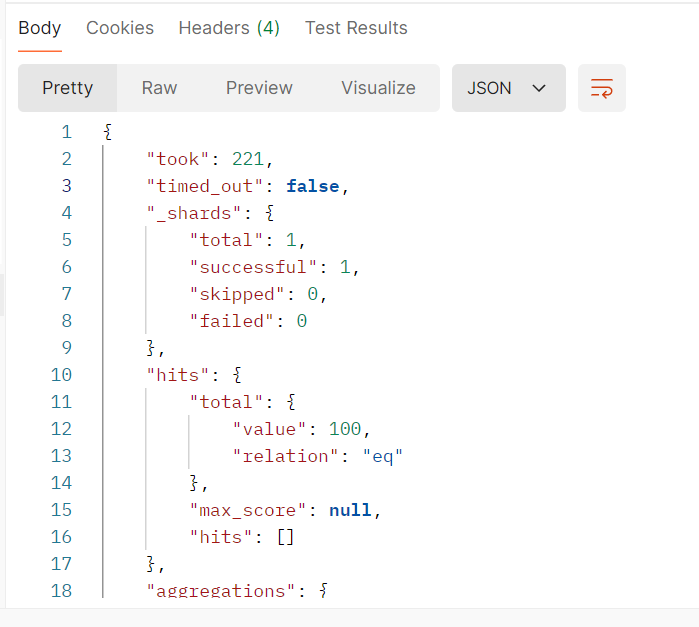

#### 2.2.16 计算每天的订单数量，并显示7天移动平均值

>代码

```json
{
    "size": 0,
    "aggs": {
      "orders_over_time": {
        "date_histogram": {
          "field": "order_date",
          "calendar_interval": "1d"
        },
        "aggs": {
          "daily_orders": {
            "value_count": {
              "field": "order_id"
            }
          },
          "7_day_moving_avg": {
            "moving_fn": {
              "script": "MovingFunctions.unweightedAvg(values)",
              "buckets_path": "daily_orders",
              "window": 7
            }
          }
        }
      }
    }
  }
  ```

  >成功代码

  ```json
  {
    "took": 64,
    "timed_out": false,
    "_shards": {
        "total": 1,
        "successful": 1,
        "skipped": 0,
        "failed": 0
    },
    "hits": {
        "total": {
            "value": 100,
            "relation": "eq"
        },
        "max_score": null,
        "hits": []
    },
    "aggregations": {
        "orders_over_time": {
            "buckets": [
                {
                    "key_as_string": "2023-01-02T00:00:00.000Z",
                    "key": 1672617600000,
                    "doc_count": 1,
                    "daily_orders": {
                        "value": 1
                    },
                    "7_day_moving_avg": {
                        "value": null
                    }
                },
                {
                    "key_as_string": "2023-01-03T00:00:00.000Z",
                    "key": 1672704000000,
                    "doc_count": 1,
                    "daily_orders": {
                        "value": 1
                    },
                    "7_day_moving_avg": {
                        "value": 1.0
                    }
                },
                {
                    "key_as_string": "2023-01-04T00:00:00.000Z",
                    "key": 1672790400000,
                    "doc_count": 0,
                    "daily_orders": {
                        "value": 0
                    }
                },
                {
                    "key_as_string": "2023-01-05T00:00:00.000Z",
                    "key": 1672876800000,
                    "doc_count": 0,
                    "daily_orders": {
                        "value": 0
                    }
                },
                {
                    "key_as_string": "2023-01-06T00:00:00.000Z",
                    "key": 1672963200000,
                    "doc_count": 0,
                    "daily_orders": {
                        "value": 0
                    }
                },
                {
                    "key_as_string": "2023-01-07T00:00:00.000Z",
                    "key": 1673049600000,
                    "doc_count": 1,
                    "daily_orders": {
                        "value": 1
                    },
                    "7_day_moving_avg": {
                        "value": 1.0
                    }
                },
                {
                    "key_as_string": "2023-01-08T00:00:00.000Z",
                    "key": 1673136000000,
                    "doc_count": 0,
                    "daily_orders": {
                        "value": 0
                    }
                },
                {
                    "key_as_string": "2023-01-09T00:00:00.000Z",
                    "key": 1673222400000,
                    "doc_count": 0,
                    "daily_orders": {
                        "value": 0
                    }
                },
                {
                    "key_as_string": "2023-01-10T00:00:00.000Z",
                    "key": 1673308800000,
                    "doc_count": 1,
                    "daily_orders": {
                        "value": 1
                    },
                    "7_day_moving_avg": {
                        "value": 1.0
                    }
                },
                {
                    "key_as_string": "2023-01-11T00:00:00.000Z",
                    "key": 1673395200000,
                    "doc_count": 0,
                    "daily_orders": {
                        "value": 0
                    }
                },
                {
                    "key_as_string": "2023-01-12T00:00:00.000Z",
                    "key": 1673481600000,
                    "doc_count": 0,
                    "daily_orders": {
                        "value": 0
                    }
                },
                {
                    "key_as_string": "2023-01-13T00:00:00.000Z",
                    "key": 1673568000000,
                    "doc_count": 1,
                    "daily_orders": {
                        "value": 1
                    },
                    "7_day_moving_avg": {
                        "value": 1.0
                    }
                },
                {
                    "key_as_string": "2023-01-14T00:00:00.000Z",
                    "key": 1673654400000,
                    "doc_count": 0,
                    "daily_orders": {
                        "value": 0
                    }
                },
                {
                    "key_as_string": "2023-01-15T00:00:00.000Z",
                    "key": 1673740800000,
                    "doc_count": 1,
                    "daily_orders": {
                        "value": 1
                    },
                    "7_day_moving_avg": {
                        "value": 1.0
                    }
                },
                {
                    "key_as_string": "2023-01-16T00:00:00.000Z",
                    "key": 1673827200000,
                    "doc_count": 0,
                    "daily_orders": {
                        "value": 0
                    }
                },
                {
                    "key_as_string": "2023-01-17T00:00:00.000Z",
                    "key": 1673913600000,
                    "doc_count": 0,
                    "daily_orders": {
                        "value": 0
                    }
                },
                {
                    "key_as_string": "2023-01-18T00:00:00.000Z",
                    "key": 1674000000000,
                    "doc_count": 0,
                    "daily_orders": {
                        "value": 0
                    }
                },
                {
                    "key_as_string": "2023-01-19T00:00:00.000Z",
                    "key": 1674086400000,
                    "doc_count": 1,
                    "daily_orders": {
                        "value": 1
                    },
                    "7_day_moving_avg": {
                        "value": 1.0
                    }
                },
                {
                    "key_as_string": "2023-01-20T00:00:00.000Z",
                    "key": 1674172800000,
                    "doc_count": 2,
                    "daily_orders": {
                        "value": 2
                    },
                    "7_day_moving_avg": {
                        "value": 1.0
                    }
                },
                {
                    "key_as_string": "2023-01-21T00:00:00.000Z",
                    "key": 1674259200000,
                    "doc_count": 0,
                    "daily_orders": {
                        "value": 0
                    }
                },
                {
                    "key_as_string": "2023-01-22T00:00:00.000Z",
                    "key": 1674345600000,
                    "doc_count": 0,
                    "daily_orders": {
                        "value": 0
                    }
                },
                {
                    "key_as_string": "2023-01-23T00:00:00.000Z",
                    "key": 1674432000000,
                    "doc_count": 0,
                    "daily_orders": {
                        "value": 0
                    }
                },
                {
                    "key_as_string": "2023-01-24T00:00:00.000Z",
                    "key": 1674518400000,
                    "doc_count": 0,
                    "daily_orders": {
                        "value": 0
                    }
                },
                {
                    "key_as_string": "2023-01-25T00:00:00.000Z",
                    "key": 1674604800000,
                    "doc_count": 0,
                    "daily_orders": {
                        "value": 0
                    }
                },
                {
                    "key_as_string": "2023-01-26T00:00:00.000Z",
                    "key": 1674691200000,
                    "doc_count": 0,
                    "daily_orders": {
                        "value": 0
                    }
                },
                {
                    "key_as_string": "2023-01-27T00:00:00.000Z",
                    "key": 1674777600000,
                    "doc_count": 1,
                    "daily_orders": {
                        "value": 1
                    },
                    "7_day_moving_avg": {
                        "value": 1.1428571428571428
                    }
                },
                {
                    "key_as_string": "2023-01-28T00:00:00.000Z",
                    "key": 1674864000000,
                    "doc_count": 1,
                    "daily_orders": {
                        "value": 1
                    },
                    "7_day_moving_avg": {
                        "value": 1.1428571428571428
                    }
                },
                {
                    "key_as_string": "2023-01-29T00:00:00.000Z",
                    "key": 1674950400000,
                    "doc_count": 1,
                    "daily_orders": {
                        "value": 1
                    },
                    "7_day_moving_avg": {
                        "value": 1.1428571428571428
                    }
                },
                {
                    "key_as_string": "2023-01-30T00:00:00.000Z",
                    "key": 1675036800000,
                    "doc_count": 0,
                    "daily_orders": {
                        "value": 0
                    }
                },
                {
                    "key_as_string": "2023-01-31T00:00:00.000Z",
                    "key": 1675123200000,
                    "doc_count": 0,
                    "daily_orders": {
                        "value": 0
                    }
                },
                {
                    "key_as_string": "2023-02-01T00:00:00.000Z",
                    "key": 1675209600000,
                    "doc_count": 0,
                    "daily_orders": {
                        "value": 0
                    }
                },
                {
                    "key_as_string": "2023-02-02T00:00:00.000Z",
                    "key": 1675296000000,
                    "doc_count": 1,
                    "daily_orders": {
                        "value": 1
                    },
                    "7_day_moving_avg": {
                        "value": 1.1428571428571428
                    }
                },
                {
                    "key_as_string": "2023-02-03T00:00:00.000Z",
                    "key": 1675382400000,
                    "doc_count": 0,
                    "daily_orders": {
                        "value": 0
                    }
                },
                {
                    "key_as_string": "2023-02-04T00:00:00.000Z",
                    "key": 1675468800000,
                    "doc_count": 0,
                    "daily_orders": {
                        "value": 0
                    }
                },
                {
                    "key_as_string": "2023-02-05T00:00:00.000Z",
                    "key": 1675555200000,
                    "doc_count": 0,
                    "daily_orders": {
                        "value": 0
                    }
                },
                {
                    "key_as_string": "2023-02-06T00:00:00.000Z",
                    "key": 1675641600000,
                    "doc_count": 1,
                    "daily_orders": {
                        "value": 1
                    },
                    "7_day_moving_avg": {
                        "value": 1.1428571428571428
                    }
                },
                {
                    "key_as_string": "2023-02-07T00:00:00.000Z",
                    "key": 1675728000000,
                    "doc_count": 0,
                    "daily_orders": {
                        "value": 0
                    }
                },
                {
                    "key_as_string": "2023-02-08T00:00:00.000Z",
                    "key": 1675814400000,
                    "doc_count": 0,
                    "daily_orders": {
                        "value": 0
                    }
                },
                {
                    "key_as_string": "2023-02-09T00:00:00.000Z",
                    "key": 1675900800000,
                    "doc_count": 0,
                    "daily_orders": {
                        "value": 0
                    }
                },
                {
                    "key_as_string": "2023-02-10T00:00:00.000Z",
                    "key": 1675987200000,
                    "doc_count": 0,
                    "daily_orders": {
                        "value": 0
                    }
                },
                {
                    "key_as_string": "2023-02-11T00:00:00.000Z",
                    "key": 1676073600000,
                    "doc_count": 0,
                    "daily_orders": {
                        "value": 0
                    }
                },
                {
                    "key_as_string": "2023-02-12T00:00:00.000Z",
                    "key": 1676160000000,
                    "doc_count": 0,
                    "daily_orders": {
                        "value": 0
                    }
                },
                {
                    "key_as_string": "2023-02-13T00:00:00.000Z",
                    "key": 1676246400000,
                    "doc_count": 0,
                    "daily_orders": {
                        "value": 0
                    }
                },
                {
                    "key_as_string": "2023-02-14T00:00:00.000Z",
                    "key": 1676332800000,
                    "doc_count": 0,
                    "daily_orders": {
                        "value": 0
                    }
                },
                {
                    "key_as_string": "2023-02-15T00:00:00.000Z",
                    "key": 1676419200000,
                    "doc_count": 0,
                    "daily_orders": {
                        "value": 0
                    }
                },
                {
                    "key_as_string": "2023-02-16T00:00:00.000Z",
                    "key": 1676505600000,
                    "doc_count": 1,
                    "daily_orders": {
                        "value": 1
                    },
                    "7_day_moving_avg": {
                        "value": 1.1428571428571428
                    }
                },
                {
                    "key_as_string": "2023-02-17T00:00:00.000Z",
                    "key": 1676592000000,
                    "doc_count": 1,
                    "daily_orders": {
                        "value": 1
                    },
                    "7_day_moving_avg": {
                        "value": 1.1428571428571428
                    }
                },
                {
                    "key_as_string": "2023-02-18T00:00:00.000Z",
                    "key": 1676678400000,
                    "doc_count": 1,
                    "daily_orders": {
                        "value": 1
                    },
                    "7_day_moving_avg": {
                        "value": 1.0
                    }
                },
                {
                    "key_as_string": "2023-02-19T00:00:00.000Z",
                    "key": 1676764800000,
                    "doc_count": 0,
                    "daily_orders": {
                        "value": 0
                    }
                },
                {
                    "key_as_string": "2023-02-20T00:00:00.000Z",
                    "key": 1676851200000,
                    "doc_count": 0,
                    "daily_orders": {
                        "value": 0
                    }
                },
                {
                    "key_as_string": "2023-02-21T00:00:00.000Z",
                    "key": 1676937600000,
                    "doc_count": 0,
                    "daily_orders": {
                        "value": 0
                    }
                },
                {
                    "key_as_string": "2023-02-22T00:00:00.000Z",
                    "key": 1677024000000,
                    "doc_count": 1,
                    "daily_orders": {
                        "value": 1
                    },
                    "7_day_moving_avg": {
                        "value": 1.0
                    }
                },
                {
                    "key_as_string": "2023-02-23T00:00:00.000Z",
                    "key": 1677110400000,
                    "doc_count": 1,
                    "daily_orders": {
                        "value": 1
                    },
                    "7_day_moving_avg": {
                        "value": 1.0
                    }
                },
                {
                    "key_as_string": "2023-02-24T00:00:00.000Z",
                    "key": 1677196800000,
                    "doc_count": 0,
                    "daily_orders": {
                        "value": 0
                    }
                },
                {
                    "key_as_string": "2023-02-25T00:00:00.000Z",
                    "key": 1677283200000,
                    "doc_count": 2,
                    "daily_orders": {
                        "value": 2
                    },
                    "7_day_moving_avg": {
                        "value": 1.0
                    }
                },
                {
                    "key_as_string": "2023-02-26T00:00:00.000Z",
                    "key": 1677369600000,
                    "doc_count": 0,
                    "daily_orders": {
                        "value": 0
                    }
                },
                {
                    "key_as_string": "2023-02-27T00:00:00.000Z",
                    "key": 1677456000000,
                    "doc_count": 2,
                    "daily_orders": {
                        "value": 2
                    },
                    "7_day_moving_avg": {
                        "value": 1.1428571428571428
                    }
                },
                {
                    "key_as_string": "2023-02-28T00:00:00.000Z",
                    "key": 1677542400000,
                    "doc_count": 0,
                    "daily_orders": {
                        "value": 0
                    }
                },
                {
                    "key_as_string": "2023-03-01T00:00:00.000Z",
                    "key": 1677628800000,
                    "doc_count": 2,
                    "daily_orders": {
                        "value": 2
                    },
                    "7_day_moving_avg": {
                        "value": 1.2857142857142858
                    }
                },
                {
                    "key_as_string": "2023-03-02T00:00:00.000Z",
                    "key": 1677715200000,
                    "doc_count": 0,
                    "daily_orders": {
                        "value": 0
                    }
                },
                {
                    "key_as_string": "2023-03-03T00:00:00.000Z",
                    "key": 1677801600000,
                    "doc_count": 1,
                    "daily_orders": {
                        "value": 1
                    },
                    "7_day_moving_avg": {
                        "value": 1.4285714285714286
                    }
                },
                {
                    "key_as_string": "2023-03-04T00:00:00.000Z",
                    "key": 1677888000000,
                    "doc_count": 0,
                    "daily_orders": {
                        "value": 0
                    }
                },
                {
                    "key_as_string": "2023-03-05T00:00:00.000Z",
                    "key": 1677974400000,
                    "doc_count": 0,
                    "daily_orders": {
                        "value": 0
                    }
                },
                {
                    "key_as_string": "2023-03-06T00:00:00.000Z",
                    "key": 1678060800000,
                    "doc_count": 1,
                    "daily_orders": {
                        "value": 1
                    },
                    "7_day_moving_avg": {
                        "value": 1.4285714285714286
                    }
                },
                {
                    "key_as_string": "2023-03-07T00:00:00.000Z",
                    "key": 1678147200000,
                    "doc_count": 0,
                    "daily_orders": {
                        "value": 0
                    }
                },
                {
                    "key_as_string": "2023-03-08T00:00:00.000Z",
                    "key": 1678233600000,
                    "doc_count": 0,
                    "daily_orders": {
                        "value": 0
                    }
                },
                {
                    "key_as_string": "2023-03-09T00:00:00.000Z",
                    "key": 1678320000000,
                    "doc_count": 0,
                    "daily_orders": {
                        "value": 0
                    }
                },
                {
                    "key_as_string": "2023-03-10T00:00:00.000Z",
                    "key": 1678406400000,
                    "doc_count": 0,
                    "daily_orders": {
                        "value": 0
                    }
                },
                {
                    "key_as_string": "2023-03-11T00:00:00.000Z",
                    "key": 1678492800000,
                    "doc_count": 0,
                    "daily_orders": {
                        "value": 0
                    }
                },
                {
                    "key_as_string": "2023-03-12T00:00:00.000Z",
                    "key": 1678579200000,
                    "doc_count": 1,
                    "daily_orders": {
                        "value": 1
                    },
                    "7_day_moving_avg": {
                        "value": 1.4285714285714286
                    }
                },
                {
                    "key_as_string": "2023-03-13T00:00:00.000Z",
                    "key": 1678665600000,
                    "doc_count": 1,
                    "daily_orders": {
                        "value": 1
                    },
                    "7_day_moving_avg": {
                        "value": 1.4285714285714286
                    }
                },
                {
                    "key_as_string": "2023-03-14T00:00:00.000Z",
                    "key": 1678752000000,
                    "doc_count": 0,
                    "daily_orders": {
                        "value": 0
                    }
                },
                {
                    "key_as_string": "2023-03-15T00:00:00.000Z",
                    "key": 1678838400000,
                    "doc_count": 1,
                    "daily_orders": {
                        "value": 1
                    },
                    "7_day_moving_avg": {
                        "value": 1.4285714285714286
                    }
                },
                {
                    "key_as_string": "2023-03-16T00:00:00.000Z",
                    "key": 1678924800000,
                    "doc_count": 0,
                    "daily_orders": {
                        "value": 0
                    }
                },
                {
                    "key_as_string": "2023-03-17T00:00:00.000Z",
                    "key": 1679011200000,
                    "doc_count": 1,
                    "daily_orders": {
                        "value": 1
                    },
                    "7_day_moving_avg": {
                        "value": 1.2857142857142858
                    }
                },
                {
                    "key_as_string": "2023-03-18T00:00:00.000Z",
                    "key": 1679097600000,
                    "doc_count": 0,
                    "daily_orders": {
                        "value": 0
                    }
                },
                {
                    "key_as_string": "2023-03-19T00:00:00.000Z",
                    "key": 1679184000000,
                    "doc_count": 0,
                    "daily_orders": {
                        "value": 0
                    }
                },
                {
                    "key_as_string": "2023-03-20T00:00:00.000Z",
                    "key": 1679270400000,
                    "doc_count": 0,
                    "daily_orders": {
                        "value": 0
                    }
                },
                {
                    "key_as_string": "2023-03-21T00:00:00.000Z",
                    "key": 1679356800000,
                    "doc_count": 1,
                    "daily_orders": {
                        "value": 1
                    },
                    "7_day_moving_avg": {
                        "value": 1.1428571428571428
                    }
                },
                {
                    "key_as_string": "2023-03-22T00:00:00.000Z",
                    "key": 1679443200000,
                    "doc_count": 0,
                    "daily_orders": {
                        "value": 0
                    }
                },
                {
                    "key_as_string": "2023-03-23T00:00:00.000Z",
                    "key": 1679529600000,
                    "doc_count": 0,
                    "daily_orders": {
                        "value": 0
                    }
                },
                {
                    "key_as_string": "2023-03-24T00:00:00.000Z",
                    "key": 1679616000000,
                    "doc_count": 0,
                    "daily_orders": {
                        "value": 0
                    }
                },
                {
                    "key_as_string": "2023-03-25T00:00:00.000Z",
                    "key": 1679702400000,
                    "doc_count": 0,
                    "daily_orders": {
                        "value": 0
                    }
                },
                {
                    "key_as_string": "2023-03-26T00:00:00.000Z",
                    "key": 1679788800000,
                    "doc_count": 0,
                    "daily_orders": {
                        "value": 0
                    }
                },
                {
                    "key_as_string": "2023-03-27T00:00:00.000Z",
                    "key": 1679875200000,
                    "doc_count": 0,
                    "daily_orders": {
                        "value": 0
                    }
                },
                {
                    "key_as_string": "2023-03-28T00:00:00.000Z",
                    "key": 1679961600000,
                    "doc_count": 1,
                    "daily_orders": {
                        "value": 1
                    },
                    "7_day_moving_avg": {
                        "value": 1.0
                    }
                },
                {
                    "key_as_string": "2023-03-29T00:00:00.000Z",
                    "key": 1680048000000,
                    "doc_count": 0,
                    "daily_orders": {
                        "value": 0
                    }
                },
                {
                    "key_as_string": "2023-03-30T00:00:00.000Z",
                    "key": 1680134400000,
                    "doc_count": 0,
                    "daily_orders": {
                        "value": 0
                    }
                },
                {
                    "key_as_string": "2023-03-31T00:00:00.000Z",
                    "key": 1680220800000,
                    "doc_count": 0,
                    "daily_orders": {
                        "value": 0
                    }
                },
                {
                    "key_as_string": "2023-04-01T00:00:00.000Z",
                    "key": 1680307200000,
                    "doc_count": 1,
                    "daily_orders": {
                        "value": 1
                    },
                    "7_day_moving_avg": {
                        "value": 1.0
                    }
                },
                {
                    "key_as_string": "2023-04-02T00:00:00.000Z",
                    "key": 1680393600000,
                    "doc_count": 0,
                    "daily_orders": {
                        "value": 0
                    }
                },
                {
                    "key_as_string": "2023-04-03T00:00:00.000Z",
                    "key": 1680480000000,
                    "doc_count": 0,
                    "daily_orders": {
                        "value": 0
                    }
                },
                {
                    "key_as_string": "2023-04-04T00:00:00.000Z",
                    "key": 1680566400000,
                    "doc_count": 0,
                    "daily_orders": {
                        "value": 0
                    }
                },
                {
                    "key_as_string": "2023-04-05T00:00:00.000Z",
                    "key": 1680652800000,
                    "doc_count": 0,
                    "daily_orders": {
                        "value": 0
                    }
                },
                {
                    "key_as_string": "2023-04-06T00:00:00.000Z",
                    "key": 1680739200000,
                    "doc_count": 0,
                    "daily_orders": {
                        "value": 0
                    }
                },
                {
                    "key_as_string": "2023-04-07T00:00:00.000Z",
                    "key": 1680825600000,
                    "doc_count": 0,
                    "daily_orders": {
                        "value": 0
                    }
                },
                {
                    "key_as_string": "2023-04-08T00:00:00.000Z",
                    "key": 1680912000000,
                    "doc_count": 0,
                    "daily_orders": {
                        "value": 0
                    }
                },
                {
                    "key_as_string": "2023-04-09T00:00:00.000Z",
                    "key": 1680998400000,
                    "doc_count": 0,
                    "daily_orders": {
                        "value": 0
                    }
                },
                {
                    "key_as_string": "2023-04-10T00:00:00.000Z",
                    "key": 1681084800000,
                    "doc_count": 0,
                    "daily_orders": {
                        "value": 0
                    }
                },
                {
                    "key_as_string": "2023-04-11T00:00:00.000Z",
                    "key": 1681171200000,
                    "doc_count": 1,
                    "daily_orders": {
                        "value": 1
                    },
                    "7_day_moving_avg": {
                        "value": 1.0
                    }
                },
                {
                    "key_as_string": "2023-04-12T00:00:00.000Z",
                    "key": 1681257600000,
                    "doc_count": 1,
                    "daily_orders": {
                        "value": 1
                    },
                    "7_day_moving_avg": {
                        "value": 1.0
                    }
                },
                {
                    "key_as_string": "2023-04-13T00:00:00.000Z",
                    "key": 1681344000000,
                    "doc_count": 0,
                    "daily_orders": {
                        "value": 0
                    }
                },
                {
                    "key_as_string": "2023-04-14T00:00:00.000Z",
                    "key": 1681430400000,
                    "doc_count": 1,
                    "daily_orders": {
                        "value": 1
                    },
                    "7_day_moving_avg": {
                        "value": 1.0
                    }
                },
                {
                    "key_as_string": "2023-04-15T00:00:00.000Z",
                    "key": 1681516800000,
                    "doc_count": 0,
                    "daily_orders": {
                        "value": 0
                    }
                },
                {
                    "key_as_string": "2023-04-16T00:00:00.000Z",
                    "key": 1681603200000,
                    "doc_count": 1,
                    "daily_orders": {
                        "value": 1
                    },
                    "7_day_moving_avg": {
                        "value": 1.0
                    }
                },
                {
                    "key_as_string": "2023-04-17T00:00:00.000Z",
                    "key": 1681689600000,
                    "doc_count": 0,
                    "daily_orders": {
                        "value": 0
                    }
                },
                {
                    "key_as_string": "2023-04-18T00:00:00.000Z",
                    "key": 1681776000000,
                    "doc_count": 0,
                    "daily_orders": {
                        "value": 0
                    }
                },
                {
                    "key_as_string": "2023-04-19T00:00:00.000Z",
                    "key": 1681862400000,
                    "doc_count": 0,
                    "daily_orders": {
                        "value": 0
                    }
                },
                {
                    "key_as_string": "2023-04-20T00:00:00.000Z",
                    "key": 1681948800000,
                    "doc_count": 0,
                    "daily_orders": {
                        "value": 0
                    }
                },
                {
                    "key_as_string": "2023-04-21T00:00:00.000Z",
                    "key": 1682035200000,
                    "doc_count": 0,
                    "daily_orders": {
                        "value": 0
                    }
                },
                {
                    "key_as_string": "2023-04-22T00:00:00.000Z",
                    "key": 1682121600000,
                    "doc_count": 0,
                    "daily_orders": {
                        "value": 0
                    }
                },
                {
                    "key_as_string": "2023-04-23T00:00:00.000Z",
                    "key": 1682208000000,
                    "doc_count": 0,
                    "daily_orders": {
                        "value": 0
                    }
                },
                {
                    "key_as_string": "2023-04-24T00:00:00.000Z",
                    "key": 1682294400000,
                    "doc_count": 0,
                    "daily_orders": {
                        "value": 0
                    }
                },
                {
                    "key_as_string": "2023-04-25T00:00:00.000Z",
                    "key": 1682380800000,
                    "doc_count": 0,
                    "daily_orders": {
                        "value": 0
                    }
                },
                {
                    "key_as_string": "2023-04-26T00:00:00.000Z",
                    "key": 1682467200000,
                    "doc_count": 0,
                    "daily_orders": {
                        "value": 0
                    }
                },
                {
                    "key_as_string": "2023-04-27T00:00:00.000Z",
                    "key": 1682553600000,
                    "doc_count": 1,
                    "daily_orders": {
                        "value": 1
                    },
                    "7_day_moving_avg": {
                        "value": 1.0
                    }
                },
                {
                    "key_as_string": "2023-04-28T00:00:00.000Z",
                    "key": 1682640000000,
                    "doc_count": 1,
                    "daily_orders": {
                        "value": 1
                    },
                    "7_day_moving_avg": {
                        "value": 1.0
                    }
                },
                {
                    "key_as_string": "2023-04-29T00:00:00.000Z",
                    "key": 1682726400000,
                    "doc_count": 2,
                    "daily_orders": {
                        "value": 2
                    },
                    "7_day_moving_avg": {
                        "value": 1.0
                    }
                },
                {
                    "key_as_string": "2023-04-30T00:00:00.000Z",
                    "key": 1682812800000,
                    "doc_count": 0,
                    "daily_orders": {
                        "value": 0
                    }
                },
                {
                    "key_as_string": "2023-05-01T00:00:00.000Z",
                    "key": 1682899200000,
                    "doc_count": 0,
                    "daily_orders": {
                        "value": 0
                    }
                },
                {
                    "key_as_string": "2023-05-02T00:00:00.000Z",
                    "key": 1682985600000,
                    "doc_count": 1,
                    "daily_orders": {
                        "value": 1
                    },
                    "7_day_moving_avg": {
                        "value": 1.1428571428571428
                    }
                },
                {
                    "key_as_string": "2023-05-03T00:00:00.000Z",
                    "key": 1683072000000,
                    "doc_count": 0,
                    "daily_orders": {
                        "value": 0
                    }
                },
                {
                    "key_as_string": "2023-05-04T00:00:00.000Z",
                    "key": 1683158400000,
                    "doc_count": 1,
                    "daily_orders": {
                        "value": 1
                    },
                    "7_day_moving_avg": {
                        "value": 1.1428571428571428
                    }
                },
                {
                    "key_as_string": "2023-05-05T00:00:00.000Z",
                    "key": 1683244800000,
                    "doc_count": 0,
                    "daily_orders": {
                        "value": 0
                    }
                },
                {
                    "key_as_string": "2023-05-06T00:00:00.000Z",
                    "key": 1683331200000,
                    "doc_count": 0,
                    "daily_orders": {
                        "value": 0
                    }
                },
                {
                    "key_as_string": "2023-05-07T00:00:00.000Z",
                    "key": 1683417600000,
                    "doc_count": 0,
                    "daily_orders": {
                        "value": 0
                    }
                },
                {
                    "key_as_string": "2023-05-08T00:00:00.000Z",
                    "key": 1683504000000,
                    "doc_count": 0,
                    "daily_orders": {
                        "value": 0
                    }
                },
                {
                    "key_as_string": "2023-05-09T00:00:00.000Z",
                    "key": 1683590400000,
                    "doc_count": 0,
                    "daily_orders": {
                        "value": 0
                    }
                },
                {
                    "key_as_string": "2023-05-10T00:00:00.000Z",
                    "key": 1683676800000,
                    "doc_count": 1,
                    "daily_orders": {
                        "value": 1
                    },
                    "7_day_moving_avg": {
                        "value": 1.1428571428571428
                    }
                },
                {
                    "key_as_string": "2023-05-11T00:00:00.000Z",
                    "key": 1683763200000,
                    "doc_count": 0,
                    "daily_orders": {
                        "value": 0
                    }
                },
                {
                    "key_as_string": "2023-05-12T00:00:00.000Z",
                    "key": 1683849600000,
                    "doc_count": 2,
                    "daily_orders": {
                        "value": 2
                    },
                    "7_day_moving_avg": {
                        "value": 1.1428571428571428
                    }
                },
                {
                    "key_as_string": "2023-05-13T00:00:00.000Z",
                    "key": 1683936000000,
                    "doc_count": 0,
                    "daily_orders": {
                        "value": 0
                    }
                },
                {
                    "key_as_string": "2023-05-14T00:00:00.000Z",
                    "key": 1684022400000,
                    "doc_count": 0,
                    "daily_orders": {
                        "value": 0
                    }
                },
                {
                    "key_as_string": "2023-05-15T00:00:00.000Z",
                    "key": 1684108800000,
                    "doc_count": 0,
                    "daily_orders": {
                        "value": 0
                    }
                },
                {
                    "key_as_string": "2023-05-16T00:00:00.000Z",
                    "key": 1684195200000,
                    "doc_count": 0,
                    "daily_orders": {
                        "value": 0
                    }
                },
                {
                    "key_as_string": "2023-05-17T00:00:00.000Z",
                    "key": 1684281600000,
                    "doc_count": 0,
                    "daily_orders": {
                        "value": 0
                    }
                },
                {
                    "key_as_string": "2023-05-18T00:00:00.000Z",
                    "key": 1684368000000,
                    "doc_count": 0,
                    "daily_orders": {
                        "value": 0
                    }
                },
                {
                    "key_as_string": "2023-05-19T00:00:00.000Z",
                    "key": 1684454400000,
                    "doc_count": 0,
                    "daily_orders": {
                        "value": 0
                    }
                },
                {
                    "key_as_string": "2023-05-20T00:00:00.000Z",
                    "key": 1684540800000,
                    "doc_count": 0,
                    "daily_orders": {
                        "value": 0
                    }
                },
                {
                    "key_as_string": "2023-05-21T00:00:00.000Z",
                    "key": 1684627200000,
                    "doc_count": 2,
                    "daily_orders": {
                        "value": 2
                    },
                    "7_day_moving_avg": {
                        "value": 1.2857142857142858
                    }
                },
                {
                    "key_as_string": "2023-05-22T00:00:00.000Z",
                    "key": 1684713600000,
                    "doc_count": 0,
                    "daily_orders": {
                        "value": 0
                    }
                },
                {
                    "key_as_string": "2023-05-23T00:00:00.000Z",
                    "key": 1684800000000,
                    "doc_count": 0,
                    "daily_orders": {
                        "value": 0
                    }
                },
                {
                    "key_as_string": "2023-05-24T00:00:00.000Z",
                    "key": 1684886400000,
                    "doc_count": 0,
                    "daily_orders": {
                        "value": 0
                    }
                },
                {
                    "key_as_string": "2023-05-25T00:00:00.000Z",
                    "key": 1684972800000,
                    "doc_count": 1,
                    "daily_orders": {
                        "value": 1
                    },
                    "7_day_moving_avg": {
                        "value": 1.4285714285714286
                    }
                },
                {
                    "key_as_string": "2023-05-26T00:00:00.000Z",
                    "key": 1685059200000,
                    "doc_count": 0,
                    "daily_orders": {
                        "value": 0
                    }
                },
                {
                    "key_as_string": "2023-05-27T00:00:00.000Z",
                    "key": 1685145600000,
                    "doc_count": 1,
                    "daily_orders": {
                        "value": 1
                    },
                    "7_day_moving_avg": {
                        "value": 1.4285714285714286
                    }
                },
                {
                    "key_as_string": "2023-05-28T00:00:00.000Z",
                    "key": 1685232000000,
                    "doc_count": 0,
                    "daily_orders": {
                        "value": 0
                    }
                },
                {
                    "key_as_string": "2023-05-29T00:00:00.000Z",
                    "key": 1685318400000,
                    "doc_count": 1,
                    "daily_orders": {
                        "value": 1
                    },
                    "7_day_moving_avg": {
                        "value": 1.2857142857142858
                    }
                },
                {
                    "key_as_string": "2023-05-30T00:00:00.000Z",
                    "key": 1685404800000,
                    "doc_count": 0,
                    "daily_orders": {
                        "value": 0
                    }
                },
                {
                    "key_as_string": "2023-05-31T00:00:00.000Z",
                    "key": 1685491200000,
                    "doc_count": 0,
                    "daily_orders": {
                        "value": 0
                    }
                },
                {
                    "key_as_string": "2023-06-01T00:00:00.000Z",
                    "key": 1685577600000,
                    "doc_count": 0,
                    "daily_orders": {
                        "value": 0
                    }
                },
                {
                    "key_as_string": "2023-06-02T00:00:00.000Z",
                    "key": 1685664000000,
                    "doc_count": 0,
                    "daily_orders": {
                        "value": 0
                    }
                },
                {
                    "key_as_string": "2023-06-03T00:00:00.000Z",
                    "key": 1685750400000,
                    "doc_count": 0,
                    "daily_orders": {
                        "value": 0
                    }
                },
                {
                    "key_as_string": "2023-06-04T00:00:00.000Z",
                    "key": 1685836800000,
                    "doc_count": 0,
                    "daily_orders": {
                        "value": 0
                    }
                },
                {
                    "key_as_string": "2023-06-05T00:00:00.000Z",
                    "key": 1685923200000,
                    "doc_count": 0,
                    "daily_orders": {
                        "value": 0
                    }
                },
                {
                    "key_as_string": "2023-06-06T00:00:00.000Z",
                    "key": 1686009600000,
                    "doc_count": 0,
                    "daily_orders": {
                        "value": 0
                    }
                },
                {
                    "key_as_string": "2023-06-07T00:00:00.000Z",
                    "key": 1686096000000,
                    "doc_count": 1,
                    "daily_orders": {
                        "value": 1
                    },
                    "7_day_moving_avg": {
                        "value": 1.2857142857142858
                    }
                },
                {
                    "key_as_string": "2023-06-08T00:00:00.000Z",
                    "key": 1686182400000,
                    "doc_count": 0,
                    "daily_orders": {
                        "value": 0
                    }
                },
                {
                    "key_as_string": "2023-06-09T00:00:00.000Z",
                    "key": 1686268800000,
                    "doc_count": 0,
                    "daily_orders": {
                        "value": 0
                    }
                },
                {
                    "key_as_string": "2023-06-10T00:00:00.000Z",
                    "key": 1686355200000,
                    "doc_count": 0,
                    "daily_orders": {
                        "value": 0
                    }
                },
                {
                    "key_as_string": "2023-06-11T00:00:00.000Z",
                    "key": 1686441600000,
                    "doc_count": 0,
                    "daily_orders": {
                        "value": 0
                    }
                },
                {
                    "key_as_string": "2023-06-12T00:00:00.000Z",
                    "key": 1686528000000,
                    "doc_count": 1,
                    "daily_orders": {
                        "value": 1
                    },
                    "7_day_moving_avg": {
                        "value": 1.2857142857142858
                    }
                },
                {
                    "key_as_string": "2023-06-13T00:00:00.000Z",
                    "key": 1686614400000,
                    "doc_count": 0,
                    "daily_orders": {
                        "value": 0
                    }
                },
                {
                    "key_as_string": "2023-06-14T00:00:00.000Z",
                    "key": 1686700800000,
                    "doc_count": 1,
                    "daily_orders": {
                        "value": 1
                    },
                    "7_day_moving_avg": {
                        "value": 1.2857142857142858
                    }
                },
                {
                    "key_as_string": "2023-06-15T00:00:00.000Z",
                    "key": 1686787200000,
                    "doc_count": 1,
                    "daily_orders": {
                        "value": 1
                    },
                    "7_day_moving_avg": {
                        "value": 1.1428571428571428
                    }
                },
                {
                    "key_as_string": "2023-06-16T00:00:00.000Z",
                    "key": 1686873600000,
                    "doc_count": 0,
                    "daily_orders": {
                        "value": 0
                    }
                },
                {
                    "key_as_string": "2023-06-17T00:00:00.000Z",
                    "key": 1686960000000,
                    "doc_count": 0,
                    "daily_orders": {
                        "value": 0
                    }
                },
                {
                    "key_as_string": "2023-06-18T00:00:00.000Z",
                    "key": 1687046400000,
                    "doc_count": 0,
                    "daily_orders": {
                        "value": 0
                    }
                },
                {
                    "key_as_string": "2023-06-19T00:00:00.000Z",
                    "key": 1687132800000,
                    "doc_count": 0,
                    "daily_orders": {
                        "value": 0
                    }
                },
                {
                    "key_as_string": "2023-06-20T00:00:00.000Z",
                    "key": 1687219200000,
                    "doc_count": 0,
                    "daily_orders": {
                        "value": 0
                    }
                },
                {
                    "key_as_string": "2023-06-21T00:00:00.000Z",
                    "key": 1687305600000,
                    "doc_count": 0,
                    "daily_orders": {
                        "value": 0
                    }
                },
                {
                    "key_as_string": "2023-06-22T00:00:00.000Z",
                    "key": 1687392000000,
                    "doc_count": 0,
                    "daily_orders": {
                        "value": 0
                    }
                },
                {
                    "key_as_string": "2023-06-23T00:00:00.000Z",
                    "key": 1687478400000,
                    "doc_count": 1,
                    "daily_orders": {
                        "value": 1
                    },
                    "7_day_moving_avg": {
                        "value": 1.0
                    }
                },
                {
                    "key_as_string": "2023-06-24T00:00:00.000Z",
                    "key": 1687564800000,
                    "doc_count": 0,
                    "daily_orders": {
                        "value": 0
                    }
                },
                {
                    "key_as_string": "2023-06-25T00:00:00.000Z",
                    "key": 1687651200000,
                    "doc_count": 1,
                    "daily_orders": {
                        "value": 1
                    },
                    "7_day_moving_avg": {
                        "value": 1.0
                    }
                },
                {
                    "key_as_string": "2023-06-26T00:00:00.000Z",
                    "key": 1687737600000,
                    "doc_count": 1,
                    "daily_orders": {
                        "value": 1
                    },
                    "7_day_moving_avg": {
                        "value": 1.0
                    }
                },
                {
                    "key_as_string": "2023-06-27T00:00:00.000Z",
                    "key": 1687824000000,
                    "doc_count": 1,
                    "daily_orders": {
                        "value": 1
                    },
                    "7_day_moving_avg": {
                        "value": 1.0
                    }
                },
                {
                    "key_as_string": "2023-06-28T00:00:00.000Z",
                    "key": 1687910400000,
                    "doc_count": 0,
                    "daily_orders": {
                        "value": 0
                    }
                },
                {
                    "key_as_string": "2023-06-29T00:00:00.000Z",
                    "key": 1687996800000,
                    "doc_count": 0,
                    "daily_orders": {
                        "value": 0
                    }
                },
                {
                    "key_as_string": "2023-06-30T00:00:00.000Z",
                    "key": 1688083200000,
                    "doc_count": 1,
                    "daily_orders": {
                        "value": 1
                    },
                    "7_day_moving_avg": {
                        "value": 1.0
                    }
                },
                {
                    "key_as_string": "2023-07-01T00:00:00.000Z",
                    "key": 1688169600000,
                    "doc_count": 0,
                    "daily_orders": {
                        "value": 0
                    }
                },
                {
                    "key_as_string": "2023-07-02T00:00:00.000Z",
                    "key": 1688256000000,
                    "doc_count": 0,
                    "daily_orders": {
                        "value": 0
                    }
                },
                {
                    "key_as_string": "2023-07-03T00:00:00.000Z",
                    "key": 1688342400000,
                    "doc_count": 0,
                    "daily_orders": {
                        "value": 0
                    }
                },
                {
                    "key_as_string": "2023-07-04T00:00:00.000Z",
                    "key": 1688428800000,
                    "doc_count": 0,
                    "daily_orders": {
                        "value": 0
                    }
                },
                {
                    "key_as_string": "2023-07-05T00:00:00.000Z",
                    "key": 1688515200000,
                    "doc_count": 0,
                    "daily_orders": {
                        "value": 0
                    }
                },
                {
                    "key_as_string": "2023-07-06T00:00:00.000Z",
                    "key": 1688601600000,
                    "doc_count": 1,
                    "daily_orders": {
                        "value": 1
                    },
                    "7_day_moving_avg": {
                        "value": 1.0
                    }
                },
                {
                    "key_as_string": "2023-07-07T00:00:00.000Z",
                    "key": 1688688000000,
                    "doc_count": 0,
                    "daily_orders": {
                        "value": 0
                    }
                },
                {
                    "key_as_string": "2023-07-08T00:00:00.000Z",
                    "key": 1688774400000,
                    "doc_count": 0,
                    "daily_orders": {
                        "value": 0
                    }
                },
                {
                    "key_as_string": "2023-07-09T00:00:00.000Z",
                    "key": 1688860800000,
                    "doc_count": 1,
                    "daily_orders": {
                        "value": 1
                    },
                    "7_day_moving_avg": {
                        "value": 1.0
                    }
                },
                {
                    "key_as_string": "2023-07-10T00:00:00.000Z",
                    "key": 1688947200000,
                    "doc_count": 1,
                    "daily_orders": {
                        "value": 1
                    },
                    "7_day_moving_avg": {
                        "value": 1.0
                    }
                },
                {
                    "key_as_string": "2023-07-11T00:00:00.000Z",
                    "key": 1689033600000,
                    "doc_count": 0,
                    "daily_orders": {
                        "value": 0
                    }
                },
                {
                    "key_as_string": "2023-07-12T00:00:00.000Z",
                    "key": 1689120000000,
                    "doc_count": 1,
                    "daily_orders": {
                        "value": 1
                    },
                    "7_day_moving_avg": {
                        "value": 1.0
                    }
                },
                {
                    "key_as_string": "2023-07-13T00:00:00.000Z",
                    "key": 1689206400000,
                    "doc_count": 1,
                    "daily_orders": {
                        "value": 1
                    },
                    "7_day_moving_avg": {
                        "value": 1.0
                    }
                },
                {
                    "key_as_string": "2023-07-14T00:00:00.000Z",
                    "key": 1689292800000,
                    "doc_count": 0,
                    "daily_orders": {
                        "value": 0
                    }
                },
                {
                    "key_as_string": "2023-07-15T00:00:00.000Z",
                    "key": 1689379200000,
                    "doc_count": 0,
                    "daily_orders": {
                        "value": 0
                    }
                },
                {
                    "key_as_string": "2023-07-16T00:00:00.000Z",
                    "key": 1689465600000,
                    "doc_count": 0,
                    "daily_orders": {
                        "value": 0
                    }
                },
                {
                    "key_as_string": "2023-07-17T00:00:00.000Z",
                    "key": 1689552000000,
                    "doc_count": 0,
                    "daily_orders": {
                        "value": 0
                    }
                },
                {
                    "key_as_string": "2023-07-18T00:00:00.000Z",
                    "key": 1689638400000,
                    "doc_count": 0,
                    "daily_orders": {
                        "value": 0
                    }
                },
                {
                    "key_as_string": "2023-07-19T00:00:00.000Z",
                    "key": 1689724800000,
                    "doc_count": 0,
                    "daily_orders": {
                        "value": 0
                    }
                },
                {
                    "key_as_string": "2023-07-20T00:00:00.000Z",
                    "key": 1689811200000,
                    "doc_count": 0,
                    "daily_orders": {
                        "value": 0
                    }
                },
                {
                    "key_as_string": "2023-07-21T00:00:00.000Z",
                    "key": 1689897600000,
                    "doc_count": 0,
                    "daily_orders": {
                        "value": 0
                    }
                },
                {
                    "key_as_string": "2023-07-22T00:00:00.000Z",
                    "key": 1689984000000,
                    "doc_count": 1,
                    "daily_orders": {
                        "value": 1
                    },
                    "7_day_moving_avg": {
                        "value": 1.0
                    }
                },
                {
                    "key_as_string": "2023-07-23T00:00:00.000Z",
                    "key": 1690070400000,
                    "doc_count": 0,
                    "daily_orders": {
                        "value": 0
                    }
                },
                {
                    "key_as_string": "2023-07-24T00:00:00.000Z",
                    "key": 1690156800000,
                    "doc_count": 0,
                    "daily_orders": {
                        "value": 0
                    }
                },
                {
                    "key_as_string": "2023-07-25T00:00:00.000Z",
                    "key": 1690243200000,
                    "doc_count": 0,
                    "daily_orders": {
                        "value": 0
                    }
                },
                {
                    "key_as_string": "2023-07-26T00:00:00.000Z",
                    "key": 1690329600000,
                    "doc_count": 0,
                    "daily_orders": {
                        "value": 0
                    }
                },
                {
                    "key_as_string": "2023-07-27T00:00:00.000Z",
                    "key": 1690416000000,
                    "doc_count": 0,
                    "daily_orders": {
                        "value": 0
                    }
                },
                {
                    "key_as_string": "2023-07-28T00:00:00.000Z",
                    "key": 1690502400000,
                    "doc_count": 0,
                    "daily_orders": {
                        "value": 0
                    }
                },
                {
                    "key_as_string": "2023-07-29T00:00:00.000Z",
                    "key": 1690588800000,
                    "doc_count": 0,
                    "daily_orders": {
                        "value": 0
                    }
                },
                {
                    "key_as_string": "2023-07-30T00:00:00.000Z",
                    "key": 1690675200000,
                    "doc_count": 1,
                    "daily_orders": {
                        "value": 1
                    },
                    "7_day_moving_avg": {
                        "value": 1.0
                    }
                },
                {
                    "key_as_string": "2023-07-31T00:00:00.000Z",
                    "key": 1690761600000,
                    "doc_count": 0,
                    "daily_orders": {
                        "value": 0
                    }
                },
                {
                    "key_as_string": "2023-08-01T00:00:00.000Z",
                    "key": 1690848000000,
                    "doc_count": 0,
                    "daily_orders": {
                        "value": 0
                    }
                },
                {
                    "key_as_string": "2023-08-02T00:00:00.000Z",
                    "key": 1690934400000,
                    "doc_count": 1,
                    "daily_orders": {
                        "value": 1
                    },
                    "7_day_moving_avg": {
                        "value": 1.0
                    }
                },
                {
                    "key_as_string": "2023-08-03T00:00:00.000Z",
                    "key": 1691020800000,
                    "doc_count": 0,
                    "daily_orders": {
                        "value": 0
                    }
                },
                {
                    "key_as_string": "2023-08-04T00:00:00.000Z",
                    "key": 1691107200000,
                    "doc_count": 1,
                    "daily_orders": {
                        "value": 1
                    },
                    "7_day_moving_avg": {
                        "value": 1.0
                    }
                },
                {
                    "key_as_string": "2023-08-05T00:00:00.000Z",
                    "key": 1691193600000,
                    "doc_count": 1,
                    "daily_orders": {
                        "value": 1
                    },
                    "7_day_moving_avg": {
                        "value": 1.0
                    }
                },
                {
                    "key_as_string": "2023-08-06T00:00:00.000Z",
                    "key": 1691280000000,
                    "doc_count": 0,
                    "daily_orders": {
                        "value": 0
                    }
                },
                {
                    "key_as_string": "2023-08-07T00:00:00.000Z",
                    "key": 1691366400000,
                    "doc_count": 0,
                    "daily_orders": {
                        "value": 0
                    }
                },
                {
                    "key_as_string": "2023-08-08T00:00:00.000Z",
                    "key": 1691452800000,
                    "doc_count": 0,
                    "daily_orders": {
                        "value": 0
                    }
                },
                {
                    "key_as_string": "2023-08-09T00:00:00.000Z",
                    "key": 1691539200000,
                    "doc_count": 0,
                    "daily_orders": {
                        "value": 0
                    }
                },
                {
                    "key_as_string": "2023-08-10T00:00:00.000Z",
                    "key": 1691625600000,
                    "doc_count": 0,
                    "daily_orders": {
                        "value": 0
                    }
                },
                {
                    "key_as_string": "2023-08-11T00:00:00.000Z",
                    "key": 1691712000000,
                    "doc_count": 0,
                    "daily_orders": {
                        "value": 0
                    }
                },
                {
                    "key_as_string": "2023-08-12T00:00:00.000Z",
                    "key": 1691798400000,
                    "doc_count": 0,
                    "daily_orders": {
                        "value": 0
                    }
                },
                {
                    "key_as_string": "2023-08-13T00:00:00.000Z",
                    "key": 1691884800000,
                    "doc_count": 0,
                    "daily_orders": {
                        "value": 0
                    }
                },
                {
                    "key_as_string": "2023-08-14T00:00:00.000Z",
                    "key": 1691971200000,
                    "doc_count": 0,
                    "daily_orders": {
                        "value": 0
                    }
                },
                {
                    "key_as_string": "2023-08-15T00:00:00.000Z",
                    "key": 1692057600000,
                    "doc_count": 2,
                    "daily_orders": {
                        "value": 2
                    },
                    "7_day_moving_avg": {
                        "value": 1.0
                    }
                },
                {
                    "key_as_string": "2023-08-16T00:00:00.000Z",
                    "key": 1692144000000,
                    "doc_count": 0,
                    "daily_orders": {
                        "value": 0
                    }
                },
                {
                    "key_as_string": "2023-08-17T00:00:00.000Z",
                    "key": 1692230400000,
                    "doc_count": 0,
                    "daily_orders": {
                        "value": 0
                    }
                },
                {
                    "key_as_string": "2023-08-18T00:00:00.000Z",
                    "key": 1692316800000,
                    "doc_count": 0,
                    "daily_orders": {
                        "value": 0
                    }
                },
                {
                    "key_as_string": "2023-08-19T00:00:00.000Z",
                    "key": 1692403200000,
                    "doc_count": 2,
                    "daily_orders": {
                        "value": 2
                    },
                    "7_day_moving_avg": {
                        "value": 1.1428571428571428
                    }
                },
                {
                    "key_as_string": "2023-08-20T00:00:00.000Z",
                    "key": 1692489600000,
                    "doc_count": 0,
                    "daily_orders": {
                        "value": 0
                    }
                },
                {
                    "key_as_string": "2023-08-21T00:00:00.000Z",
                    "key": 1692576000000,
                    "doc_count": 0,
                    "daily_orders": {
                        "value": 0
                    }
                },
                {
                    "key_as_string": "2023-08-22T00:00:00.000Z",
                    "key": 1692662400000,
                    "doc_count": 0,
                    "daily_orders": {
                        "value": 0
                    }
                },
                {
                    "key_as_string": "2023-08-23T00:00:00.000Z",
                    "key": 1692748800000,
                    "doc_count": 0,
                    "daily_orders": {
                        "value": 0
                    }
                },
                {
                    "key_as_string": "2023-08-24T00:00:00.000Z",
                    "key": 1692835200000,
                    "doc_count": 0,
                    "daily_orders": {
                        "value": 0
                    }
                },
                {
                    "key_as_string": "2023-08-25T00:00:00.000Z",
                    "key": 1692921600000,
                    "doc_count": 1,
                    "daily_orders": {
                        "value": 1
                    },
                    "7_day_moving_avg": {
                        "value": 1.2857142857142858
                    }
                },
                {
                    "key_as_string": "2023-08-26T00:00:00.000Z",
                    "key": 1693008000000,
                    "doc_count": 0,
                    "daily_orders": {
                        "value": 0
                    }
                },
                {
                    "key_as_string": "2023-08-27T00:00:00.000Z",
                    "key": 1693094400000,
                    "doc_count": 0,
                    "daily_orders": {
                        "value": 0
                    }
                },
                {
                    "key_as_string": "2023-08-28T00:00:00.000Z",
                    "key": 1693180800000,
                    "doc_count": 0,
                    "daily_orders": {
                        "value": 0
                    }
                },
                {
                    "key_as_string": "2023-08-29T00:00:00.000Z",
                    "key": 1693267200000,
                    "doc_count": 0,
                    "daily_orders": {
                        "value": 0
                    }
                },
                {
                    "key_as_string": "2023-08-30T00:00:00.000Z",
                    "key": 1693353600000,
                    "doc_count": 0,
                    "daily_orders": {
                        "value": 0
                    }
                },
                {
                    "key_as_string": "2023-08-31T00:00:00.000Z",
                    "key": 1693440000000,
                    "doc_count": 0,
                    "daily_orders": {
                        "value": 0
                    }
                },
                {
                    "key_as_string": "2023-09-01T00:00:00.000Z",
                    "key": 1693526400000,
                    "doc_count": 0,
                    "daily_orders": {
                        "value": 0
                    }
                },
                {
                    "key_as_string": "2023-09-02T00:00:00.000Z",
                    "key": 1693612800000,
                    "doc_count": 0,
                    "daily_orders": {
                        "value": 0
                    }
                },
                {
                    "key_as_string": "2023-09-03T00:00:00.000Z",
                    "key": 1693699200000,
                    "doc_count": 0,
                    "daily_orders": {
                        "value": 0
                    }
                },
                {
                    "key_as_string": "2023-09-04T00:00:00.000Z",
                    "key": 1693785600000,
                    "doc_count": 0,
                    "daily_orders": {
                        "value": 0
                    }
                },
                {
                    "key_as_string": "2023-09-05T00:00:00.000Z",
                    "key": 1693872000000,
                    "doc_count": 0,
                    "daily_orders": {
                        "value": 0
                    }
                },
                {
                    "key_as_string": "2023-09-06T00:00:00.000Z",
                    "key": 1693958400000,
                    "doc_count": 0,
                    "daily_orders": {
                        "value": 0
                    }
                },
                {
                    "key_as_string": "2023-09-07T00:00:00.000Z",
                    "key": 1694044800000,
                    "doc_count": 0,
                    "daily_orders": {
                        "value": 0
                    }
                },
                {
                    "key_as_string": "2023-09-08T00:00:00.000Z",
                    "key": 1694131200000,
                    "doc_count": 0,
                    "daily_orders": {
                        "value": 0
                    }
                },
                {
                    "key_as_string": "2023-09-09T00:00:00.000Z",
                    "key": 1694217600000,
                    "doc_count": 0,
                    "daily_orders": {
                        "value": 0
                    }
                },
                {
                    "key_as_string": "2023-09-10T00:00:00.000Z",
                    "key": 1694304000000,
                    "doc_count": 0,
                    "daily_orders": {
                        "value": 0
                    }
                },
                {
                    "key_as_string": "2023-09-11T00:00:00.000Z",
                    "key": 1694390400000,
                    "doc_count": 0,
                    "daily_orders": {
                        "value": 0
                    }
                },
                {
                    "key_as_string": "2023-09-12T00:00:00.000Z",
                    "key": 1694476800000,
                    "doc_count": 0,
                    "daily_orders": {
                        "value": 0
                    }
                },
                {
                    "key_as_string": "2023-09-13T00:00:00.000Z",
                    "key": 1694563200000,
                    "doc_count": 0,
                    "daily_orders": {
                        "value": 0
                    }
                },
                {
                    "key_as_string": "2023-09-14T00:00:00.000Z",
                    "key": 1694649600000,
                    "doc_count": 0,
                    "daily_orders": {
                        "value": 0
                    }
                },
                {
                    "key_as_string": "2023-09-15T00:00:00.000Z",
                    "key": 1694736000000,
                    "doc_count": 1,
                    "daily_orders": {
                        "value": 1
                    },
                    "7_day_moving_avg": {
                        "value": 1.2857142857142858
                    }
                },
                {
                    "key_as_string": "2023-09-16T00:00:00.000Z",
                    "key": 1694822400000,
                    "doc_count": 0,
                    "daily_orders": {
                        "value": 0
                    }
                },
                {
                    "key_as_string": "2023-09-17T00:00:00.000Z",
                    "key": 1694908800000,
                    "doc_count": 0,
                    "daily_orders": {
                        "value": 0
                    }
                },
                {
                    "key_as_string": "2023-09-18T00:00:00.000Z",
                    "key": 1694995200000,
                    "doc_count": 0,
                    "daily_orders": {
                        "value": 0
                    }
                },
                {
                    "key_as_string": "2023-09-19T00:00:00.000Z",
                    "key": 1695081600000,
                    "doc_count": 0,
                    "daily_orders": {
                        "value": 0
                    }
                },
                {
                    "key_as_string": "2023-09-20T00:00:00.000Z",
                    "key": 1695168000000,
                    "doc_count": 0,
                    "daily_orders": {
                        "value": 0
                    }
                },
                {
                    "key_as_string": "2023-09-21T00:00:00.000Z",
                    "key": 1695254400000,
                    "doc_count": 0,
                    "daily_orders": {
                        "value": 0
                    }
                },
                {
                    "key_as_string": "2023-09-22T00:00:00.000Z",
                    "key": 1695340800000,
                    "doc_count": 1,
                    "daily_orders": {
                        "value": 1
                    },
                    "7_day_moving_avg": {
                        "value": 1.2857142857142858
                    }
                },
                {
                    "key_as_string": "2023-09-23T00:00:00.000Z",
                    "key": 1695427200000,
                    "doc_count": 1,
                    "daily_orders": {
                        "value": 1
                    },
                    "7_day_moving_avg": {
                        "value": 1.2857142857142858
                    }
                },
                {
                    "key_as_string": "2023-09-24T00:00:00.000Z",
                    "key": 1695513600000,
                    "doc_count": 0,
                    "daily_orders": {
                        "value": 0
                    }
                },
                {
                    "key_as_string": "2023-09-25T00:00:00.000Z",
                    "key": 1695600000000,
                    "doc_count": 0,
                    "daily_orders": {
                        "value": 0
                    }
                },
                {
                    "key_as_string": "2023-09-26T00:00:00.000Z",
                    "key": 1695686400000,
                    "doc_count": 0,
                    "daily_orders": {
                        "value": 0
                    }
                },
                {
                    "key_as_string": "2023-09-27T00:00:00.000Z",
                    "key": 1695772800000,
                    "doc_count": 0,
                    "daily_orders": {
                        "value": 0
                    }
                },
                {
                    "key_as_string": "2023-09-28T00:00:00.000Z",
                    "key": 1695859200000,
                    "doc_count": 0,
                    "daily_orders": {
                        "value": 0
                    }
                },
                {
                    "key_as_string": "2023-09-29T00:00:00.000Z",
                    "key": 1695945600000,
                    "doc_count": 0,
                    "daily_orders": {
                        "value": 0
                    }
                },
                {
                    "key_as_string": "2023-09-30T00:00:00.000Z",
                    "key": 1696032000000,
                    "doc_count": 0,
                    "daily_orders": {
                        "value": 0
                    }
                },
                {
                    "key_as_string": "2023-10-01T00:00:00.000Z",
                    "key": 1696118400000,
                    "doc_count": 0,
                    "daily_orders": {
                        "value": 0
                    }
                },
                {
                    "key_as_string": "2023-10-02T00:00:00.000Z",
                    "key": 1696204800000,
                    "doc_count": 0,
                    "daily_orders": {
                        "value": 0
                    }
                },
                {
                    "key_as_string": "2023-10-03T00:00:00.000Z",
                    "key": 1696291200000,
                    "doc_count": 1,
                    "daily_orders": {
                        "value": 1
                    },
                    "7_day_moving_avg": {
                        "value": 1.2857142857142858
                    }
                },
                {
                    "key_as_string": "2023-10-04T00:00:00.000Z",
                    "key": 1696377600000,
                    "doc_count": 0,
                    "daily_orders": {
                        "value": 0
                    }
                },
                {
                    "key_as_string": "2023-10-05T00:00:00.000Z",
                    "key": 1696464000000,
                    "doc_count": 1,
                    "daily_orders": {
                        "value": 1
                    },
                    "7_day_moving_avg": {
                        "value": 1.2857142857142858
                    }
                },
                {
                    "key_as_string": "2023-10-06T00:00:00.000Z",
                    "key": 1696550400000,
                    "doc_count": 0,
                    "daily_orders": {
                        "value": 0
                    }
                },
                {
                    "key_as_string": "2023-10-07T00:00:00.000Z",
                    "key": 1696636800000,
                    "doc_count": 0,
                    "daily_orders": {
                        "value": 0
                    }
                },
                {
                    "key_as_string": "2023-10-08T00:00:00.000Z",
                    "key": 1696723200000,
                    "doc_count": 0,
                    "daily_orders": {
                        "value": 0
                    }
                },
                {
                    "key_as_string": "2023-10-09T00:00:00.000Z",
                    "key": 1696809600000,
                    "doc_count": 1,
                    "daily_orders": {
                        "value": 1
                    },
                    "7_day_moving_avg": {
                        "value": 1.1428571428571428
                    }
                },
                {
                    "key_as_string": "2023-10-10T00:00:00.000Z",
                    "key": 1696896000000,
                    "doc_count": 1,
                    "daily_orders": {
                        "value": 1
                    },
                    "7_day_moving_avg": {
                        "value": 1.0
                    }
                },
                {
                    "key_as_string": "2023-10-11T00:00:00.000Z",
                    "key": 1696982400000,
                    "doc_count": 0,
                    "daily_orders": {
                        "value": 0
                    }
                },
                {
                    "key_as_string": "2023-10-12T00:00:00.000Z",
                    "key": 1697068800000,
                    "doc_count": 1,
                    "daily_orders": {
                        "value": 1
                    },
                    "7_day_moving_avg": {
                        "value": 1.0
                    }
                },
                {
                    "key_as_string": "2023-10-13T00:00:00.000Z",
                    "key": 1697155200000,
                    "doc_count": 1,
                    "daily_orders": {
                        "value": 1
                    },
                    "7_day_moving_avg": {
                        "value": 1.0
                    }
                },
                {
                    "key_as_string": "2023-10-14T00:00:00.000Z",
                    "key": 1697241600000,
                    "doc_count": 0,
                    "daily_orders": {
                        "value": 0
                    }
                },
                {
                    "key_as_string": "2023-10-15T00:00:00.000Z",
                    "key": 1697328000000,
                    "doc_count": 0,
                    "daily_orders": {
                        "value": 0
                    }
                },
                {
                    "key_as_string": "2023-10-16T00:00:00.000Z",
                    "key": 1697414400000,
                    "doc_count": 0,
                    "daily_orders": {
                        "value": 0
                    }
                },
                {
                    "key_as_string": "2023-10-17T00:00:00.000Z",
                    "key": 1697500800000,
                    "doc_count": 0,
                    "daily_orders": {
                        "value": 0
                    }
                },
                {
                    "key_as_string": "2023-10-18T00:00:00.000Z",
                    "key": 1697587200000,
                    "doc_count": 0,
                    "daily_orders": {
                        "value": 0
                    }
                },
                {
                    "key_as_string": "2023-10-19T00:00:00.000Z",
                    "key": 1697673600000,
                    "doc_count": 0,
                    "daily_orders": {
                        "value": 0
                    }
                },
                {
                    "key_as_string": "2023-10-20T00:00:00.000Z",
                    "key": 1697760000000,
                    "doc_count": 0,
                    "daily_orders": {
                        "value": 0
                    }
                },
                {
                    "key_as_string": "2023-10-21T00:00:00.000Z",
                    "key": 1697846400000,
                    "doc_count": 0,
                    "daily_orders": {
                        "value": 0
                    }
                },
                {
                    "key_as_string": "2023-10-22T00:00:00.000Z",
                    "key": 1697932800000,
                    "doc_count": 0,
                    "daily_orders": {
                        "value": 0
                    }
                },
                {
                    "key_as_string": "2023-10-23T00:00:00.000Z",
                    "key": 1698019200000,
                    "doc_count": 0,
                    "daily_orders": {
                        "value": 0
                    }
                },
                {
                    "key_as_string": "2023-10-24T00:00:00.000Z",
                    "key": 1698105600000,
                    "doc_count": 0,
                    "daily_orders": {
                        "value": 0
                    }
                },
                {
                    "key_as_string": "2023-10-25T00:00:00.000Z",
                    "key": 1698192000000,
                    "doc_count": 0,
                    "daily_orders": {
                        "value": 0
                    }
                },
                {
                    "key_as_string": "2023-10-26T00:00:00.000Z",
                    "key": 1698278400000,
                    "doc_count": 0,
                    "daily_orders": {
                        "value": 0
                    }
                },
                {
                    "key_as_string": "2023-10-27T00:00:00.000Z",
                    "key": 1698364800000,
                    "doc_count": 0,
                    "daily_orders": {
                        "value": 0
                    }
                },
                {
                    "key_as_string": "2023-10-28T00:00:00.000Z",
                    "key": 1698451200000,
                    "doc_count": 0,
                    "daily_orders": {
                        "value": 0
                    }
                },
                {
                    "key_as_string": "2023-10-29T00:00:00.000Z",
                    "key": 1698537600000,
                    "doc_count": 0,
                    "daily_orders": {
                        "value": 0
                    }
                },
                {
                    "key_as_string": "2023-10-30T00:00:00.000Z",
                    "key": 1698624000000,
                    "doc_count": 0,
                    "daily_orders": {
                        "value": 0
                    }
                },
                {
                    "key_as_string": "2023-10-31T00:00:00.000Z",
                    "key": 1698710400000,
                    "doc_count": 0,
                    "daily_orders": {
                        "value": 0
                    }
                },
                {
                    "key_as_string": "2023-11-01T00:00:00.000Z",
                    "key": 1698796800000,
                    "doc_count": 0,
                    "daily_orders": {
                        "value": 0
                    }
                },
                {
                    "key_as_string": "2023-11-02T00:00:00.000Z",
                    "key": 1698883200000,
                    "doc_count": 0,
                    "daily_orders": {
                        "value": 0
                    }
                },
                {
                    "key_as_string": "2023-11-03T00:00:00.000Z",
                    "key": 1698969600000,
                    "doc_count": 0,
                    "daily_orders": {
                        "value": 0
                    }
                },
                {
                    "key_as_string": "2023-11-04T00:00:00.000Z",
                    "key": 1699056000000,
                    "doc_count": 0,
                    "daily_orders": {
                        "value": 0
                    }
                },
                {
                    "key_as_string": "2023-11-05T00:00:00.000Z",
                    "key": 1699142400000,
                    "doc_count": 0,
                    "daily_orders": {
                        "value": 0
                    }
                },
                {
                    "key_as_string": "2023-11-06T00:00:00.000Z",
                    "key": 1699228800000,
                    "doc_count": 0,
                    "daily_orders": {
                        "value": 0
                    }
                },
                {
                    "key_as_string": "2023-11-07T00:00:00.000Z",
                    "key": 1699315200000,
                    "doc_count": 0,
                    "daily_orders": {
                        "value": 0
                    }
                },
                {
                    "key_as_string": "2023-11-08T00:00:00.000Z",
                    "key": 1699401600000,
                    "doc_count": 0,
                    "daily_orders": {
                        "value": 0
                    }
                },
                {
                    "key_as_string": "2023-11-09T00:00:00.000Z",
                    "key": 1699488000000,
                    "doc_count": 0,
                    "daily_orders": {
                        "value": 0
                    }
                },
                {
                    "key_as_string": "2023-11-10T00:00:00.000Z",
                    "key": 1699574400000,
                    "doc_count": 1,
                    "daily_orders": {
                        "value": 1
                    },
                    "7_day_moving_avg": {
                        "value": 1.0
                    }
                },
                {
                    "key_as_string": "2023-11-11T00:00:00.000Z",
                    "key": 1699660800000,
                    "doc_count": 0,
                    "daily_orders": {
                        "value": 0
                    }
                },
                {
                    "key_as_string": "2023-11-12T00:00:00.000Z",
                    "key": 1699747200000,
                    "doc_count": 0,
                    "daily_orders": {
                        "value": 0
                    }
                },
                {
                    "key_as_string": "2023-11-13T00:00:00.000Z",
                    "key": 1699833600000,
                    "doc_count": 0,
                    "daily_orders": {
                        "value": 0
                    }
                },
                {
                    "key_as_string": "2023-11-14T00:00:00.000Z",
                    "key": 1699920000000,
                    "doc_count": 1,
                    "daily_orders": {
                        "value": 1
                    },
                    "7_day_moving_avg": {
                        "value": 1.0
                    }
                },
                {
                    "key_as_string": "2023-11-15T00:00:00.000Z",
                    "key": 1700006400000,
                    "doc_count": 0,
                    "daily_orders": {
                        "value": 0
                    }
                },
                {
                    "key_as_string": "2023-11-16T00:00:00.000Z",
                    "key": 1700092800000,
                    "doc_count": 0,
                    "daily_orders": {
                        "value": 0
                    }
                },
                {
                    "key_as_string": "2023-11-17T00:00:00.000Z",
                    "key": 1700179200000,
                    "doc_count": 1,
                    "daily_orders": {
                        "value": 1
                    },
                    "7_day_moving_avg": {
                        "value": 1.0
                    }
                },
                {
                    "key_as_string": "2023-11-18T00:00:00.000Z",
                    "key": 1700265600000,
                    "doc_count": 0,
                    "daily_orders": {
                        "value": 0
                    }
                },
                {
                    "key_as_string": "2023-11-19T00:00:00.000Z",
                    "key": 1700352000000,
                    "doc_count": 0,
                    "daily_orders": {
                        "value": 0
                    }
                },
                {
                    "key_as_string": "2023-11-20T00:00:00.000Z",
                    "key": 1700438400000,
                    "doc_count": 0,
                    "daily_orders": {
                        "value": 0
                    }
                },
                {
                    "key_as_string": "2023-11-21T00:00:00.000Z",
                    "key": 1700524800000,
                    "doc_count": 0,
                    "daily_orders": {
                        "value": 0
                    }
                },
                {
                    "key_as_string": "2023-11-22T00:00:00.000Z",
                    "key": 1700611200000,
                    "doc_count": 0,
                    "daily_orders": {
                        "value": 0
                    }
                },
                {
                    "key_as_string": "2023-11-23T00:00:00.000Z",
                    "key": 1700697600000,
                    "doc_count": 0,
                    "daily_orders": {
                        "value": 0
                    }
                },
                {
                    "key_as_string": "2023-11-24T00:00:00.000Z",
                    "key": 1700784000000,
                    "doc_count": 0,
                    "daily_orders": {
                        "value": 0
                    }
                },
                {
                    "key_as_string": "2023-11-25T00:00:00.000Z",
                    "key": 1700870400000,
                    "doc_count": 2,
                    "daily_orders": {
                        "value": 2
                    },
                    "7_day_moving_avg": {
                        "value": 1.0
                    }
                },
                {
                    "key_as_string": "2023-11-26T00:00:00.000Z",
                    "key": 1700956800000,
                    "doc_count": 0,
                    "daily_orders": {
                        "value": 0
                    }
                },
                {
                    "key_as_string": "2023-11-27T00:00:00.000Z",
                    "key": 1701043200000,
                    "doc_count": 0,
                    "daily_orders": {
                        "value": 0
                    }
                },
                {
                    "key_as_string": "2023-11-28T00:00:00.000Z",
                    "key": 1701129600000,
                    "doc_count": 0,
                    "daily_orders": {
                        "value": 0
                    }
                },
                {
                    "key_as_string": "2023-11-29T00:00:00.000Z",
                    "key": 1701216000000,
                    "doc_count": 0,
                    "daily_orders": {
                        "value": 0
                    }
                },
                {
                    "key_as_string": "2023-11-30T00:00:00.000Z",
                    "key": 1701302400000,
                    "doc_count": 1,
                    "daily_orders": {
                        "value": 1
                    },
                    "7_day_moving_avg": {
                        "value": 1.1428571428571428
                    }
                },
                {
                    "key_as_string": "2023-12-01T00:00:00.000Z",
                    "key": 1701388800000,
                    "doc_count": 1,
                    "daily_orders": {
                        "value": 1
                    },
                    "7_day_moving_avg": {
                        "value": 1.1428571428571428
                    }
                },
                {
                    "key_as_string": "2023-12-02T00:00:00.000Z",
                    "key": 1701475200000,
                    "doc_count": 0,
                    "daily_orders": {
                        "value": 0
                    }
                },
                {
                    "key_as_string": "2023-12-03T00:00:00.000Z",
                    "key": 1701561600000,
                    "doc_count": 0,
                    "daily_orders": {
                        "value": 0
                    }
                },
                {
                    "key_as_string": "2023-12-04T00:00:00.000Z",
                    "key": 1701648000000,
                    "doc_count": 0,
                    "daily_orders": {
                        "value": 0
                    }
                },
                {
                    "key_as_string": "2023-12-05T00:00:00.000Z",
                    "key": 1701734400000,
                    "doc_count": 0,
                    "daily_orders": {
                        "value": 0
                    }
                },
                {
                    "key_as_string": "2023-12-06T00:00:00.000Z",
                    "key": 1701820800000,
                    "doc_count": 0,
                    "daily_orders": {
                        "value": 0
                    }
                },
                {
                    "key_as_string": "2023-12-07T00:00:00.000Z",
                    "key": 1701907200000,
                    "doc_count": 1,
                    "daily_orders": {
                        "value": 1
                    },
                    "7_day_moving_avg": {
                        "value": 1.1428571428571428
                    }
                },
                {
                    "key_as_string": "2023-12-08T00:00:00.000Z",
                    "key": 1701993600000,
                    "doc_count": 0,
                    "daily_orders": {
                        "value": 0
                    }
                },
                {
                    "key_as_string": "2023-12-09T00:00:00.000Z",
                    "key": 1702080000000,
                    "doc_count": 0,
                    "daily_orders": {
                        "value": 0
                    }
                },
                {
                    "key_as_string": "2023-12-10T00:00:00.000Z",
                    "key": 1702166400000,
                    "doc_count": 0,
                    "daily_orders": {
                        "value": 0
                    }
                },
                {
                    "key_as_string": "2023-12-11T00:00:00.000Z",
                    "key": 1702252800000,
                    "doc_count": 0,
                    "daily_orders": {
                        "value": 0
                    }
                },
                {
                    "key_as_string": "2023-12-12T00:00:00.000Z",
                    "key": 1702339200000,
                    "doc_count": 0,
                    "daily_orders": {
                        "value": 0
                    }
                },
                {
                    "key_as_string": "2023-12-13T00:00:00.000Z",
                    "key": 1702425600000,
                    "doc_count": 0,
                    "daily_orders": {
                        "value": 0
                    }
                },
                {
                    "key_as_string": "2023-12-14T00:00:00.000Z",
                    "key": 1702512000000,
                    "doc_count": 0,
                    "daily_orders": {
                        "value": 0
                    }
                },
                {
                    "key_as_string": "2023-12-15T00:00:00.000Z",
                    "key": 1702598400000,
                    "doc_count": 0,
                    "daily_orders": {
                        "value": 0
                    }
                },
                {
                    "key_as_string": "2023-12-16T00:00:00.000Z",
                    "key": 1702684800000,
                    "doc_count": 0,
                    "daily_orders": {
                        "value": 0
                    }
                },
                {
                    "key_as_string": "2023-12-17T00:00:00.000Z",
                    "key": 1702771200000,
                    "doc_count": 0,
                    "daily_orders": {
                        "value": 0
                    }
                },
                {
                    "key_as_string": "2023-12-18T00:00:00.000Z",
                    "key": 1702857600000,
                    "doc_count": 1,
                    "daily_orders": {
                        "value": 1
                    },
                    "7_day_moving_avg": {
                        "value": 1.1428571428571428
                    }
                },
                {
                    "key_as_string": "2023-12-19T00:00:00.000Z",
                    "key": 1702944000000,
                    "doc_count": 1,
                    "daily_orders": {
                        "value": 1
                    },
                    "7_day_moving_avg": {
                        "value": 1.1428571428571428
                    }
                },
                {
                    "key_as_string": "2023-12-20T00:00:00.000Z",
                    "key": 1703030400000,
                    "doc_count": 1,
                    "daily_orders": {
                        "value": 1
                    },
                    "7_day_moving_avg": {
                        "value": 1.1428571428571428
                    }
                },
                {
                    "key_as_string": "2023-12-21T00:00:00.000Z",
                    "key": 1703116800000,
                    "doc_count": 0,
                    "daily_orders": {
                        "value": 0
                    }
                },
                {
                    "key_as_string": "2023-12-22T00:00:00.000Z",
                    "key": 1703203200000,
                    "doc_count": 0,
                    "daily_orders": {
                        "value": 0
                    }
                },
                {
                    "key_as_string": "2023-12-23T00:00:00.000Z",
                    "key": 1703289600000,
                    "doc_count": 0,
                    "daily_orders": {
                        "value": 0
                    }
                },
                {
                    "key_as_string": "2023-12-24T00:00:00.000Z",
                    "key": 1703376000000,
                    "doc_count": 0,
                    "daily_orders": {
                        "value": 0
                    }
                },
                {
                    "key_as_string": "2023-12-25T00:00:00.000Z",
                    "key": 1703462400000,
                    "doc_count": 2,
                    "daily_orders": {
                        "value": 2
                    },
                    "7_day_moving_avg": {
                        "value": 1.1428571428571428
                    }
                },
                {
                    "key_as_string": "2023-12-26T00:00:00.000Z",
                    "key": 1703548800000,
                    "doc_count": 0,
                    "daily_orders": {
                        "value": 0
                    }
                },
                {
                    "key_as_string": "2023-12-27T00:00:00.000Z",
                    "key": 1703635200000,
                    "doc_count": 0,
                    "daily_orders": {
                        "value": 0
                    }
                },
                {
                    "key_as_string": "2023-12-28T00:00:00.000Z",
                    "key": 1703721600000,
                    "doc_count": 0,
                    "daily_orders": {
                        "value": 0
                    }
                },
                {
                    "key_as_string": "2023-12-29T00:00:00.000Z",
                    "key": 1703808000000,
                    "doc_count": 0,
                    "daily_orders": {
                        "value": 0
                    }
                },
                {
                    "key_as_string": "2023-12-30T00:00:00.000Z",
                    "key": 1703894400000,
                    "doc_count": 0,
                    "daily_orders": {
                        "value": 0
                    }
                },
                {
                    "key_as_string": "2023-12-31T00:00:00.000Z",
                    "key": 1703980800000,
                    "doc_count": 2,
                    "daily_orders": {
                        "value": 2
                    },
                    "7_day_moving_avg": {
                        "value": 1.1428571428571428
                    }
                }
            ]
        }
    }
}
```

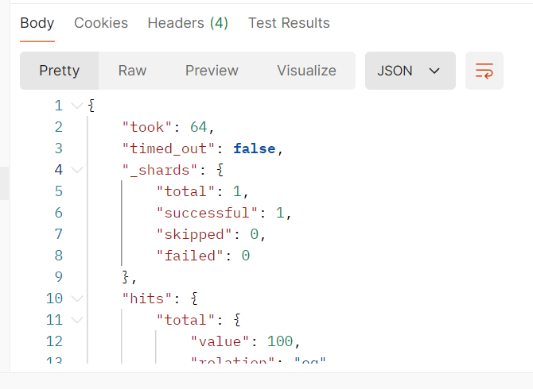

#### 2.2.17 比较本月销售额与上月销售额的差异

>代码

```json
{
    "size": 0,
    "aggs": {
        "sale_per_month": {
            "date_histogram": {
                "field": "order_date",
                "calendar_interval": "1M"
            },
            "aggs": {
                "sales": {
                    "sum": {
                        "field": "total_amount"
                    }
                },
                "sales_distance_last_month": {
                    "derivative":{
                        "buckets_path":"sales"
                    }
                }
            }
        }
    }
}
```

>成功代码

```json
{
    "took": 30,
    "timed_out": false,
    "_shards": {
        "total": 1,
        "successful": 1,
        "skipped": 0,
        "failed": 0
    },
    "hits": {
        "total": {
            "value": 100,
            "relation": "eq"
        },
        "max_score": null,
        "hits": []
    },
    "aggregations": {
        "sale_per_month": {
            "buckets": [
                {
                    "key_as_string": "2023-01-01T00:00:00.000Z",
                    "key": 1672531200000,
                    "doc_count": 12,
                    "sales": {
                        "value": 24381.61993408203
                    }
                },
                {
                    "key_as_string": "2023-02-01T00:00:00.000Z",
                    "key": 1675209600000,
                    "doc_count": 11,
                    "sales": {
                        "value": 18870.850006103516
                    },
                    "sales_distance_last_month": {
                        "value": -5510.769927978516
                    }
                },
                {
                    "key_as_string": "2023-03-01T00:00:00.000Z",
                    "key": 1677628800000,
                    "doc_count": 10,
                    "sales": {
                        "value": 17959.33026123047
                    },
                    "sales_distance_last_month": {
                        "value": -911.5197448730469
                    }
                },
                {
                    "key_as_string": "2023-04-01T00:00:00.000Z",
                    "key": 1680307200000,
                    "doc_count": 9,
                    "sales": {
                        "value": 18775.959869384766
                    },
                    "sales_distance_last_month": {
                        "value": 816.6296081542969
                    }
                },
                {
                    "key_as_string": "2023-05-01T00:00:00.000Z",
                    "key": 1682899200000,
                    "doc_count": 10,
                    "sales": {
                        "value": 11713.169967651367
                    },
                    "sales_distance_last_month": {
                        "value": -7062.789901733398
                    }
                },
                {
                    "key_as_string": "2023-06-01T00:00:00.000Z",
                    "key": 1685577600000,
                    "doc_count": 9,
                    "sales": {
                        "value": 6771.1600341796875
                    },
                    "sales_distance_last_month": {
                        "value": -4942.00993347168
                    }
                },
                {
                    "key_as_string": "2023-07-01T00:00:00.000Z",
                    "key": 1688169600000,
                    "doc_count": 7,
                    "sales": {
                        "value": 9110.010131835938
                    },
                    "sales_distance_last_month": {
                        "value": 2338.85009765625
                    }
                },
                {
                    "key_as_string": "2023-08-01T00:00:00.000Z",
                    "key": 1690848000000,
                    "doc_count": 8,
                    "sales": {
                        "value": 12135.870210647583
                    },
                    "sales_distance_last_month": {
                        "value": 3025.8600788116455
                    }
                },
                {
                    "key_as_string": "2023-09-01T00:00:00.000Z",
                    "key": 1693526400000,
                    "doc_count": 3,
                    "sales": {
                        "value": 8615.500122070312
                    },
                    "sales_distance_last_month": {
                        "value": -3520.3700885772705
                    }
                },
                {
                    "key_as_string": "2023-10-01T00:00:00.000Z",
                    "key": 1696118400000,
                    "doc_count": 6,
                    "sales": {
                        "value": 12106.000183105469
                    },
                    "sales_distance_last_month": {
                        "value": 3490.5000610351562
                    }
                },
                {
                    "key_as_string": "2023-11-01T00:00:00.000Z",
                    "key": 1698796800000,
                    "doc_count": 6,
                    "sales": {
                        "value": 8176.529968261719
                    },
                    "sales_distance_last_month": {
                        "value": -3929.47021484375
                    }
                },
                {
                    "key_as_string": "2023-12-01T00:00:00.000Z",
                    "key": 1701388800000,
                    "doc_count": 9,
                    "sales": {
                        "value": 12509.620300292969
                    },
                    "sales_distance_last_month": {
                        "value": 4333.09033203125
                    }
                }
            ]
        }
    }
}
```

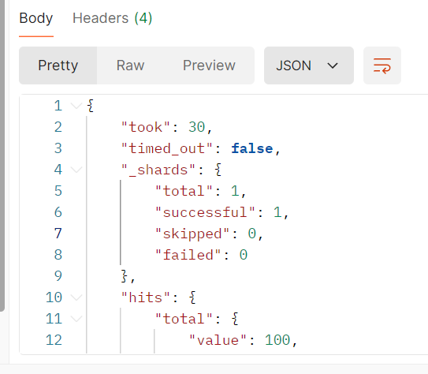

#### 2.2.18 计算每周的总销售额，并找出销售额增长最快的一周

>代码

```json
{
    "size":0,
    "aggs":{
        "week_per":{
            "date_histogram":{
                "field":"order_date",
                "calendar_interval":"1w"
            },
            "aggs":{
                "week_per_sum":{
                    "sum":{
                        "field":"total_amount"
                    }
                },
                "sales_week_derivative":{
                    "derivative":{
                        "buckets_path":"week_per_sum"
                    }
                }
            }
        },
        "max_func":{
            "max_bucket":{
                "buckets_path":"week_per>sales_week_derivative"
            }
        }
    }
}
```

>成功代码

```json
{
    "took": 163,
    "timed_out": false,
    "_shards": {
        "total": 1,
        "successful": 1,
        "skipped": 0,
        "failed": 0
    },
    "hits": {
        "total": {
            "value": 100,
            "relation": "eq"
        },
        "max_score": null,
        "hits": []
    },
    "aggregations": {
        "week_per": {
            "buckets": [
                {
                    "key_as_string": "2023-01-02T00:00:00.000Z",
                    "key": 1672617600000,
                    "doc_count": 3,
                    "week_per_sum": {
                        "value": 4912.139953613281
                    }
                },
                {
                    "key_as_string": "2023-01-09T00:00:00.000Z",
                    "key": 1673222400000,
                    "doc_count": 3,
                    "week_per_sum": {
                        "value": 8571.68994140625
                    },
                    "sales_week_derivative": {
                        "value": 3659.5499877929688
                    }
                },
                {
                    "key_as_string": "2023-01-16T00:00:00.000Z",
                    "key": 1673827200000,
                    "doc_count": 3,
                    "week_per_sum": {
                        "value": 3978.7000732421875
                    },
                    "sales_week_derivative": {
                        "value": -4592.9898681640625
                    }
                },
                {
                    "key_as_string": "2023-01-23T00:00:00.000Z",
                    "key": 1674432000000,
                    "doc_count": 3,
                    "week_per_sum": {
                        "value": 6919.0899658203125
                    },
                    "sales_week_derivative": {
                        "value": 2940.389892578125
                    }
                },
                {
                    "key_as_string": "2023-01-30T00:00:00.000Z",
                    "key": 1675036800000,
                    "doc_count": 1,
                    "week_per_sum": {
                        "value": 3605.800048828125
                    },
                    "sales_week_derivative": {
                        "value": -3313.2899169921875
                    }
                },
                {
                    "key_as_string": "2023-02-06T00:00:00.000Z",
                    "key": 1675641600000,
                    "doc_count": 1,
                    "week_per_sum": {
                        "value": 635.1199951171875
                    },
                    "sales_week_derivative": {
                        "value": -2970.6800537109375
                    }
                },
                {
                    "key_as_string": "2023-02-13T00:00:00.000Z",
                    "key": 1676246400000,
                    "doc_count": 3,
                    "week_per_sum": {
                        "value": 3622.939971923828
                    },
                    "sales_week_derivative": {
                        "value": 2987.8199768066406
                    }
                },
                {
                    "key_as_string": "2023-02-20T00:00:00.000Z",
                    "key": 1676851200000,
                    "doc_count": 4,
                    "week_per_sum": {
                        "value": 7788.419982910156
                    },
                    "sales_week_derivative": {
                        "value": 4165.480010986328
                    }
                },
                {
                    "key_as_string": "2023-02-27T00:00:00.000Z",
                    "key": 1677456000000,
                    "doc_count": 5,
                    "week_per_sum": {
                        "value": 9165.450073242188
                    },
                    "sales_week_derivative": {
                        "value": 1377.0300903320312
                    }
                },
                {
                    "key_as_string": "2023-03-06T00:00:00.000Z",
                    "key": 1678060800000,
                    "doc_count": 2,
                    "week_per_sum": {
                        "value": 1358.5800170898438
                    },
                    "sales_week_derivative": {
                        "value": -7806.870056152344
                    }
                },
                {
                    "key_as_string": "2023-03-13T00:00:00.000Z",
                    "key": 1678665600000,
                    "doc_count": 3,
                    "week_per_sum": {
                        "value": 6438.730224609375
                    },
                    "sales_week_derivative": {
                        "value": 5080.150207519531
                    }
                },
                {
                    "key_as_string": "2023-03-20T00:00:00.000Z",
                    "key": 1679270400000,
                    "doc_count": 1,
                    "week_per_sum": {
                        "value": 600.6900024414062
                    },
                    "sales_week_derivative": {
                        "value": -5838.040222167969
                    }
                },
                {
                    "key_as_string": "2023-03-27T00:00:00.000Z",
                    "key": 1679875200000,
                    "doc_count": 2,
                    "week_per_sum": {
                        "value": 4943.72998046875
                    },
                    "sales_week_derivative": {
                        "value": 4343.039978027344
                    }
                },
                {
                    "key_as_string": "2023-04-03T00:00:00.000Z",
                    "key": 1680480000000,
                    "doc_count": 0,
                    "week_per_sum": {
                        "value": 0
                    },
                    "sales_week_derivative": {
                        "value": null
                    }
                },
                {
                    "key_as_string": "2023-04-10T00:00:00.000Z",
                    "key": 1681084800000,
                    "doc_count": 4,
                    "week_per_sum": {
                        "value": 8707.539825439453
                    },
                    "sales_week_derivative": {
                        "value": null
                    }
                },
                {
                    "key_as_string": "2023-04-17T00:00:00.000Z",
                    "key": 1681689600000,
                    "doc_count": 0,
                    "week_per_sum": {
                        "value": 0
                    },
                    "sales_week_derivative": {
                        "value": null
                    }
                },
                {
                    "key_as_string": "2023-04-24T00:00:00.000Z",
                    "key": 1682294400000,
                    "doc_count": 4,
                    "week_per_sum": {
                        "value": 8739.140014648438
                    },
                    "sales_week_derivative": {
                        "value": null
                    }
                },
                {
                    "key_as_string": "2023-05-01T00:00:00.000Z",
                    "key": 1682899200000,
                    "doc_count": 2,
                    "week_per_sum": {
                        "value": 3348.029998779297
                    },
                    "sales_week_derivative": {
                        "value": -5391.110015869141
                    }
                },
                {
                    "key_as_string": "2023-05-08T00:00:00.000Z",
                    "key": 1683504000000,
                    "doc_count": 3,
                    "week_per_sum": {
                        "value": 2923.4099731445312
                    },
                    "sales_week_derivative": {
                        "value": -424.6200256347656
                    }
                },
                {
                    "key_as_string": "2023-05-15T00:00:00.000Z",
                    "key": 1684108800000,
                    "doc_count": 2,
                    "week_per_sum": {
                        "value": 572.7400054931641
                    },
                    "sales_week_derivative": {
                        "value": -2350.669967651367
                    }
                },
                {
                    "key_as_string": "2023-05-22T00:00:00.000Z",
                    "key": 1684713600000,
                    "doc_count": 2,
                    "week_per_sum": {
                        "value": 4489.47998046875
                    },
                    "sales_week_derivative": {
                        "value": 3916.739974975586
                    }
                },
                {
                    "key_as_string": "2023-05-29T00:00:00.000Z",
                    "key": 1685318400000,
                    "doc_count": 1,
                    "week_per_sum": {
                        "value": 379.510009765625
                    },
                    "sales_week_derivative": {
                        "value": -4109.969970703125
                    }
                },
                {
                    "key_as_string": "2023-06-05T00:00:00.000Z",
                    "key": 1685923200000,
                    "doc_count": 1,
                    "week_per_sum": {
                        "value": 904.010009765625
                    },
                    "sales_week_derivative": {
                        "value": 524.5
                    }
                },
                {
                    "key_as_string": "2023-06-12T00:00:00.000Z",
                    "key": 1686528000000,
                    "doc_count": 3,
                    "week_per_sum": {
                        "value": 3652.4400024414062
                    },
                    "sales_week_derivative": {
                        "value": 2748.4299926757812
                    }
                },
                {
                    "key_as_string": "2023-06-19T00:00:00.000Z",
                    "key": 1687132800000,
                    "doc_count": 2,
                    "week_per_sum": {
                        "value": 1073.9700012207031
                    },
                    "sales_week_derivative": {
                        "value": -2578.470001220703
                    }
                },
                {
                    "key_as_string": "2023-06-26T00:00:00.000Z",
                    "key": 1687737600000,
                    "doc_count": 3,
                    "week_per_sum": {
                        "value": 1140.7400207519531
                    },
                    "sales_week_derivative": {
                        "value": 66.77001953125
                    }
                },
                {
                    "key_as_string": "2023-07-03T00:00:00.000Z",
                    "key": 1688342400000,
                    "doc_count": 2,
                    "week_per_sum": {
                        "value": 3268.2000732421875
                    },
                    "sales_week_derivative": {
                        "value": 2127.4600524902344
                    }
                },
                {
                    "key_as_string": "2023-07-10T00:00:00.000Z",
                    "key": 1688947200000,
                    "doc_count": 3,
                    "week_per_sum": {
                        "value": 1996.9200439453125
                    },
                    "sales_week_derivative": {
                        "value": -1271.280029296875
                    }
                },
                {
                    "key_as_string": "2023-07-17T00:00:00.000Z",
                    "key": 1689552000000,
                    "doc_count": 1,
                    "week_per_sum": {
                        "value": 2220.9599609375
                    },
                    "sales_week_derivative": {
                        "value": 224.0399169921875
                    }
                },
                {
                    "key_as_string": "2023-07-24T00:00:00.000Z",
                    "key": 1690156800000,
                    "doc_count": 1,
                    "week_per_sum": {
                        "value": 1623.9300537109375
                    },
                    "sales_week_derivative": {
                        "value": -597.0299072265625
                    }
                },
                {
                    "key_as_string": "2023-07-31T00:00:00.000Z",
                    "key": 1690761600000,
                    "doc_count": 3,
                    "week_per_sum": {
                        "value": 5719.370178222656
                    },
                    "sales_week_derivative": {
                        "value": 4095.4401245117188
                    }
                },
                {
                    "key_as_string": "2023-08-07T00:00:00.000Z",
                    "key": 1691366400000,
                    "doc_count": 0,
                    "week_per_sum": {
                        "value": 0
                    },
                    "sales_week_derivative": {
                        "value": null
                    }
                },
                {
                    "key_as_string": "2023-08-14T00:00:00.000Z",
                    "key": 1691971200000,
                    "doc_count": 4,
                    "week_per_sum": {
                        "value": 6387.220031738281
                    },
                    "sales_week_derivative": {
                        "value": null
                    }
                },
                {
                    "key_as_string": "2023-08-21T00:00:00.000Z",
                    "key": 1692576000000,
                    "doc_count": 1,
                    "week_per_sum": {
                        "value": 29.280000686645508
                    },
                    "sales_week_derivative": {
                        "value": -6357.940031051636
                    }
                },
                {
                    "key_as_string": "2023-08-28T00:00:00.000Z",
                    "key": 1693180800000,
                    "doc_count": 0,
                    "week_per_sum": {
                        "value": 0
                    },
                    "sales_week_derivative": {
                        "value": null
                    }
                },
                {
                    "key_as_string": "2023-09-04T00:00:00.000Z",
                    "key": 1693785600000,
                    "doc_count": 0,
                    "week_per_sum": {
                        "value": 0
                    },
                    "sales_week_derivative": {
                        "value": null
                    }
                },
                {
                    "key_as_string": "2023-09-11T00:00:00.000Z",
                    "key": 1694390400000,
                    "doc_count": 1,
                    "week_per_sum": {
                        "value": 4886.10009765625
                    },
                    "sales_week_derivative": {
                        "value": null
                    }
                },
                {
                    "key_as_string": "2023-09-18T00:00:00.000Z",
                    "key": 1694995200000,
                    "doc_count": 2,
                    "week_per_sum": {
                        "value": 3729.4000244140625
                    },
                    "sales_week_derivative": {
                        "value": -1156.7000732421875
                    }
                },
                {
                    "key_as_string": "2023-09-25T00:00:00.000Z",
                    "key": 1695600000000,
                    "doc_count": 0,
                    "week_per_sum": {
                        "value": 0
                    },
                    "sales_week_derivative": {
                        "value": null
                    }
                },
                {
                    "key_as_string": "2023-10-02T00:00:00.000Z",
                    "key": 1696204800000,
                    "doc_count": 2,
                    "week_per_sum": {
                        "value": 5857.110168457031
                    },
                    "sales_week_derivative": {
                        "value": null
                    }
                },
                {
                    "key_as_string": "2023-10-09T00:00:00.000Z",
                    "key": 1696809600000,
                    "doc_count": 4,
                    "week_per_sum": {
                        "value": 6248.8900146484375
                    },
                    "sales_week_derivative": {
                        "value": 391.77984619140625
                    }
                },
                {
                    "key_as_string": "2023-10-16T00:00:00.000Z",
                    "key": 1697414400000,
                    "doc_count": 0,
                    "week_per_sum": {
                        "value": 0
                    },
                    "sales_week_derivative": {
                        "value": null
                    }
                },
                {
                    "key_as_string": "2023-10-23T00:00:00.000Z",
                    "key": 1698019200000,
                    "doc_count": 0,
                    "week_per_sum": {
                        "value": 0
                    },
                    "sales_week_derivative": {
                        "value": null
                    }
                },
                {
                    "key_as_string": "2023-10-30T00:00:00.000Z",
                    "key": 1698624000000,
                    "doc_count": 0,
                    "week_per_sum": {
                        "value": 0
                    },
                    "sales_week_derivative": {
                        "value": null
                    }
                },
                {
                    "key_as_string": "2023-11-06T00:00:00.000Z",
                    "key": 1699228800000,
                    "doc_count": 1,
                    "week_per_sum": {
                        "value": 342.6300048828125
                    },
                    "sales_week_derivative": {
                        "value": null
                    }
                },
                {
                    "key_as_string": "2023-11-13T00:00:00.000Z",
                    "key": 1699833600000,
                    "doc_count": 2,
                    "week_per_sum": {
                        "value": 3917.739990234375
                    },
                    "sales_week_derivative": {
                        "value": 3575.1099853515625
                    }
                },
                {
                    "key_as_string": "2023-11-20T00:00:00.000Z",
                    "key": 1700438400000,
                    "doc_count": 2,
                    "week_per_sum": {
                        "value": 1300.9099731445312
                    },
                    "sales_week_derivative": {
                        "value": -2616.8300170898438
                    }
                },
                {
                    "key_as_string": "2023-11-27T00:00:00.000Z",
                    "key": 1701043200000,
                    "doc_count": 2,
                    "week_per_sum": {
                        "value": 3575.4299926757812
                    },
                    "sales_week_derivative": {
                        "value": 2274.52001953125
                    }
                },
                {
                    "key_as_string": "2023-12-04T00:00:00.000Z",
                    "key": 1701648000000,
                    "doc_count": 1,
                    "week_per_sum": {
                        "value": 1498.1099853515625
                    },
                    "sales_week_derivative": {
                        "value": -2077.3200073242188
                    }
                },
                {
                    "key_as_string": "2023-12-11T00:00:00.000Z",
                    "key": 1702252800000,
                    "doc_count": 0,
                    "week_per_sum": {
                        "value": 0
                    },
                    "sales_week_derivative": {
                        "value": null
                    }
                },
                {
                    "key_as_string": "2023-12-18T00:00:00.000Z",
                    "key": 1702857600000,
                    "doc_count": 3,
                    "week_per_sum": {
                        "value": 2833.2600708007812
                    },
                    "sales_week_derivative": {
                        "value": null
                    }
                },
                {
                    "key_as_string": "2023-12-25T00:00:00.000Z",
                    "key": 1703462400000,
                    "doc_count": 4,
                    "week_per_sum": {
                        "value": 7218.070251464844
                    },
                    "sales_week_derivative": {
                        "value": 4384.8101806640625
                    }
                }
            ]
        },
        "max_func": {
            "value": 5080.150207519531,
            "keys": [
                "2023-03-13T00:00:00.000Z"
            ]
        }
    }
}
```

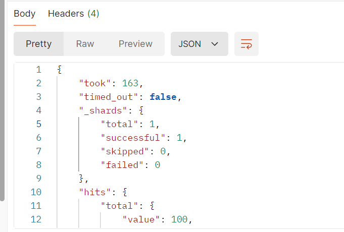

## 三、问题及解决

1、Elasticsearch的date_histogram不支持fixed_interval,也不支持3M这样的时间复合聚合，只能用标准的1m,1h,1d,1w,1M,1q,1y。

2、size: 0: 这个设置表示我们不需要返回具体的文档，只需要聚合结果。

3、关于moving_fn，用来求移动平均值，详细参考官方文档[链接](https://www.elastic.co/guide/en/elasticsearch/reference/current/search-aggregations-pipeline-movfn-aggregation.html)。需要注意规定的参数一个都不能少。

4、关于scripted metrics的思考：虽然本次作业没有用到。这个聚合方法可以实现一些自定义的操作，但因为没有用elasticsearch自己的索引相关操作，且需要分片和迭代最后再汇集到一起，很多时候性能非常低。
提升性能的方法有扩大缓冲池（有局限性） 和优化查询逻辑，尽量使用elasticsearch自带的方法去优化。
脚本适合在复杂场景下使用，如非必须尽量用DSL。
