# 实验五

> 学院：省级示范性软件学院
>
> 题目：《实验五：Kibana技术》
>
> 姓名：黄玺竹
>
> 学号：2200770269
>
> 班级：软工2201
>
> 日期：2024-11-11
>
> 实验环境：Elasticsearch8.12.2 Kibana8.12.2

## 一、实验目的

1.熟悉kibana dashboard操作

2.与前驱知识相结合

## 二、实验内容

### 1.统计每个产品类别的总销售额

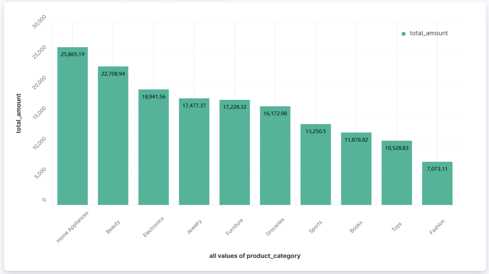

### 2.计算每个城市的平均订单金额

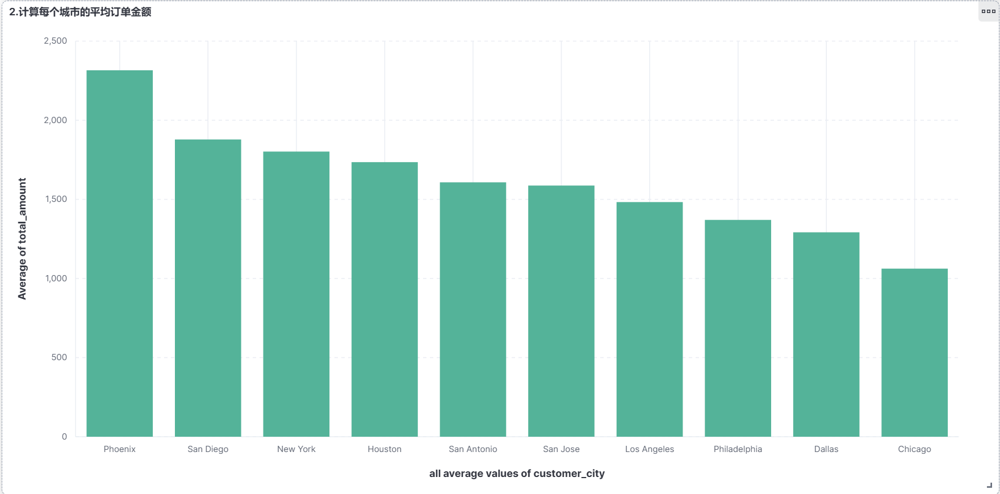

### 3.找出销量最高的前5个产品

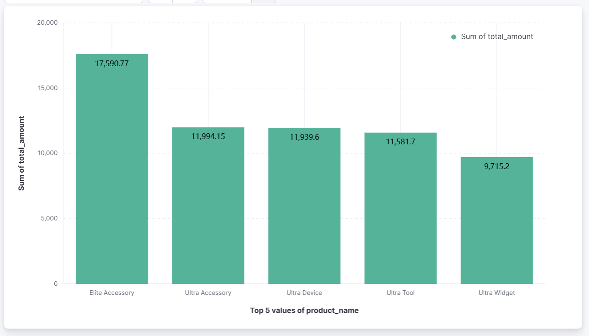

### 4.计算男性和女性客户的平均订单金额

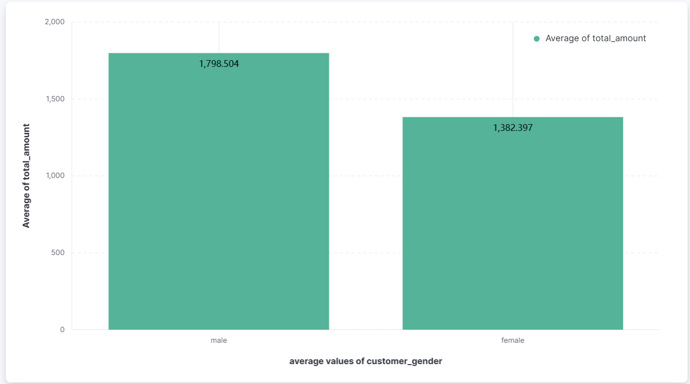

### 5.统计每种支付方式的使用次数和总金额

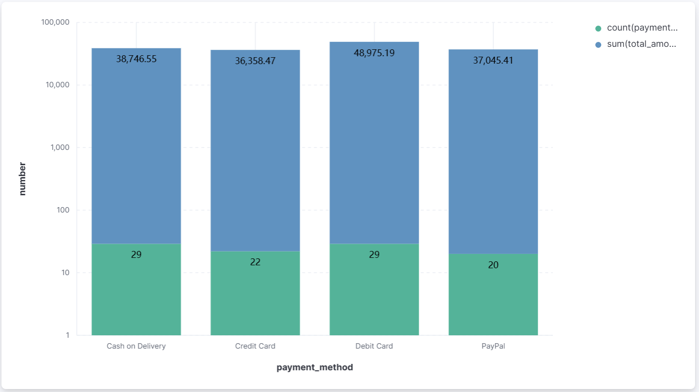

### 6.计算每个年龄段（18-30，31-50，51+）的客户数量

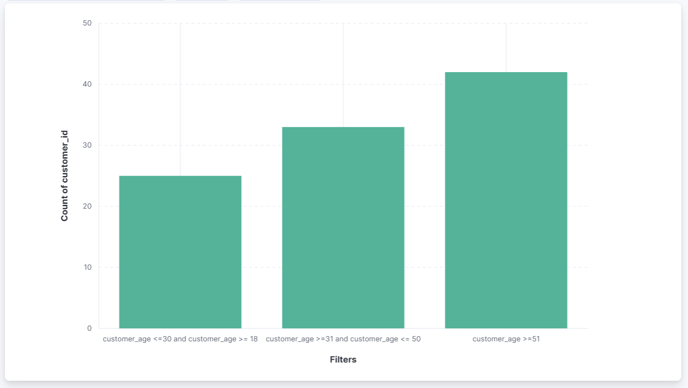

### 7.计算每周的总销售额，并找出销售额增长最快的一周

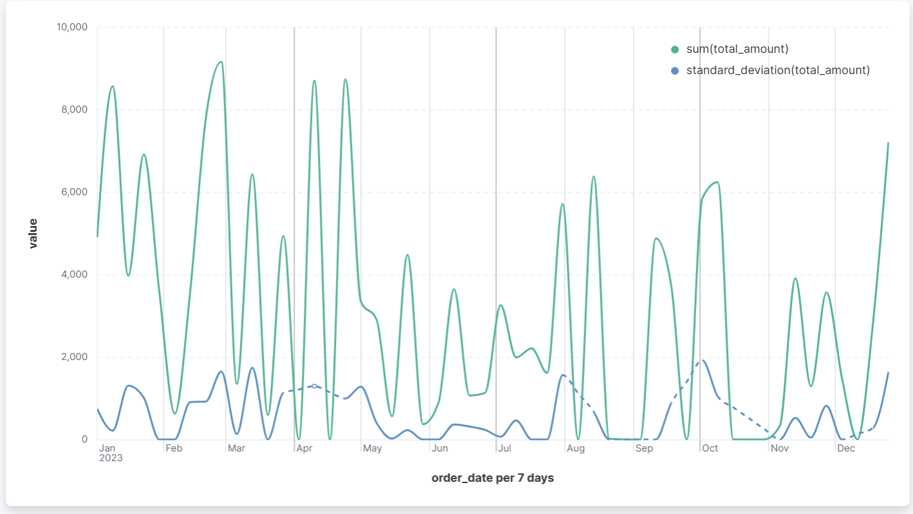

### 8.比较本月销售额与上月销售额的差异

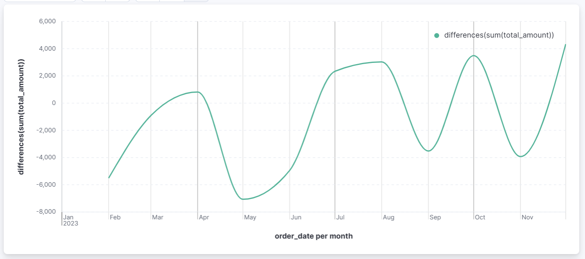

### 9.计算每个季度销售额最高的产品类别

在里面先对Metrics y轴设置为sum-total_amount

再设置buckets,对x轴设置为date_histogram,custom为90d

最后splits,新加aggrations,字段为product_category,设置size为1

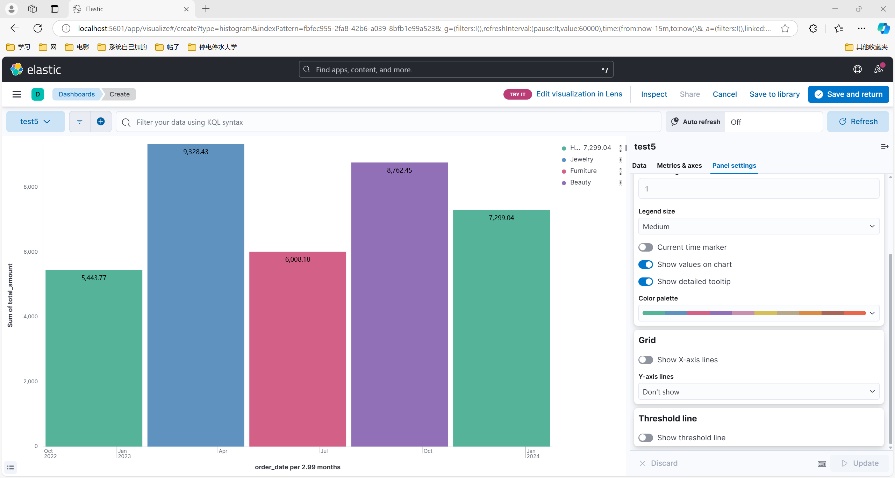

### 10.计算每天的订单数量，并显示7天移动平均值

两张图分开画信息会更多，合在一起给人的感觉特别混乱。

七天平均移动值：

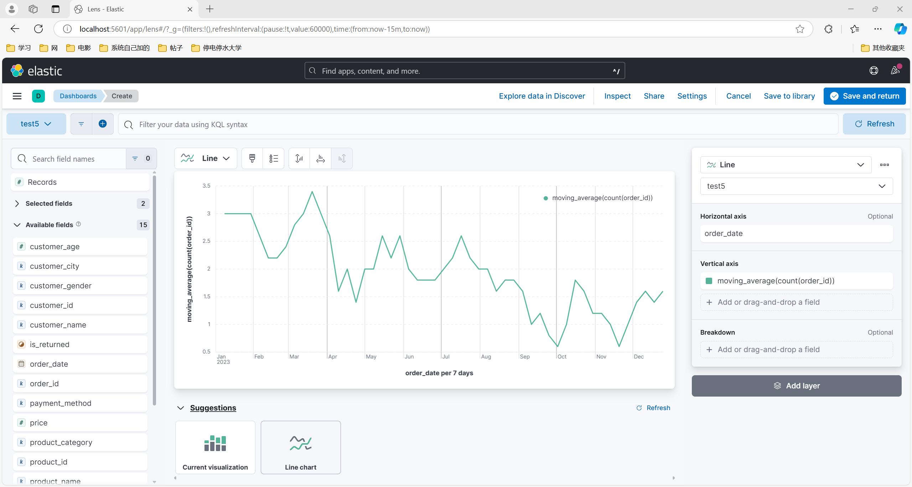

每天的订单数量：

我选择不画，一年只有100个订单，基本都是一天一两个，没什么重点，画出来也没有可以分析的价值，特别丑

放入同一个dashboard中：

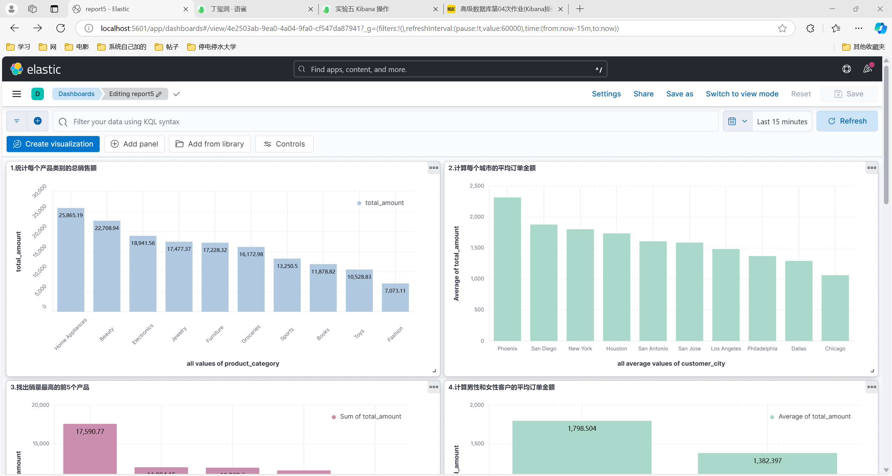

## 三、问题及解决

可以使用pipeline去解决子聚合操作，参考在dev tool里调试的结果，用相同的思路去作图实现。

一张图要突出重点，如果内容过多会导致信息特别杂乱，难以分析，可以适当的分成合适张数的图。

部分分析价值不高的信息可以直接省略，更有利于出结论。
