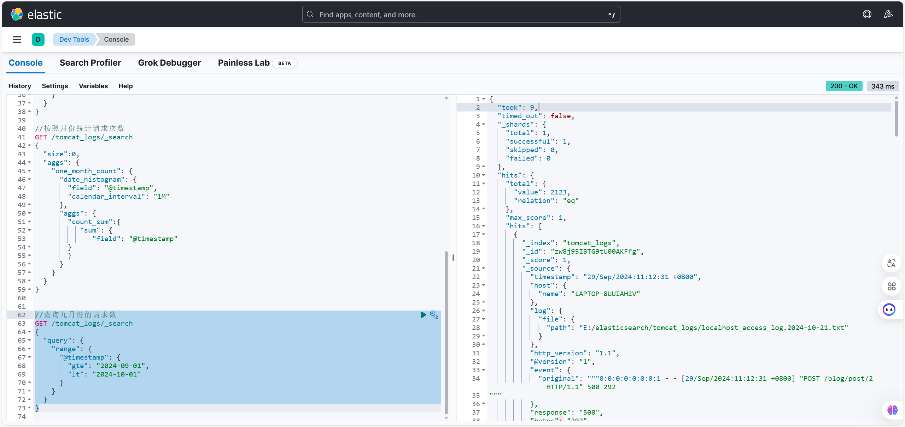

# 实验四

> 学院：省级示范性软件学院
>
> 题目：《实验四：Logstash操作》
>
> 姓名：黄玺竹
>
> 学号：2200770269
>
> 班级：软工2201
>
> 日期：2024-11-4
>
> 实验环境：Elasticsearch-8.12.2 Kibana-8.12.2

## 一、实验目的

1、了解Logstash的核心概念

2、掌握Logstash的输入、输出、过滤

3、能将数据导入到本地的elasticsearch中并做相关分析

## 二、实验内容

### 1、tomcat日志处理

#### step1 启动logstash

>note 使用绝对路径
>命令行输入 bin\logstash.bat -f E:\elasticsearch\logstash-8.12.2-windows-x86_64\logstash-8.12.2\config\tomcat_logs.conf


#### step2 导入全部数据，在kibana中显示

>代码

```json
GET /tomcat_logs/_search
{
  "query":{
    "match_all":{
      
    }
  }
}
```

>控制台

```json
{
  "took": 23,
  "timed_out": false,
  "_shards": {
    "total": 1,
    "successful": 1,
    "skipped": 0,
    "failed": 0
  },
  "hits": {
    "total": {
      "value": 3000,
      "relation": "eq"
    },
    "max_score": 1,
    "hits": [
      {
        "_index": "tomcat_logs",
        "_id": "qw8B95IBTG9tU00AI0FI",
        "_score": 1,
        "_source": {
          "client": "0:0:0:0:0:0:0:1",
          "timestamp": "12/Oct/2024:11:12:31 +0800",
          "@version": "1",
          "log": {
            "file": {
              "path": "E:/elasticsearch/tomcat_logs/localhost_access_log.2024-10-19.txt"
            }
          },
          "request": "/examples/jsp/images/execute.gif",
          "http_version": "1.1",
          "method": "POST",
          "response": "404",
          "@timestamp": "2024-10-12T03:12:31.000Z",
          "host": {
            "name": "LAPTOP-8UUIAH2V"
          },
          "message": """0:0:0:0:0:0:0:1 - - [12/Oct/2024:11:12:31 +0800] "POST /examples/jsp/images/execute.gif HTTP/1.1" 404 13
""",
          "event": {
            "original": """0:0:0:0:0:0:0:1 - - [12/Oct/2024:11:12:31 +0800] "POST /examples/jsp/images/execute.gif HTTP/1.1" 404 13
"""
          },
          "bytes": "13"
        }
      },
      {
        "_index": "tomcat_logs",
        "_id": "sg8B95IBTG9tU00AI0FI",
        "_score": 1,
        "_source": {
          "client": "0:0:0:0:0:0:0:1",
          "timestamp": "01/Oct/2024:11:12:31 +0800",
          "@version": "1",
          "log": {
            "file": {
              "path": "E:/elasticsearch/tomcat_logs/localhost_access_log.2024-10-19.txt"
            }
          },
          "request": "/demo1/hello",
          "http_version": "1.1",
          "method": "POST",
          "response": "302",
          "@timestamp": "2024-10-01T03:12:31.000Z",
          "host": {
            "name": "LAPTOP-8UUIAH2V"
          },
          "message": """0:0:0:0:0:0:0:1 - - [01/Oct/2024:11:12:31 +0800] "POST /demo1/hello HTTP/1.1" 302 13
""",
          "event": {
            "original": """0:0:0:0:0:0:0:1 - - [01/Oct/2024:11:12:31 +0800] "POST /demo1/hello HTTP/1.1" 302 13
"""
          },
          "bytes": "13"
        }
      },
      {
        "_index": "tomcat_logs",
        "_id": "ug8B95IBTG9tU00AI0FI",
        "_score": 1,
        "_source": {
          "client": "0:0:0:0:0:0:0:1",
          "timestamp": "03/Oct/2024:11:12:31 +0800",
          "@version": "1",
          "log": {
            "file": {
              "path": "E:/elasticsearch/tomcat_logs/localhost_access_log.2024-10-19.txt"
            }
          },
          "request": "/api/data",
          "http_version": "1.1",
          "method": "POST",
          "response": "200",
          "@timestamp": "2024-10-03T03:12:31.000Z",
          "host": {
            "name": "LAPTOP-8UUIAH2V"
          },
          "message": """0:0:0:0:0:0:0:1 - - [03/Oct/2024:11:12:31 +0800] "POST /api/data HTTP/1.1" 200 292
""",
          "event": {
            "original": """0:0:0:0:0:0:0:1 - - [03/Oct/2024:11:12:31 +0800] "POST /api/data HTTP/1.1" 200 292
"""
          },
          "bytes": "292"
        }
      },
      {
        "_index": "tomcat_logs",
        "_id": "wQ8B95IBTG9tU00AI0FI",
        "_score": 1,
        "_source": {
          "client": "0:0:0:0:0:0:0:1",
          "timestamp": "29/Sep/2024:11:12:31 +0800",
          "@version": "1",
          "log": {
            "file": {
              "path": "E:/elasticsearch/tomcat_logs/localhost_access_log.2024-10-20.txt"
            }
          },
          "request": "/demo1/hello",
          "http_version": "1.1",
          "method": "POST",
          "response": "500",
          "@timestamp": "2024-09-29T03:12:31.000Z",
          "host": {
            "name": "LAPTOP-8UUIAH2V"
          },
          "message": """0:0:0:0:0:0:0:1 - - [29/Sep/2024:11:12:31 +0800] "POST /demo1/hello HTTP/1.1" 500 1242
""",
          "event": {
            "original": """0:0:0:0:0:0:0:1 - - [29/Sep/2024:11:12:31 +0800] "POST /demo1/hello HTTP/1.1" 500 1242
"""
          },
          "bytes": "1242"
        }
      },
      {
        "_index": "tomcat_logs",
        "_id": "yA8B95IBTG9tU00AI0FI",
        "_score": 1,
        "_source": {
          "client": "0:0:0:0:0:0:0:1",
          "timestamp": "06/Oct/2024:11:12:31 +0800",
          "@version": "1",
          "log": {
            "file": {
              "path": "E:/elasticsearch/tomcat_logs/localhost_access_log.2024-10-20.txt"
            }
          },
          "request": "/demo1/hello",
          "http_version": "1.1",
          "method": "GET",
          "response": "200",
          "@timestamp": "2024-10-06T03:12:31.000Z",
          "host": {
            "name": "LAPTOP-8UUIAH2V"
          },
          "message": """0:0:0:0:0:0:0:1 - - [06/Oct/2024:11:12:31 +0800] "GET /demo1/hello HTTP/1.1" 200 292
""",
          "event": {
            "original": """0:0:0:0:0:0:0:1 - - [06/Oct/2024:11:12:31 +0800] "GET /demo1/hello HTTP/1.1" 200 292
"""
          },
          "bytes": "292"
        }
      },
      {
        "_index": "tomcat_logs",
        "_id": "zw8B95IBTG9tU00AI0FI",
        "_score": 1,
        "_source": {
          "client": "0:0:0:0:0:0:0:1",
          "timestamp": "15/Oct/2024:11:12:31 +0800",
          "@version": "1",
          "log": {
            "file": {
              "path": "E:/elasticsearch/tomcat_logs/localhost_access_log.2024-10-20.txt"
            }
          },
          "request": "/api/data",
          "http_version": "1.1",
          "method": "POST",
          "response": "500",
          "@timestamp": "2024-10-15T03:12:31.000Z",
          "host": {
            "name": "LAPTOP-8UUIAH2V"
          },
          "message": """0:0:0:0:0:0:0:1 - - [15/Oct/2024:11:12:31 +0800] "POST /api/data HTTP/1.1" 500 99
""",
          "event": {
            "original": """0:0:0:0:0:0:0:1 - - [15/Oct/2024:11:12:31 +0800] "POST /api/data HTTP/1.1" 500 99
"""
          },
          "bytes": "99"
        }
      },
      {
        "_index": "tomcat_logs",
        "_id": "1w8B95IBTG9tU00AI0FI",
        "_score": 1,
        "_source": {
          "client": "0:0:0:0:0:0:0:1",
          "timestamp": "29/Sep/2024:11:12:31 +0800",
          "@version": "1",
          "log": {
            "file": {
              "path": "E:/elasticsearch/tomcat_logs/localhost_access_log.2024-10-20.txt"
            }
          },
          "request": "/api/user/profile",
          "http_version": "1.1",
          "method": "POST",
          "response": "404",
          "@timestamp": "2024-09-29T03:12:31.000Z",
          "host": {
            "name": "LAPTOP-8UUIAH2V"
          },
          "message": """0:0:0:0:0:0:0:1 - - [29/Sep/2024:11:12:31 +0800] "POST /api/user/profile HTTP/1.1" 404 292
""",
          "event": {
            "original": """0:0:0:0:0:0:0:1 - - [29/Sep/2024:11:12:31 +0800] "POST /api/user/profile HTTP/1.1" 404 292
"""
          },
          "bytes": "292"
        }
      },
      {
        "_index": "tomcat_logs",
        "_id": "4w8B95IBTG9tU00AI0FI",
        "_score": 1,
        "_source": {
          "client": "0:0:0:0:0:0:0:1",
          "timestamp": "29/Sep/2024:11:12:31 +0800",
          "@version": "1",
          "log": {
            "file": {
              "path": "E:/elasticsearch/tomcat_logs/localhost_access_log.2024-10-20.txt"
            }
          },
          "request": "/api/user/profile",
          "http_version": "1.1",
          "method": "GET",
          "response": "404",
          "@timestamp": "2024-09-29T03:12:31.000Z",
          "host": {
            "name": "LAPTOP-8UUIAH2V"
          },
          "message": """0:0:0:0:0:0:0:1 - - [29/Sep/2024:11:12:31 +0800] "GET /api/user/profile HTTP/1.1" 404 292
""",
          "event": {
            "original": """0:0:0:0:0:0:0:1 - - [29/Sep/2024:11:12:31 +0800] "GET /api/user/profile HTTP/1.1" 404 292
"""
          },
          "bytes": "292"
        }
      },
      {
        "_index": "tomcat_logs",
        "_id": "6w8B95IBTG9tU00AI0FI",
        "_score": 1,
        "_source": {
          "client": "0:0:0:0:0:0:0:1",
          "timestamp": "29/Sep/2024:11:12:31 +0800",
          "@version": "1",
          "log": {
            "file": {
              "path": "E:/elasticsearch/tomcat_logs/localhost_access_log.2024-10-18.txt"
            }
          },
          "request": "/blog/post/2",
          "http_version": "1.1",
          "method": "GET",
          "response": "200",
          "@timestamp": "2024-09-29T03:12:31.000Z",
          "host": {
            "name": "LAPTOP-8UUIAH2V"
          },
          "message": """0:0:0:0:0:0:0:1 - - [29/Sep/2024:11:12:31 +0800] "GET /blog/post/2 HTTP/1.1" 200 1242
""",
          "event": {
            "original": """0:0:0:0:0:0:0:1 - - [29/Sep/2024:11:12:31 +0800] "GET /blog/post/2 HTTP/1.1" 200 1242
"""
          },
          "bytes": "1242"
        }
      },
      {
        "_index": "tomcat_logs",
        "_id": "9Q8B95IBTG9tU00AI0FI",
        "_score": 1,
        "_source": {
          "client": "0:0:0:0:0:0:0:1",
          "timestamp": "27/Sep/2024:11:12:31 +0800",
          "@version": "1",
          "log": {
            "file": {
              "path": "E:/elasticsearch/tomcat_logs/localhost_access_log.2024-10-18.txt"
            }
          },
          "request": "/api/data",
          "http_version": "1.1",
          "method": "POST",
          "response": "404",
          "@timestamp": "2024-09-27T03:12:31.000Z",
          "host": {
            "name": "LAPTOP-8UUIAH2V"
          },
          "message": """0:0:0:0:0:0:0:1 - - [27/Sep/2024:11:12:31 +0800] "POST /api/data HTTP/1.1" 404 292
""",
          "event": {
            "original": """0:0:0:0:0:0:0:1 - - [27/Sep/2024:11:12:31 +0800] "POST /api/data HTTP/1.1" 404 292
"""
          },
          "bytes": "292"
        }
      }
    ]
  }
}
```


#### step3 五个自拟实战操作

>1、按照月份统计请求次数
>代码

```json
//按照月份统计请求次数
GET /tomcat_logs/_search
{
  "size":0,
  "aggs": {
    "one_month_count": {
      "date_histogram": {
        "field": "@timestamp",
        "calendar_interval": "1M"
      },
      "aggs": {
        "count_sum":{
           "cardinality": {
              "field": "@timestamp"
        }
        }
      }
    }
  }
}
```

>控制台显示

```json
{
  "took": 144,
  "timed_out": false,
  "_shards": {
    "total": 1,
    "successful": 1,
    "skipped": 0,
    "failed": 0
  },
  "hits": {
    "total": {
      "value": 3000,
      "relation": "eq"
    },
    "max_score": null,
    "hits": []
  },
  "aggregations": {
    "one_month_count": {
      "buckets": [
        {
          "key_as_string": "2024-08-01T00:00:00.000Z",
          "key": 1722470400000,
          "doc_count": 126,
          "count_sum": {
            "value": 8
          }
        },
        {
          "key_as_string": "2024-09-01T00:00:00.000Z",
          "key": 1725148800000,
          "doc_count": 2123,
          "count_sum": {
            "value": 30
          }
        },
        {
          "key_as_string": "2024-10-01T00:00:00.000Z",
          "key": 1727740800000,
          "doc_count": 751,
          "count_sum": {
            "value": 21
          }
        }
      ]
    }
  }
}
```


>2、查询九月的请求数
>代码

```json
//查询九月份的请求数
GET /tomcat_logs/_search
{
  "query": {
    "range": {
      "@timestamp": {
        "gte": "2024-09-01",
        "lt": "2024-10-01"
      }
    }
  }
}
```

>控制台输出

```json
{
  "took": 9,
  "timed_out": false,
  "_shards": {
    "total": 1,
    "successful": 1,
    "skipped": 0,
    "failed": 0
  },
  "hits": {
    "total": {
      "value": 2123,
      "relation": "eq"
    },
    "max_score": 1,
    "hits": [
      {
        "_index": "tomcat_logs",
        "_id": "zw8j95IBTG9tU00AKFfg",
        "_score": 1,
        "_source": {
          "timestamp": "29/Sep/2024:11:12:31 +0800",
          "host": {
            "name": "LAPTOP-8UUIAH2V"
          },
          "log": {
            "file": {
              "path": "E:/elasticsearch/tomcat_logs/localhost_access_log.2024-10-21.txt"
            }
          },
          "http_version": "1.1",
          "@version": "1",
          "event": {
            "original": """0:0:0:0:0:0:0:1 - - [29/Sep/2024:11:12:31 +0800] "POST /blog/post/2 HTTP/1.1" 500 292
"""
          },
          "response": "500",
          "bytes": "292",
          "client": "0:0:0:0:0:0:0:1",
          "message": """0:0:0:0:0:0:0:1 - - [29/Sep/2024:11:12:31 +0800] "POST /blog/post/2 HTTP/1.1" 500 292
""",
          "@timestamp": "2024-09-29T03:12:31.000Z",
          "request": "/blog/post/2",
          "method": "POST"
        }
      },
      {
        "_index": "tomcat_logs",
        "_id": "1Q8j95IBTG9tU00AKFfg",
        "_score": 1,
        "_source": {
          "timestamp": "24/Sep/2024:11:12:31 +0800",
          "host": {
            "name": "LAPTOP-8UUIAH2V"
          },
          "log": {
            "file": {
              "path": "E:/elasticsearch/tomcat_logs/localhost_access_log.2024-10-21.txt"
            }
          },
          "http_version": "1.1",
          "@version": "1",
          "event": {
            "original": """0:0:0:0:0:0:0:1 - - [24/Sep/2024:11:12:31 +0800] "POST /demo/ HTTP/1.1" 500 13
"""
          },
          "response": "500",
          "bytes": "13",
          "client": "0:0:0:0:0:0:0:1",
          "message": """0:0:0:0:0:0:0:1 - - [24/Sep/2024:11:12:31 +0800] "POST /demo/ HTTP/1.1" 500 13
""",
          "@timestamp": "2024-09-24T03:12:31.000Z",
          "request": "/demo/",
          "method": "POST"
        }
      },
      {
        "_index": "tomcat_logs",
        "_id": "2w8j95IBTG9tU00AKFfg",
        "_score": 1,
        "_source": {
          "timestamp": "30/Sep/2024:11:12:31 +0800",
          "host": {
            "name": "LAPTOP-8UUIAH2V"
          },
          "log": {
            "file": {
              "path": "E:/elasticsearch/tomcat_logs/localhost_access_log.2024-10-19.txt"
            }
          },
          "http_version": "1.1",
          "@version": "1",
          "event": {
            "original": """0:0:0:0:0:0:0:1 - - [30/Sep/2024:11:12:31 +0800] "POST /examples/jsp/images/execute.gif HTTP/1.1" 200 99
"""
          },
          "response": "200",
          "bytes": "99",
          "client": "0:0:0:0:0:0:0:1",
          "message": """0:0:0:0:0:0:0:1 - - [30/Sep/2024:11:12:31 +0800] "POST /examples/jsp/images/execute.gif HTTP/1.1" 200 99
""",
          "@timestamp": "2024-09-30T03:12:31.000Z",
          "request": "/examples/jsp/images/execute.gif",
          "method": "POST"
        }
      },
      {
        "_index": "tomcat_logs",
        "_id": "3Q8j95IBTG9tU00AKFfg",
        "_score": 1,
        "_source": {
          "timestamp": "26/Sep/2024:11:12:31 +0800",
          "host": {
            "name": "LAPTOP-8UUIAH2V"
          },
          "log": {
            "file": {
              "path": "E:/elasticsearch/tomcat_logs/localhost_access_log.2024-10-19.txt"
            }
          },
          "http_version": "1.1",
          "@version": "1",
          "event": {
            "original": """0:0:0:0:0:0:0:1 - - [26/Sep/2024:11:12:31 +0800] "POST /blog/post/2 HTTP/1.1" 500 292
"""
          },
          "response": "500",
          "bytes": "292",
          "client": "0:0:0:0:0:0:0:1",
          "message": """0:0:0:0:0:0:0:1 - - [26/Sep/2024:11:12:31 +0800] "POST /blog/post/2 HTTP/1.1" 500 292
""",
          "@timestamp": "2024-09-26T03:12:31.000Z",
          "request": "/blog/post/2",
          "method": "POST"
        }
      },
      {
        "_index": "tomcat_logs",
        "_id": "4w8j95IBTG9tU00AKFfg",
        "_score": 1,
        "_source": {
          "timestamp": "28/Sep/2024:11:12:31 +0800",
          "host": {
            "name": "LAPTOP-8UUIAH2V"
          },
          "log": {
            "file": {
              "path": "E:/elasticsearch/tomcat_logs/localhost_access_log.2024-10-19.txt"
            }
          },
          "http_version": "1.1",
          "@version": "1",
          "event": {
            "original": """0:0:0:0:0:0:0:1 - - [28/Sep/2024:11:12:31 +0800] "GET /api/data HTTP/1.1" 500 0
"""
          },
          "response": "500",
          "bytes": "0",
          "client": "0:0:0:0:0:0:0:1",
          "message": """0:0:0:0:0:0:0:1 - - [28/Sep/2024:11:12:31 +0800] "GET /api/data HTTP/1.1" 500 0
""",
          "@timestamp": "2024-09-28T03:12:31.000Z",
          "request": "/api/data",
          "method": "GET"
        }
      },
      {
        "_index": "tomcat_logs",
        "_id": "5w8j95IBTG9tU00AKFfg",
        "_score": 1,
        "_source": {
          "timestamp": "30/Sep/2024:11:12:31 +0800",
          "host": {
            "name": "LAPTOP-8UUIAH2V"
          },
          "log": {
            "file": {
              "path": "E:/elasticsearch/tomcat_logs/localhost_access_log.2024-10-19.txt"
            }
          },
          "http_version": "1.1",
          "@version": "1",
          "event": {
            "original": """0:0:0:0:0:0:0:1 - - [30/Sep/2024:11:12:31 +0800] "POST /static/js/app.js HTTP/1.1" 200 13
"""
          },
          "response": "200",
          "bytes": "13",
          "client": "0:0:0:0:0:0:0:1",
          "message": """0:0:0:0:0:0:0:1 - - [30/Sep/2024:11:12:31 +0800] "POST /static/js/app.js HTTP/1.1" 200 13
""",
          "@timestamp": "2024-09-30T03:12:31.000Z",
          "request": "/static/js/app.js",
          "method": "POST"
        }
      },
      {
        "_index": "tomcat_logs",
        "_id": "Bg8j95IBTG9tU00AKFjg",
        "_score": 1,
        "_source": {
          "timestamp": "25/Sep/2024:11:12:31 +0800",
          "host": {
            "name": "LAPTOP-8UUIAH2V"
          },
          "log": {
            "file": {
              "path": "E:/elasticsearch/tomcat_logs/localhost_access_log.2024-10-21.txt"
            }
          },
          "http_version": "1.1",
          "@version": "1",
          "event": {
            "original": """0:0:0:0:0:0:0:1 - - [25/Sep/2024:11:12:31 +0800] "POST /services HTTP/1.1" 200 99
"""
          },
          "response": "200",
          "bytes": "99",
          "client": "0:0:0:0:0:0:0:1",
          "message": """0:0:0:0:0:0:0:1 - - [25/Sep/2024:11:12:31 +0800] "POST /services HTTP/1.1" 200 99
""",
          "@timestamp": "2024-09-25T03:12:31.000Z",
          "request": "/services",
          "method": "POST"
        }
      },
      {
        "_index": "tomcat_logs",
        "_id": "9w8j95IBTG9tU00AKFfg",
        "_score": 1,
        "_source": {
          "timestamp": "30/Sep/2024:11:12:31 +0800",
          "host": {
            "name": "LAPTOP-8UUIAH2V"
          },
          "log": {
            "file": {
              "path": "E:/elasticsearch/tomcat_logs/localhost_access_log.2024-10-21.txt"
            }
          },
          "http_version": "1.1",
          "@version": "1",
          "event": {
            "original": """0:0:0:0:0:0:0:1 - - [30/Sep/2024:11:12:31 +0800] "POST /demo HTTP/1.1" 404 292
"""
          },
          "response": "404",
          "bytes": "292",
          "client": "0:0:0:0:0:0:0:1",
          "message": """0:0:0:0:0:0:0:1 - - [30/Sep/2024:11:12:31 +0800] "POST /demo HTTP/1.1" 404 292
""",
          "@timestamp": "2024-09-30T03:12:31.000Z",
          "request": "/demo",
          "method": "POST"
        }
      },
      {
        "_index": "tomcat_logs",
        "_id": "AA8j95IBTG9tU00AKFjg",
        "_score": 1,
        "_source": {
          "timestamp": "27/Sep/2024:11:12:31 +0800",
          "host": {
            "name": "LAPTOP-8UUIAH2V"
          },
          "log": {
            "file": {
              "path": "E:/elasticsearch/tomcat_logs/localhost_access_log.2024-10-21.txt"
            }
          },
          "http_version": "1.1",
          "@version": "1",
          "event": {
            "original": """0:0:0:0:0:0:0:1 - - [27/Sep/2024:11:12:31 +0800] "POST /products/item/456 HTTP/1.1" 500 1231
"""
          },
          "response": "500",
          "bytes": "1231",
          "client": "0:0:0:0:0:0:0:1",
          "message": """0:0:0:0:0:0:0:1 - - [27/Sep/2024:11:12:31 +0800] "POST /products/item/456 HTTP/1.1" 500 1231
""",
          "@timestamp": "2024-09-27T03:12:31.000Z",
          "request": "/products/item/456",
          "method": "POST"
        }
      },
      {
        "_index": "tomcat_logs",
        "_id": "Aw8j95IBTG9tU00AKFjg",
        "_score": 1,
        "_source": {
          "timestamp": "26/Sep/2024:11:12:31 +0800",
          "host": {
            "name": "LAPTOP-8UUIAH2V"
          },
          "log": {
            "file": {
              "path": "E:/elasticsearch/tomcat_logs/localhost_access_log.2024-10-21.txt"
            }
          },
          "http_version": "1.1",
          "@version": "1",
          "event": {
            "original": """0:0:0:0:0:0:0:1 - - [26/Sep/2024:11:12:31 +0800] "POST /services HTTP/1.1" 404 13
"""
          },
          "response": "404",
          "bytes": "13",
          "client": "0:0:0:0:0:0:0:1",
          "message": """0:0:0:0:0:0:0:1 - - [26/Sep/2024:11:12:31 +0800] "POST /services HTTP/1.1" 404 13
""",
          "@timestamp": "2024-09-26T03:12:31.000Z",
          "request": "/services",
          "method": "POST"
        }
      }
    ]
  }
}
```



>3、每月的请求数和相应类型
>代码

```json
//每月的请求数和相应类型
GET /tomcat_logs/_search
{
  "size": 0,
  "aggs": {
    "requests_time": {
      "date_histogram": {
        "field": "@timestamp",
        "calendar_interval": "1M"
      },
      "aggs": {
        "analyse_response": {
          "terms": {
            "field": "request.keyword"
          }
        },
        "cout_response":{
          "value_count": {
            "field": "response.keyword"
          }
        }
      }
    }
  }
}
```

>控制台输出

```json
{
  "took": 58,
  "timed_out": false,
  "_shards": {
    "total": 1,
    "successful": 1,
    "skipped": 0,
    "failed": 0
  },
  "hits": {
    "total": {
      "value": 6000,
      "relation": "eq"
    },
    "max_score": null,
    "hits": []
  },
  "aggregations": {
    "requests_time": {
      "buckets": [
        {
          "key_as_string": "2024-08-01T00:00:00.000Z",
          "key": 1722470400000,
          "doc_count": 252,
          "analyse_response": {
            "doc_count_error_upper_bound": 0,
            "sum_other_doc_count": 114,
            "buckets": [
              {
                "key": "/api/user/settings",
                "doc_count": 16
              },
              {
                "key": "/blog/post/3",
                "doc_count": 16
              },
              {
                "key": "/examples/jsp/images/execute.gif",
                "doc_count": 16
              },
              {
                "key": "/api/user/profile",
                "doc_count": 14
              },
              {
                "key": "/demo/",
                "doc_count": 14
              },
              {
                "key": "/products/item/123",
                "doc_count": 14
              },
              {
                "key": "/api/products/list",
                "doc_count": 12
              },
              {
                "key": "/contact",
                "doc_count": 12
              },
              {
                "key": "/demo1",
                "doc_count": 12
              },
              {
                "key": "/demo1/hello",
                "doc_count": 12
              }
            ]
          },
          "cout_response": {
            "value": 252
          }
        },
        {
          "key_as_string": "2024-09-01T00:00:00.000Z",
          "key": 1725148800000,
          "doc_count": 4246,
          "analyse_response": {
            "doc_count_error_upper_bound": 0,
            "sum_other_doc_count": 2308,
            "buckets": [
              {
                "key": "/demo1/",
                "doc_count": 220
              },
              {
                "key": "/static/js/app.js",
                "doc_count": 206
              },
              {
                "key": "/about",
                "doc_count": 200
              },
              {
                "key": "/examples/jsp/images/execute.gif",
                "doc_count": 198
              },
              {
                "key": "/products/item/789",
                "doc_count": 192
              },
              {
                "key": "/demo/",
                "doc_count": 188
              },
              {
                "key": "/examples/jsp/images/return.gif",
                "doc_count": 186
              },
              {
                "key": "/static/css/style.css",
                "doc_count": 186
              },
              {
                "key": "/demo/hello",
                "doc_count": 182
              },
              {
                "key": "/blog/post/1",
                "doc_count": 180
              }
            ]
          },
          "cout_response": {
            "value": 4246
          }
        },
        {
          "key_as_string": "2024-10-01T00:00:00.000Z",
          "key": 1727740800000,
          "doc_count": 1502,
          "analyse_response": {
            "doc_count_error_upper_bound": 0,
            "sum_other_doc_count": 812,
            "buckets": [
              {
                "key": "/demo1/",
                "doc_count": 78
              },
              {
                "key": "/static/css/style.css",
                "doc_count": 72
              },
              {
                "key": "/blog/post/3",
                "doc_count": 70
              },
              {
                "key": "/api/products/list",
                "doc_count": 68
              },
              {
                "key": "/blog/post/2",
                "doc_count": 68
              },
              {
                "key": "/demo1",
                "doc_count": 68
              },
              {
                "key": "/examples/jsp/images/execute.gif",
                "doc_count": 68
              },
              {
                "key": "/products/item/456",
                "doc_count": 68
              },
              {
                "key": "/api/data",
                "doc_count": 66
              },
              {
                "key": "/about",
                "doc_count": 64
              }
            ]
          },
          "cout_response": {
            "value": 1502
          }
        }
      ]
    }
  }
}
```


>4.统计HTTP状态码分布

>代码

```json
//统计HTTP状态码
GET /tomcat_logs/_search
{
  "size": 0,
  "aggs": {
    "status_counts": {
      "terms": {
        "field": "response.keyword"
      }
    }
  }
}
```

>控制台输出
```json
{
  "took": 63,
  "timed_out": false,
  "_shards": {
    "total": 1,
    "successful": 1,
    "skipped": 0,
    "failed": 0
  },
  "hits": {
    "total": {
      "value": 6000,
      "relation": "eq"
    },
    "max_score": null,
    "hits": []
  },
  "aggregations": {
    "status_counts": {
      "doc_count_error_upper_bound": 0,
      "sum_other_doc_count": 0,
      "buckets": [
        {
          "key": "500",
          "doc_count": 1562
        },
        {
          "key": "200",
          "doc_count": 1498
        },
        {
          "key": "404",
          "doc_count": 1476
        },
        {
          "key": "302",
          "doc_count": 1464
        }
      ]
    }
  }
}
```


>5.请求大小分布

>代码

```json
//请求大小分布
GET /tomcat_logs/_search
{
  "size": 0,
  "aggs":{
    "size_map":{
      "terms": {
        "field": "bytes.keyword"
      }
    }
  }
}
```

>控制台输出

```json
{
  "took": 27,
  "timed_out": false,
  "_shards": {
    "total": 1,
    "successful": 1,
    "skipped": 0,
    "failed": 0
  },
  "hits": {
    "total": {
      "value": 6000,
      "relation": "eq"
    },
    "max_score": null,
    "hits": []
  },
  "aggregations": {
    "size_map": {
      "doc_count_error_upper_bound": 0,
      "sum_other_doc_count": 0,
      "buckets": [
        {
          "key": "292",
          "doc_count": 894
        },
        {
          "key": "1242",
          "doc_count": 892
        },
        {
          "key": "99",
          "doc_count": 858
        },
        {
          "key": "1231",
          "doc_count": 854
        },
        {
          "key": "14",
          "doc_count": 850
        },
        {
          "key": "13",
          "doc_count": 842
        },
        {
          "key": "0",
          "doc_count": 810
        }
      ]
    }
  }
}
```


### 2、数据转换和传输

#### step1 将本地的mysql数据库中的一张表导入到本地的elasticsearch中

>bin\logstash.bat -f E:\elasticsearch\logstash-8.12.2-windows-x86_64\logstash-8.12.2\config\mysql_to_es.conf
>控制台启动


>Kibana查询


#### step2 数据库表更新后，数据能够自动同步到elasticsearch中

>数据库中更新：


>Kibana查询


## 三、问题及解决
无